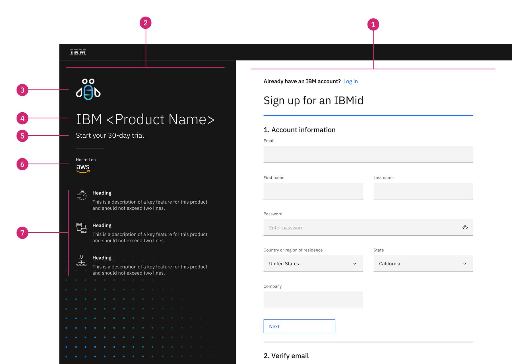

import { Breadcrumb, BreadcrumbItem } from "carbon-components-react";
import { Link } from "gatsby";

<Breadcrumb>
  <BreadcrumbItem href="https://pages.github.ibm.com/CDAI-design/cpp-foundation-microsite/">
   Home
  </BreadcrumbItem>
  <BreadcrumbItem href="https://pages.github.ibm.com/CDAI-design/cpp-foundation-microsite/saas-for-hyperscalers/overview">
   SaaS for hyperscalers
  </BreadcrumbItem>
  <BreadcrumbItem href="https://pages.github.ibm.com/CDAI-design/cpp-foundation-microsite/saas-for-hyperscalers/common-patterns-components">
   SaaS patterns and components
  </BreadcrumbItem>
  <BreadcrumbItem isCurrentPage href="https://pages.github.ibm.com/CDAI-design/cpp-foundation-microsite/saas-for-hyperscalers/common-patterns/urx">
   IBM account sign-up
  </BreadcrumbItem>
</Breadcrumb>

<PageDescription>  

Before users can access an IBM SaaS product or a product trial, they must first be authenticated with an IBMid, otherwise known as their IBMId account.  Users can create an IBMid using the standard URX (Unified Registration Experience) form.

</PageDescription>

## URX and IBMid

The URX form collects and validate the user's account information, and record the user's consensus in email communication, data privacy policy, and product terms and conditions. This form should not be modified by individual product teams. However, on the URX form page, there is a configurable panel that can be used to provide product specific information.

<Row>
  <Column colMd={8} colLg={10}>

**Example of the trial sign-up URX form, using the provided template:**

  </Column>
</Row>

1. **Sign up for IBMid form (not customizable)**
2. **Product trial sign up panel (customizable)** - The trial sign up panel starts with the title "Start your x-day trial with> message. Product team can customize the contents in this panel
3. **Product icon** - Application icon should be used
4. **Product name**
5. **Hyperscaler cloud provider logo** - This logo should be displayed if the user launches the sign up flow from one of the hyperscaler marketplaces.
6. **Product highlight** - Concise product highlight that helps reinforce user's trial signup decision

## Create IBMid

#### Step 1: Account information

<Row>
  <Column colMd={8} colLg={10}>

  </Column>
</Row>

#### Step 2: Verify email 
An email verification message will be sent to the email address provided in step 1. User will copy and paste the verification code in the URX form.
<Row>
  <Column colMd={8} colLg={10}>

  </Column>
</Row>

#### Step 3: Account Privacy
After the user accept the terms and conditions, an account is created and user is presented with the Account Privacy policy.
<Row>
  <Column colMd={8} colLg={10}>

  </Column>
</Row>