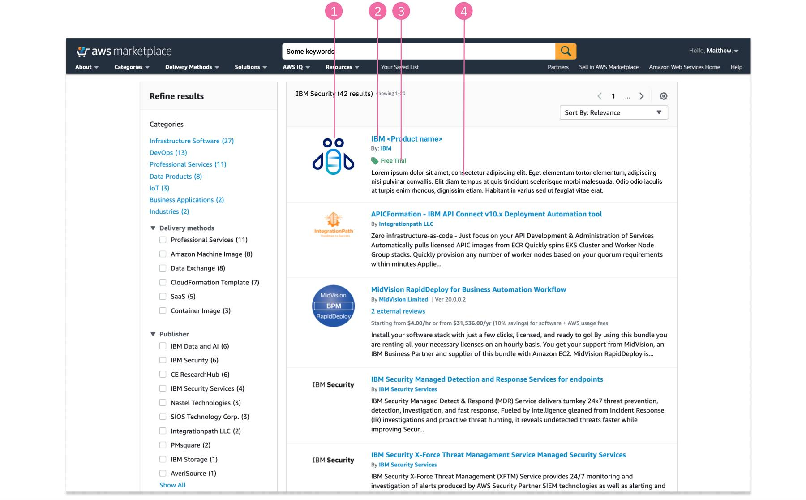

import { Breadcrumb, BreadcrumbItem } from "carbon-components-react";
import { Link } from "gatsby";

<PageDescription>

People need to find the best solutions that fulfill their needs, define options, and begin the consideration process. An excellent discover experience draws people in. It helps them find exactly what they’re looking for. 
</PageDescription>

When people look for solutions for their business needs, research shows that they tend to rely on the following discovery touch points: 
- Search results in common search engine (such as Google) and in the hyperscaler marketplaces
- Analyst reports
- Customer reviews and recommendations
- Social media influencers

Understanding the key problems that a product helps to solve brings alignment to the potential customer’s intent. Making sure our offerings are discoverable, recognizable and stand out amongst others in the marketplace search results is important as it is the first touchpoint the user has in their journey with IBM products. 

## Best practices on marketplaces

### AWS Marketplace search results
<Row>
  <Column colMd={8} colLg={10}>

  </Column>
</Row> 

1. **Product logo** - App icon (light theme), Size: 90px x 90px, Format: png
2. **Product name** 
3. **Tags** - When products offer their trials via the AWS free trial feature, the free trial tag automatically appears on the SaaS offering.
4. **Product summary** - This summary paragraph is extracted from the beginning of the Product Overview section in the product details page (the first 300 characters). Note that all formatting will be removed, including any bullets and links, when the information is displayed in this product summary area. 

<CardGroup>
  <MiniCard 
    title="Figma template" 
    href="https://www.figma.com/file/SlZ7TK2mTzNLIHZB2dGXRF/MCSP-Discover%2C-Learn%2C-Try%2C-Buy-flows?node-id=1196%3A572095&t=dIldHGZ6ycoeP78Q-1"
    actionIcon="launch">
  </MiniCard>
  <MiniCard 
    title="Graphic asset format" 
    href="https://www.figma.com/file/SlZ7TK2mTzNLIHZB2dGXRF/MCSP-Discover%2C-Learn%2C-Try%2C-Buy-flows?node-id=2042%3A429763&t=dIldHGZ6ycoeP78Q-1"
    actionIcon="launch">
  </MiniCard>
</CardGroup> 

## References
- <a href="https://w3.ibm.com/design/experience-standards/universal-experiences/discover/discover" target="_blank">Universal Experience: Discover</a>
- <a href="https://docs.aws.amazon.com/marketplace/latest/userguide/product-marketing.html" target="_blank"> AWS Marketplace Documentation: Marketing your product</a>
- <a href="https://docs.aws.amazon.com/marketplace/latest/userguide/search-engine-optimization.html" target="_blank">AWS Marketplace Documentation: Search engine optimization for products</a>