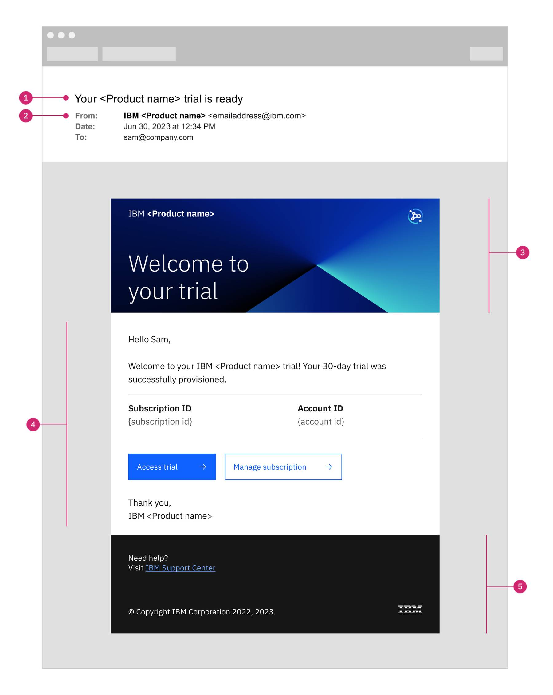

import { Breadcrumb, BreadcrumbItem } from "carbon-components-react";
import { Link } from "gatsby";

<PageDescription>

Emails provide a way to asynchronously communicate with users about their trials and subscriptions outside of the product.

</PageDescription>

<AnchorLinks>
  <AnchorLink>Overview</AnchorLink>
  <AnchorLink>Anatomy</AnchorLink>
  <AnchorLink>When to use</AnchorLink>
  <AnchorLink>Content</AnchorLink>
  <AnchorLink>Email creation</AnchorLink>
</AnchorLinks>

## Overview

Emails are sent to users to communicate information about their product trials and paid subscriptions. To avoid spamming, emails should be sent only when necessary.

## Anatomy

<Row>
<Column colMd={4} colLg={8}>

</Column>
</Row>

1. **Subject line:** A description of the topic of the email that’s displayed in the user’s inbox before they open it
2. **Sender:** The email address and display name of the user that’s sending the email
3. **Header:**  
   a. **Product name**  
   b. **Title:** Title does not need to match the subject line verbatim but it should reflect the main content of the email  
   c. **Product icon**  
   d. **Banner graphic**  
4. **Body**  
   a. **Salutation:** The way you greet the user, typically the first line or two in the email  
   b. **Body content:** The main content in the email that conveys the message that you want the user to receive  
   c. **Call to action:** The action that you want the user to take as a result of reading the email  
   d. **Signature:** The way you close the email content  
5. **Footer**  
   a. **IBM Support Center link**  
   b. **Copyright disclaimer**  
   c. **IBM 8-bar logo**

## When to use

The MultiCloud SaaS platform has an email notification system which can send emails on behalf of the products.

The above email template design is used in order to make sure that communications are consistent across all SaaS products. Email templates are sent throughout try and buy SaaS Hyperscaler flows. Here are the templates used by the platform.

<Accordion>
  <AccordionItem title="Trial email - Trial has begun">This email is sent as soon as the user has subscribed to the Trial from one of the 2 entry points of the Trial Pivot flows (ibm.com or AWS product listing trial link). This email is sent as soon as the user lands in the platform's instance provisioning screen from the IBM ID login flow from URX.
Since URX would have registered the Trial subscription in SSM but provisioning has not yet occurred, we need to send out this email in order to provide the user a way to get at least a link to the management console if the flow or connection fails once on the provisioning configuration view.
<Row>

</Row> </AccordionItem>
  <AccordionItem title="Trial email - Welcome to your trial">This email is sent when the instance of a Trial subscription has been provisioned.

<Row>

</Row> </AccordionItem>
  <AccordionItem title="Trial email - Your trial ends in n-days">This email is sent n-days prior to expiry. We suggest sending 10 days prior to trial expiring.

<Row>

</Row> 
  </AccordionItem>
  <AccordionItem title="Trial email - Your trial has expired">This email is sent when the trial has expired (typically 30 days since trial start date).

<Row>

</Row> 
  </AccordionItem>
  <AccordionItem title="Trial email - Your trial data is deleted">This email is sent when the data of Expired trial has been deleted by the platform (sent 30 days after trial has expired).

<Row>

</Row> 
  </AccordionItem>
  <AccordionItem title="Trial email - Thank you for upgrading">This email is sent when the instance of a paid subscription has been upgraded from a trial instance.

<Row>

</Row>
  </AccordionItem>
  <AccordionItem title="Subscription email - Thank you for purchasing">This email is sent as soon as the user has subscribed to the Paid instance during the IBM account set up flow that follows the AWS subscription flow.

<Row>

</Row>
  </AccordionItem>
  <AccordionItem title="Subscription email - Welcome to your instance">This email is sent when the instance of a paid subscription has been deployed.

<Row>

</Row>
  </AccordionItem>
  <AccordionItem title="Subscription email - You've deleted an instance">We recommend sending an email related to product instance that has been deleted by the user. This will come in handy for the customer in order to have an audit of the action.

<Row>

</Row>
  </AccordionItem>
  <AccordionItem title="Subscription email - Your subscription will expire soon">This email is sent n-days prior to subscription expiry.

<Row>

</Row>
  </AccordionItem>
  <AccordionItem title="Subscription email - Your subscription has expired">This email is sent when the subscription has expired.

<Row>

</Row>
  </AccordionItem>
  <AccordionItem title="Subscription email - You've updated your subscription">This email is sent when the user has modified/updated the contract on AWS for a paid subscription.

<Row>

</Row>
  </AccordionItem>
</Accordion>

## Content

Leverage the Carbon Design System for content guidance on things like capitalization, tone, voice, and terminology. In addition to the content guidance in Carbon, use the following checklist as another aid:

#### Do's 

- Use a conversational voice and tone that is personal, relatable, clear, helpful, and engaging.
- Use plain language that users can understand the first time that they read it.
- Use approved names in official spelling when referring to products.
- Use active voice to focus on who is doing the action and to be clearer and more direct.
- Use passive voice when you need to avoid using first person or blaming the user.
- Use second person (“you”) to engage the user.
- Use simple present tense (“is”), not future tense (“will”).
- Use simple past tense (“was” rather than “has been”).

#### Don'ts

- Be afraid to use contractions once in a while. Decide whether they fit the context.
- Use abbreviations that users might not understand without spelling them out first.
- Use relational positioning wording, such as “below” or “above.” Avoid other sensory words, such as “top” or “right,” due to accessibility.
- Place the account number in the email

## Email creation

[SendGrid](https://sendgrid.com/) is the email delivery platform used. Our use of SendGrid follows a federated model. Automation SaaS Platform has a parent SendGrid account which gives sub accounts to products under ASP who want to use SendGrid for email notifications (These sub accounts function as their own SendGrid accounts).

SendGrid is a user friendly tool allowing for designs to be created with their design editor, however HTML can also be used. With SendGrid's web API, you are able to send out an email using a template you have created in your SendGrid account by specifying the templateID.

SendGrid also supports handlebars, which is SendGrid's variable replacement within the templates. When using SendGrid's web API, you are able to send an extra object that will replace the labels specified in the handlebars within the email templates with fields you have defined. This allows emails to be customized dynamically.

<Row>
<Column colMd={8} colLg={8}>

</Column>
</Row>

 

<CardGroup>
  <MiniCard
    title="Figma template"
    href="https://www.figma.com/file/SlZ7TK2mTzNLIHZB2dGXRF/MCSP-Onboarding-Design-Guide?node-id=2032-429768&t=UwSHXaeG1gmo19f5-0"
    actionIcon="launch"
  ></MiniCard>
</CardGroup>{" "}
