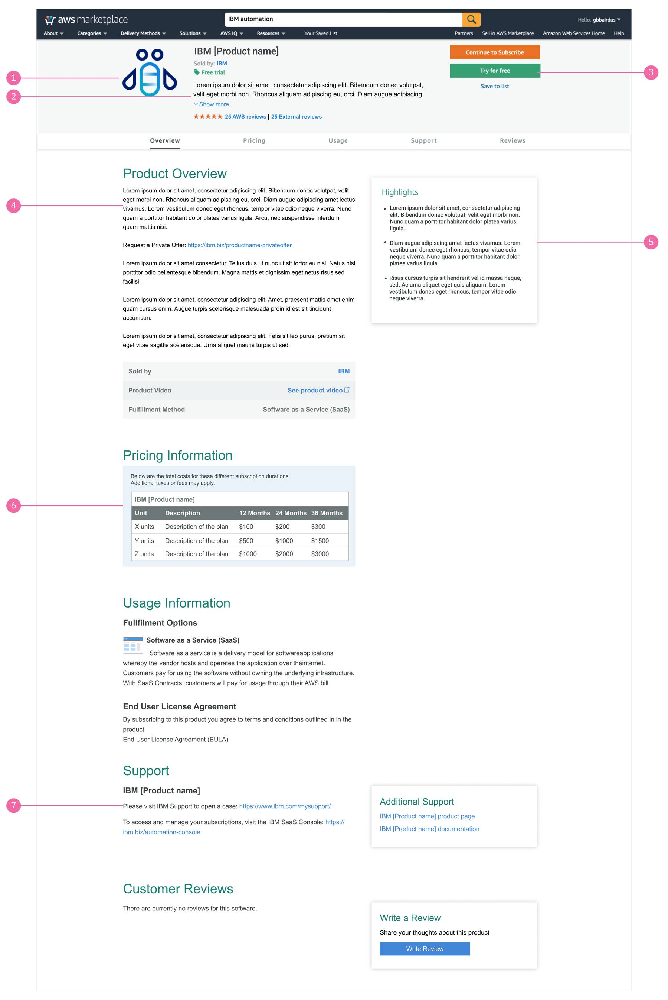
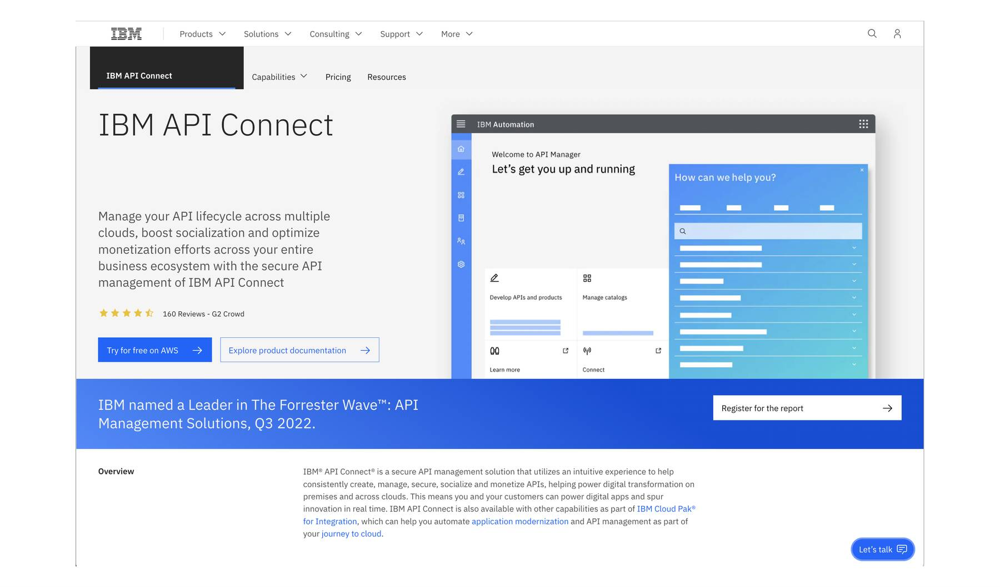
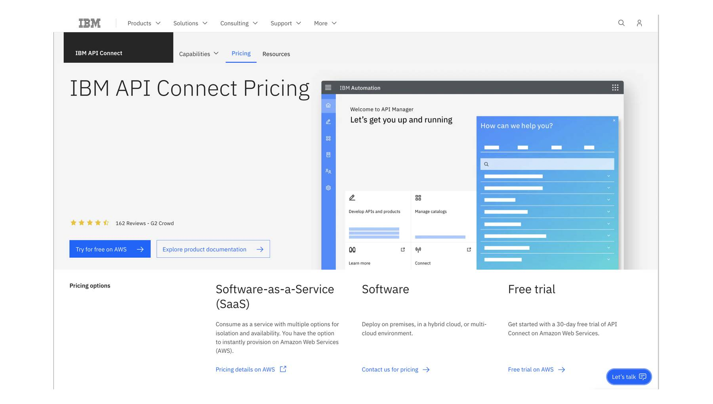

import { Breadcrumb, BreadcrumbItem } from "carbon-components-react";
import { Link } from "gatsby";

<PageDescription>

People seek knowledge to evaluate if solutions are right for them. To meet their needs and increase our engagement and competitive perception, we seek to clearly articulate the value of our products and services. We can inspire confidence that only IBM is uniquely positioned to fulfill their needs over the competition.

</PageDescription>

To increase our competitiveness in the hyperscaler marketplace and help potential customers accurately evaluate our solutions against their needs and use cases, we should provide the following in our product listing:

- Clearly explained functions & features
- Highlight our differentiators
- Subscription options and clear pricing information
- Free trial availability
- Clear business use case(s)
- Demo (click through)
- Enable to connect with technical sales or support
- Testimonials and positive user reviews (Encourage customer to provide reviews/feedback on AWS)

## Marketplace listing page best practice

### AWS Marketplace:

<Row>
  <Column colMd={8} colLg={10}>

  </Column>
</Row>

1. **Product logo** - App icon (light theme), 150px x 150px, png
2. **Product summary** - A short paragraph to introduce the product offering that is different from the product overview.
3. **Try for free** (optional) - Trial is our opportunity to show our product value and user experience
4. **Product overview**
   - Clearly explain the product functionality and features.
   - Messaging needs to speak to pragmatic buyers looking for the right product.
   - Include up-to-date, easy-to-consume technical documentation.
   - Links should only be shown after the first 300 characters of the product overview
   - Use simple, meaningful links, such as:
   - Trial related link: "https://ibm.biz/productxyzfreetrial"
   - Contact sales link for negotiating a private offer: "[https://ibm.biz/productxyz-privateoffer](https://www.ibm.com/account/reg/us-en/signup?formid=MAIL-cloud&source=ace-aws)"
5. **Product highlights** - 3 bullets concisely illustrate the product differentiators
6. **Pricing information** - Simple, clear, easy-to-understand pricing information
   - Link to the product specific support page on IBM support - Use this string: "Please visit IBM Support to open a case: https://ibm.biz/productxyz-support"
   - Example: https://ibm.biz/contentservices-support.
   - "Contact sales link for negotiating a private offer: https://ibm.biz/productxyz-privateoffer"
7. **Product highlights** - 3 bullets concisely illustrate the product differentiators
8. **Pricing information** - Simple, clear, easy-to-understand pricing information
9. **Support**
   - Link to the product specific support page on IBM support
   - Use this string: "Please visit IBM Support to open a case: https://ibm.biz/productxyz-support ". For example: https://ibm.biz/contentservices-support
   - If your proudct does not have product specific support, use this link: https://www.ibm.com/mysupport
   - Provide link to the IBM SaaS Console. Use this introduction string: “To access and manage your subscriptions, visit the IBM SaaS Console: https://console.saas.ibm.com ”
10. **Additional Support**
    - Link to product page on IBM.com - use this syntax “IBM Product name product page”
    - Link to product documentation - use this syntax “IBM Product name documentation”

<CardGroup>
  <MiniCard
    title="Figma template"
    href="https://www.figma.com/file/SlZ7TK2mTzNLIHZB2dGXRF/MCSP-Discover%2C-Learn%2C-Try%2C-Buy-flows?node-id=1196%3A572095&t=dIldHGZ6ycoeP78Q-1"
    actionIcon="launch"
  ></MiniCard>
  <MiniCard
    title="Graphic asset format"
    href="https://www.figma.com/file/SlZ7TK2mTzNLIHZB2dGXRF/MCSP-Discover%2C-Learn%2C-Try%2C-Buy-flows?node-id=2042%3A429763&t=dIldHGZ6ycoeP78Q-1"
    actionIcon="launch"
  ></MiniCard>
</CardGroup>

### IBM.com

<Row>
  <Column colMd={8} colLg={10}>

Example: IBM product marketing page for API Connect

  </Column>
</Row>

Highlight the trial availability on hyperscaler (e.g. AWS) with a CTA button on the main page. Use **"Try for free on AWS"** as the button label.

<Row>
  <Column colMd={8} colLg={10}>

Example: the IBM product pricing page for API Connect

  </Column>
</Row>

Include a direct link to the AWS marketplace where the user can learn more about the pricing options. Use **"Pricing details on AWS"** as a direct link to navigate to the product listing on AWS marketplace.

## References

- <a
    target="_blank"
    href="https://docs.aws.amazon.com/marketplace/latest/userguide/saas-products.html"
  >
    AWS Marketplace Documentation: SaaS based product
  </a>
