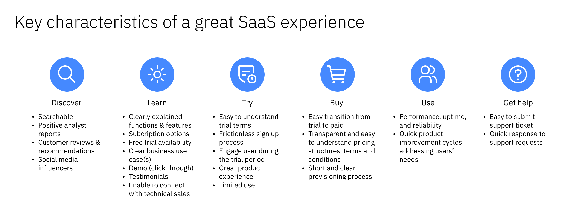

import { Breadcrumb, BreadcrumbItem } from "carbon-components-react";
import { Link } from "gatsby";

<PageDescription>

Software as a service (SaaS) is one of the software distribution models that makes our products available to the users over the internet. SaaS is driving all the growth in the software market and is expected to continue growing. Many IBM clients want to consume IBM products as SaaS on 3rd party clouds instead of legacy on-prem software.  In order to stay relevant and take advantage of the SaaS opportunity, IBM Software needs to transition to the SaaS delivery model.

The goal of the SaaS on Hyperscalers project, internally known as Project Apollo, is to make our SaaS solutions available not only on **IBM Cloud**, but also on **AWS**, **Azure**, and **Google Cloud**.

</PageDescription>

## Why hyperscalers?

Hyperscaler infrastructure allows for the massive scalability and performance of content not possible through simpler cloud-based or big data computing. Many of our clients have chosen to run on a single hyperscaler for their enterprise to take advantage of discounts given by them. This also has the advantage of focusing their IT departments on a single SaaS provider.

Our IBM Software needs to be sold and run on the hyperscalers as well to be an attractive solution to their business needs.

## SaaS experience

To be competitive in the SaaS market, we need to provide exceptional SaaS experience. Design focuses on engaging the users throughout their ** discover-learn-try-buy ** journey.

<Row>
  <Column colMd={8} colLg={10}>

  </Column>
</Row>

## MultiCloud SaaS Platform

A MultiCloud SaaS Platform (MCSP) has been built to support this strategy and to enable and accelerate the adoption of SaaS on multiple hyperscalers across the BUs. MCSP has the goal to enable Try and Buy routes for the respective hyperscaler marketplaces and to accelerate the onboarding of IBM products via a common framework. The first MCSP enablement has been accomplished for AWS and the AWS Marketplace. Work is underway to expand the support to other Hyperscalers, like Azure.

From an experience point of view, IBM products onboarding to MCSP for the SaaS journey will benefit from a series of consistent and already implemented SaaS digital journey flows and experience touch points.

Some flows worth highlighting are:

- Try and Buy sign up flows (including upgrades)
- Email notifications related to the SaaS subscriptions lifecycles and usage
- A centralized IBM SaaS Console for clients to manage their SaaS subscriptions
  - [IBM SaaS Console link](https://console.saas.ibm.com/) (uses IBM Id for login)
  - [IBM SaaS Console online docs link](https://www.ibm.com/docs/en/cloud-paks/1.0?topic=getting-started-saas-console)

Additionally, MCSP provides a set of best practices to promote consistency in the Discover/Learn experiences within those Marketplaces.

Lastly, MCSP has also identified a set of in-product patterns to promote consistency for some common user tasks relevant to SaaS, such as the use of a trial count down banner.

The sections included here describe those user journeys and patterns and provide the supporting design assets, guidance and best practices identified to date.

To read more about MCSP and the onboarding journey see [https://w3.ibm.com/w3publisher/multicloud-saas-platform](https://w3.ibm.com/w3publisher/multicloud-saas-platform)
