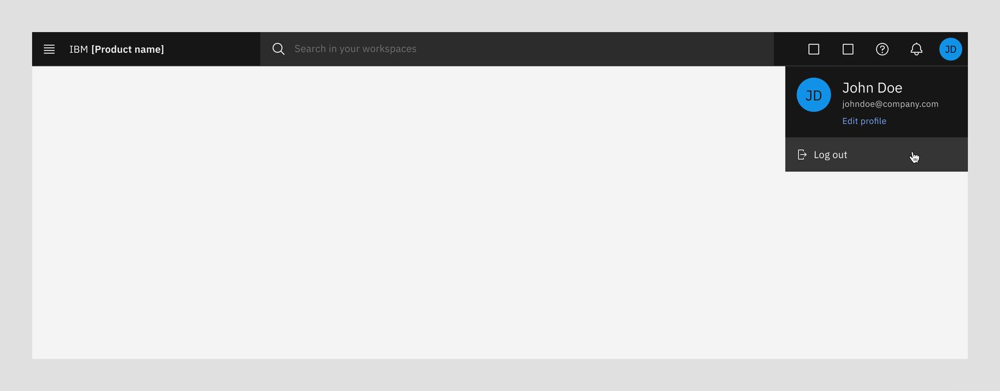
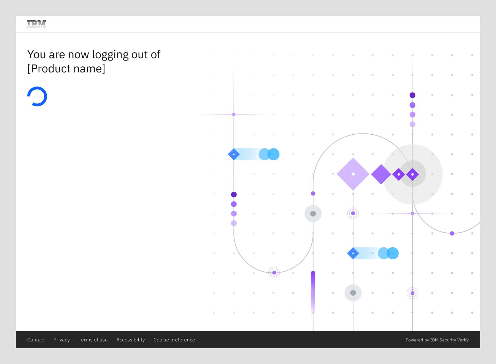
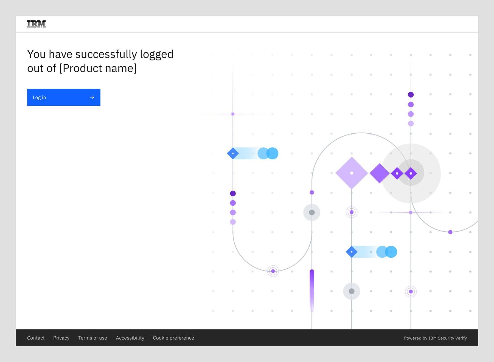
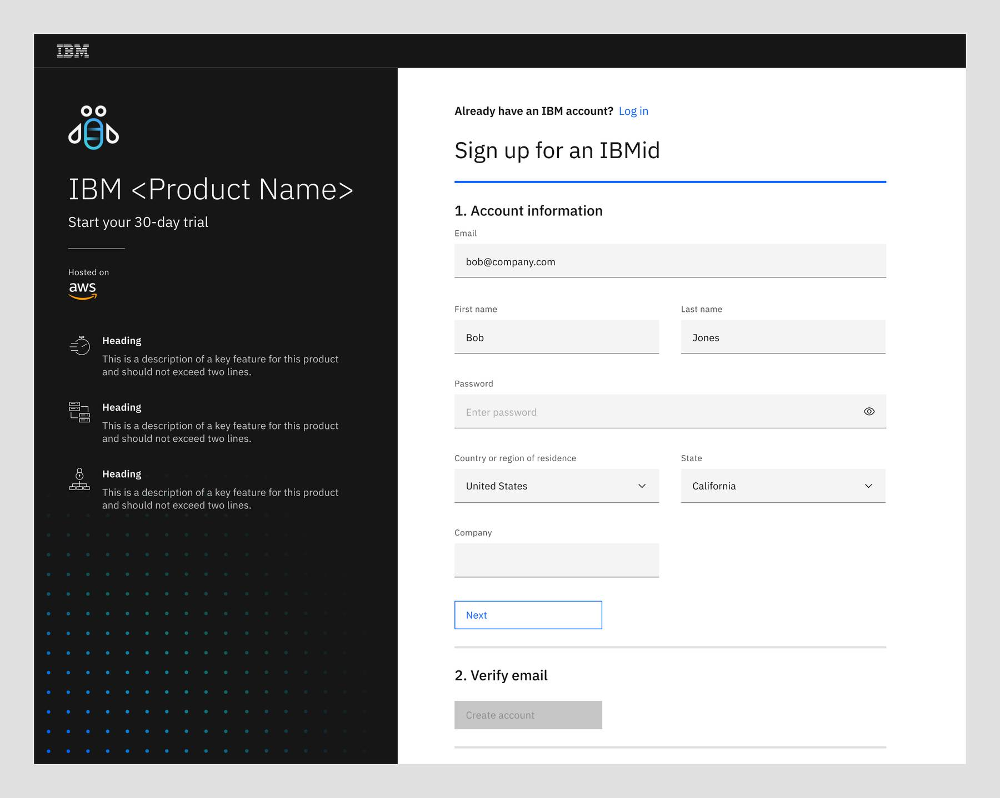
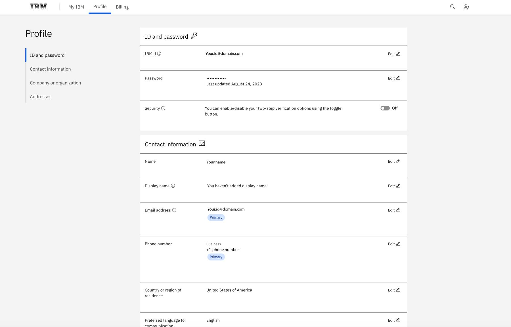
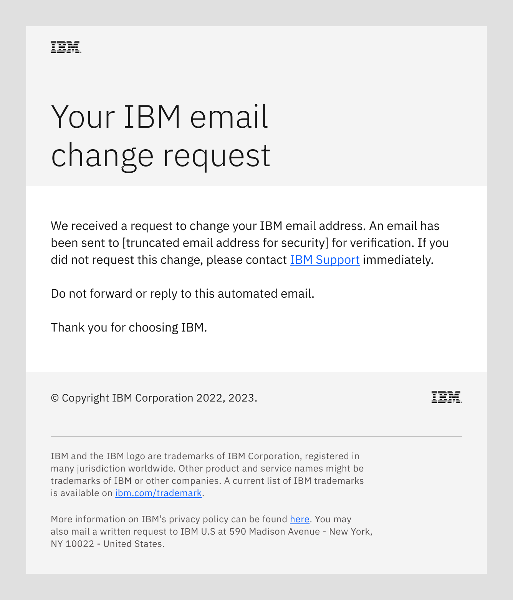
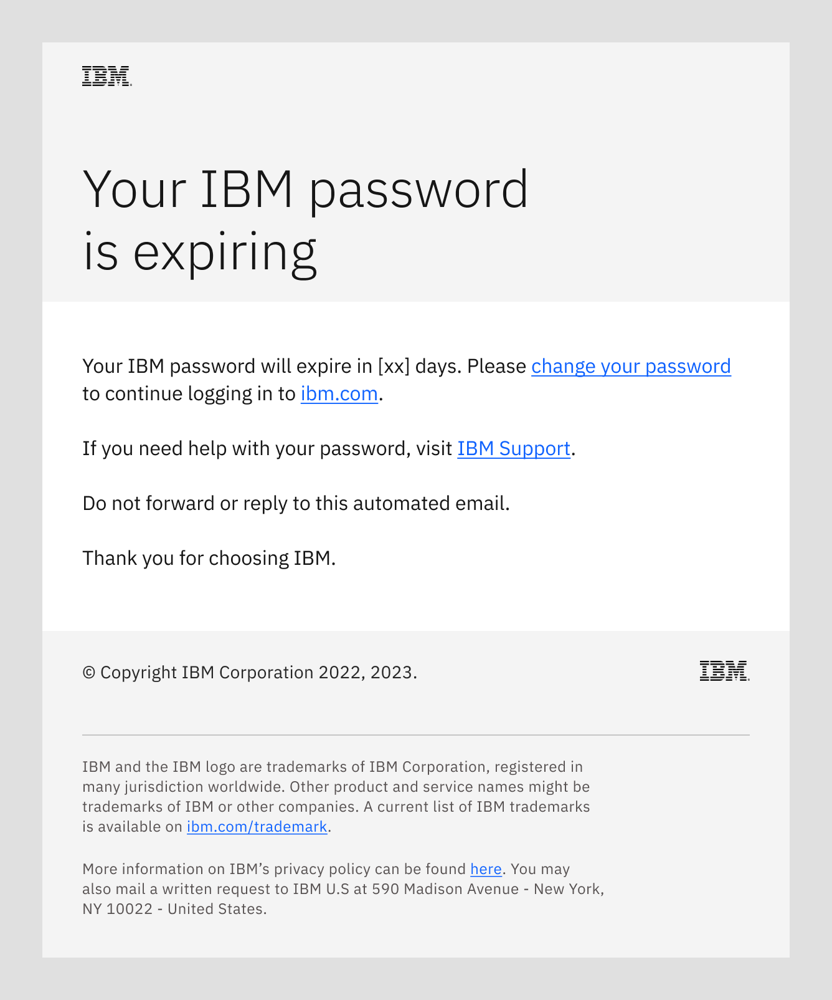

import { Breadcrumb, BreadcrumbItem } from "carbon-components-react";
import { Link } from "gatsby";

<PageDescription>

Potential customers need the capability to evaluate whether a product meets their business needs, gain experience using that product, and get any questions answered. An engaging trial experience that provides a clear demonstration of product capabilities increases try to buy conversions and boosts brand equity. 

</PageDescription>

<AnchorLinks>
  <AnchorLink>Types of trials</AnchorLink>
  <AnchorLink>AWS Trial registration flow (URX form)</AnchorLink>
  <AnchorLink>Launch points</AnchorLink>
  <AnchorLink>URX and IBMid</AnchorLink>
  <AnchorLink>IBMid log in (URX form)</AnchorLink>
  <AnchorLink>IBMid logout (URX form)</AnchorLink>
  <AnchorLink>URX Sandbox Trial, Trial, and Freemium registration flow</AnchorLink>
  <AnchorLink>Signup and provision</AnchorLink>
  <AnchorLink>URX left hand panel</AnchorLink>
  <AnchorLink>Multi-factor authentication enrollment</AnchorLink>
  <AnchorLink>Try experience upgrade</AnchorLink>
  <AnchorLink>Try experience components</AnchorLink>
  <AnchorLink>Change user email</AnchorLink>
  <AnchorLink>Change user password</AnchorLink>
  <AnchorLink>Related</AnchorLink>
  <AnchorLink>References</AnchorLink>
</AnchorLinks>

## Types of trials

To help the potential customer to evaluate the product against their business needs and use cases, different types of trial can be considered to provide the best experience when interacting with IBM.

### Product trial

A free product trial can be time-bound or with other usage limits other than time. It allows users to gain full product access up to the limit set forth in the trial terms (e.g. 30 days or storage up to 25GB/month). Users can choose to upgrade from a trial to a paid service through the same hyperscaler platform where they have launched the trial sign-up process in the first place.

<Row>
  <Column colMd={8} colLg={10}>

  </Column>
</Row> 

If trial is time-bound, a [trial period count down widget](https://pages.github.ibm.com/cdai-design/pal/cloud-paks/trial-countdown/usage/) is displayed in the global header 

<Row>
  <Column colMd={8} colLg={10}>

  </Column>
</Row>

If trial is not time-bound, a Buy button is displayed in the global header

### Test drive

(Available as an option on Azure Marketplace)
Test drive is an assigned, pre-configured environment that allowed users to try out the key features of the product without the need of signing up for an account. Once a test drive instance is assigned, it is available for use by that customer for a set period. After the period has ended, the instance will be deleted and user will no longer have access. User will be contacted through email with links for further information and action.

<Row>
  <Column colMd={6} colLg={6}>

  </Column>
</Row>

Access Test Drive from Azure Marketplace

## AWS Trial registration flow (URX form)
This flow allows users to create an IBMid using the URX form when provisioning a product on Amazon Web Services (AWS) that use URX form (for example, non-IBM Cloud products). You can use the steps listed below to create an AWS Trial registration flow.

### Launch points
The user can sign up for the AWS SaaS product trial through IBM.com or the AWS marketplace.

When a user clicks on the **Try for Free** button on the AWS product listing, they need to sign into their AWS Marketplace account first and create a free contract through AWS. At the end of the transaction, they will be provided a link to configure their account with IBM through this registration page. See the <a target="_blank" href="https://docs.aws.amazon.com/marketplace/latest/buyerguide/buyer-saas-products.html#saas-free-trials-for-contracts">documentation on AWS Marketplace</a> for more information.

<Row>
  <Column colMd={8} colLg={10}>

** IBM.com **

  </Column>
</Row>

<Row>
  <Column colMd={8} colLg={10}>

** AWS Marketplace **

  </Column>
</Row>

### URX and IBMid
Before users can access an IBM SaaS product or a product trial, they must first be authenticated with IBMid. A user can create a new IBMid or login to an IBMid using the standard Unified Registration Experience (URX) form for products not hosted on the IBM Cloud catalog. The URX form collects and validates the user’s account information, and records the user’s consent to opt in to email communication, data privacy policy, and acknowledgement of product terms and conditions. When a user is provisioning an IBM product through AWS, they will receive this specific AWS URX registration form.

<InlineNotification kind="info">

**Note:** Product teams must use the required fields listed here, but may choose to add additional fields from a limited selection such as “Are you a student?” and “Company name” to the right side of the URX form page. In addition, on the left side of the URX form page, there is a configurable panel that can be used to provide product specific information.

</InlineNotification>

### IBMid registration process
There are three unique scenarios for registering an IBMid based on whether the user already has an IBMid or needs to create one: 
1. Users who already have an IBMid can login and register for the product-specific trial. 
2. Users without an IBMid can use the LinkedIn auto-fill option to enter their account information and create a new IBMid. 
3. Users without an IBMid can enter their account information and create a new IBMid.

### URX form
The URX form used for SaaS product trial sign up for products being provisioned on AWS should use the following template.

<Row>
  <Column colMd={8} colLg={10}>

** URX form **

  </Column>
</Row>

1. **Product name**
2. **Sub-headline:** “Start your x-day trial”.
3. **IBMid login:** Login option for users with an IBMid.
4. **Sign up for IBMid form:** Limited customization is allowed. Teams may elect to add optional fields such as “Are you a student?” and “Company name”, but the fields shown are the minimum requirement.  
5. **Product trial sign up panel (customizable):** Product team can customize the contents in this panel.
6. **Hyperscaler cloud provider logo:** This logo should be displayed if the user launches the sign up flow from one of the hyperscaler marketplaces.

<InlineNotification kind="info">

**Note:** For guidance on writing content to include in the left hand panel of URX forms, see [Left hand panel guidance](https://pages.github.ibm.com/cdai-design/pal/saas-for-hyperscalers/try/#urx-left-hand-panel).

</InlineNotification>

## IBMid log in (URX form)

This flow allows users to access their product or Try experience and applies to non-IBM Cloud products provisioned through IBM. 

#### Example

Reference this product agnostic [IBMid login example](https://login.ibm.com/idaas/mtfim/sps/idaas/login?client_id=ZTY0MDc5OGUtOTE3OC00&Ta[…]d458-4b83-9372-4fd592b92bd8%26client_id%3DZTY0MDc5OGUtOTE3OC00) to see how this flow can be used in practice.

### User encounters log in screen

The user is prompted to enter their IBMid/ email address. The user can either manually enter this information or utilize browser autofill functionalities. 

<Row>
  <Column colMd={8} colLg={10}>

  </Column>
</Row>

1. **Create an IBMid link:** Directs user to the IBMid account creation form (URX)
2. **Existing IBMid field** 
3. **Continue button:** Remains disabled until IBMid has been entered and validated
4. **Remember IBMid:** User can optionally select for their browser to remember their IBMid faster login in the future
5. **Forgot IBMid link**  
6. **Support link**

### Email validation and password field

The system verifies that the email address is registered to an IBMid. Once validated, the user is presented with a field to enter their password. 

<Row>
  <Column colMd={8} colLg={10}>

  </Column>
</Row>

1. **Load indicator:** Replaces the Continue button once clicked before loading the password screen

  

<Row>
  <Column colMd={8} colLg={10}>

  </Column>
</Row>

1. **Account label:** Indicates the account the user is logging into, as entered on previous screen
2. **Password field** 
3. **Log in button:** Remains disabled until password has been entered 
4. ** Forgot password link:** Allows user to reset their password

### User enters their password and logs in

The user may manually enter their account password or utilize their browser’s saved password autofill functionality. Once submitted, their password is validated and the user is logged in to their account.

<Row>
  <Column colMd={8} colLg={10}>

  </Column>
</Row>

1. **Load indicator:** Replaces the Log in button once clicked before redirecting the user into the product or Try experience 

## IBMid logout (URX form) 
This flow outlines the process for a user to log out of an IBMid account.

### Navigating to the logout option
The logout pattern is visible to all users within a product provisioned through a URX form. The starting point of the flow is when the user clicks **Logout** in the user profile. 

<Row>
  <Column colMd={8} colLg={10}>

  </Column>
</Row>

### Logging out 
After clicking **Log out**, the following message is displayed: “You are now logging out of [Product name]”, indicating that the user is logging out. A loading status icon also appears to show that the logging out is in progress. 

<Row>
  <Column colMd={8} colLg={10}>

  </Column>
</Row>

### Successful logout
After the user has logged out, the following message is displayed: “You have successfully logged out of [Product name]”, indicating that the user has logged out successfully. 

<Row>
  <Column colMd={8} colLg={10}>

  </Column>
</Row>

### Login screen
The user can click the **Log in** button to be redirected to the main login page if desired.

For information on URX login, refer to [IBMid log in (URX form)](https://pages.github.ibm.com/cdai-design/pal/saas-for-hyperscalers/try/#ibmid-log-in-(urx-form)) page. 

<Row>
  <Column colMd={8} colLg={10}>

  </Column>
</Row>

## URX Sandbox Trial, Trial, and Freemium registration flow

This flow allows users to sign up for a Sandbox Trial, Trial, or Freemium account for products that are provisioned on IBM Marketplace and are not IBM Cloud products. In signing up for a Try experience, users will be creating an IBMid (unless they already have one).

#### Example

Reference this product agnostic [IBMid registration example]( https://www.ibm.com/account/reg/us-en/signup?formid=urx-19776&target=https%3A%2F%2[…]319-9762-4be6-b91f-9745e9e30625%26client_id%3DMyIBMDallasProdCI) to see how this flow can be used in practice.

### Navigating to the Try experience sign-up page

There are multiple ways a user can navigate to a Try experience registration form. The most common is from the marketing site, where users can click on a CTA on the homepage, navigation, or interior site pages.

<InlineNotification kind="info">

**Note:** Users cannot access the URX registration form via the IBM Cloud Catalog because the Cloud Catalog only includes products that are provisioned on IBM Cloud. If this is the case, its Try experience would be registered via the IBM Cloud registration form (pattern coming soon).

</InlineNotification>

<Row>
  <Column colMd={8} colLg={10}>

  </Column>
</Row>

### Registration process

There are three unique scenarios for the first step which are dependent on whether the user already has an IBMid or needs to create one. 

1. Users without an IBMid can enter the account information and create a new IBMid.

2. Users without an IBMid can use the LinkedIn auto-fill option to enter their account information and create a new IBMid. 

3. Users who already have an IBMid can log in and register for the product-specific Try experience. 

  

<Tabs>

<Tab label="User needs to create an IBMid">

Users who do not have an existing IBMid are prompted to continue through the registration process, including the following steps:

- **Password creation:** In order to maintain platform and account security, stringent password requirements are enforced. The user is presented with these requirements in real time upon clicking into the field, which are automatically checked off as they are met.

- **Email validation:** A verifcation code is sent to the user’s email which must be entered in the email verification field to confirm the user's identity and ownership of their account.

- **Notice and choice acknowledgement:** The notice and choice widget is used to obtain consent to contact the user by email and/or phone. 

  

<Row>
  <Column colMd={8} colLg={10}>

  </Column>
</Row>

  

<Row>
  <Column colMd={8} colLg={10}>

  </Column>
</Row>

1. **Log in link:** Users who already have an IBMid can log in directly
2. **Autofill with LinkedIn:** Users have the ability to autofill their first name, last name, and email address using their LinkedIn account information
3. **Pictograms and benefits:** Content and pictograms are determined by the product teams and should explain the value proposition in two lines or less (excluding titles) and be limited to four bullet points per form. Designers must leverage the [IBM pictogram library](https://www.ibm.com/design/language/iconography/pictograms/library/).
4. ** Password field:** Password requirements are displayed upon clicking into the field
5. **Create account button:** Remains disabled until all fields have been filled 

  
  

<Row>
  <Column colMd={8} colLg={10}>

  </Column>
</Row>

  

<Row>
  <Column colMd={8} colLg={10}>

  </Column>
</Row>

  

1. **Log in link:** Users who already have an IBMid can log in directly
2. **Verification code:** Users are emailed a verification code which must be confirmed in this field
3. **Resend code button:** If users do not receive the verification code, they may request a new one here
4. ** Notice and choice widget:** Users review the terms and conditions and set their contact consent selections
5. **Create account button:** Remains disabled until all fields and checkboxes have been filled

  

</Tab>

<Tab label="User creates account using LinkedIn autofill">

Users who do not have an existing IBMid can choose to use the LinkedIn autofill feature on the page. This feature will automatically fill the user's first name, last name, and email address for the user based on the information in their LinkedIn profile. 

  

If the user is not logged into LinkedIn at the time of selecting the autofill functionality, they will be prompted to log in so that IBM can access their profile information. After their information from LinkedIn is populated, the user must then follow all of the same steps laid out in the previous tab.

  

<Row>
  <Column colMd={8} colLg={10}>

  </Column>
</Row>

  

1. **Autofill browser modal:** Upon clicking Autofill with LinkedIn, a browser permissions modal appears for users to allow LinkedIn to autofill their account details

  

</Tab>

<Tab label="User already has an IBMid">

Users who already have an IBMid are redirected to the IBMid log in page as outlined [here](#ibmid-log-in-(urx-form)).

</Tab>

</Tabs>

### Successful registration

Upon successfully registering for their account or Try experience, the user is redirected into the product. The next time the user logs in, they will be redirected to the IBMid log in page as outlined [here](#ibmid-log-in-(urx-form)). 

<InlineNotification kind="info">

**Note:** For guidance on writing content to include in the left hand panel of URX forms, see [Left hand panel guidance](https://pages.github.ibm.com/cdai-design/pal/saas-for-hyperscalers/try/#urx-left-hand-panel).

</InlineNotification>

## Signup and provision

<InlineNotification kind="warning">

**Note:** This section is in the process of being updated to the latest URX form design as shown [here](https://pages.github.ibm.com/cdai-design/pal/saas-for-hyperscalers/try/#urx-sandbox-trial-trial-and-freemium-registration-flow).

</InlineNotification>

The user will go through the IBMid signup (URX form) and trial instance provisioning in a sequential manner.

#### Step 1: Account information

<Row>
  <Column colMd={8} colLg={10}>

  </Column>
</Row>

#### Step 2: Verify email

An email verification message will be sent to the email address provided in step 1. User will copy and paste the verification code in the URX form.

<Row>
  <Column colMd={8} colLg={10}>

  </Column>
</Row>

#### Step 3: Account Privacy

After the user accept the terms and conditions, an account is created and user is presented with the Account Privacy policy.

<Row>
  <Column colMd={8} colLg={10}>

  </Column>
</Row>

#### Step 4: Instance provisioning information

User may provide the needed information on the screen right away. However, they may also exit the flow at this point and use the email sent to the email address to access this screen at a later time. See ["Your trial has begun" in email templates](https://pages.github.ibm.com/cdai-design/pal/saas-for-hyperscalers/email-templates/) for details

<Row>
  <Column colMd={8} colLg={10}>

  </Column>
</Row>

<InlineNotification kind="info">

**Note:** The instance provisioning information screen is not part of the URX form. However, in order to provide a seamless experience to the user, the same product trial sign-up panel should be used.

</InlineNotification>

#### Step 5: Getting your trial ready

<Row>
  <Column colMd={8} colLg={10}>

While the trial instance is being provisioned, the user will see the messaging screen that informs the user about the progress.

  </Column>
</Row>

#### Step 6: Trial instance is ready

Once the provisioning process is completed, the user will be redirected to this screen with the direct access to the trial instance.

An email will be sent to the user once the provisioning process is complete. User can access to the trial instance using the link provided in the email. See "Welcome to your trial" in email template guideline for details

<Row>
  <Column colMd={8} colLg={10}>

  </Column>
</Row>

 

<CardGroup>
  <MiniCard
    title="Figma template"
    href="https://www.figma.com/file/SlZ7TK2mTzNLIHZB2dGXRF/MCSP-Onboarding-Guide?node-id=1903%3A423457&t=luuwcPD9pEO2cr6L-1"
    actionIcon="launch"
  ></MiniCard>
  <MiniCard
    title="App icons library"
    href="https://www.ibm.com/design/language/iconography/app-icons/library"
    actionIcon="launch"
  ></MiniCard>
</CardGroup>{" "}

<InlineNotification kind="info">

**Note:** For guidance on writing content to include in the left hand panel of URX forms, see [Left hand panel guidance](https://pages.github.ibm.com/cdai-design/pal/saas-for-hyperscalers/try/#urx-left-hand-panel).

</InlineNotification>

## URX left hand panel
This flow provides guidance to product teams on what should be added to the URX form for trials. Product teams can use the URX left hand panel as an effective landing page to motivate and remind users the value of enrolling for a trial. Product teams can customize the contents of this panel and add information specific to their products, such as benefits and key features. 

** URX form **
<Row>

  <Column colMd={8} colLg={10}>

  </Column>
</Row>

### Best practices for creating a successful URX left hand panel 
- The content added to the URX left hand panel should echo the same benefits featured on the marketing page.
- Product teams can have 3 to 5 bullet points in the URX left hand panel. 
- The list items must explain the the benefits of using the trial.
- The list items must remind users what they are going to get from signing up for the trial. 
- The list items must help users to clearly understand the value of using the trial. 
- The use of additional content beyond bullet points such as images, badges, or animated GIFs is not permitted in URX left hand panels, and cannot be added using the PerForm tool.

### Guidance for different types of trials
At IBM we offer three different types of product trial offerings. There are three possible trial formats offered at IBM: Trial, Sandbox Trial, and Freemium. Your product team maybe offering one trial type or a combination of multiple trials. The right approach must ultimately depend on your product, your users, and your business priorities. Therefore, the type of information that you add to the trial landing page will also differ based on the type of trial your product team chooses. 
#### 1. Trial
Trial users can experience an entire product for a limited period of time for free. The usage of the entire product within a short time enables users to set their expectations and use the Trial immediately. This information can be used to draw attention to the users in the URX left hand panel. For example,

<h5>Infrastructure and resource correlation
<Row>
  <Column colMd={8} colLg={10}>

IBM [Product name] consolidates and correlates key information to proactively alert IT Ops teams about potential problems.

  </Column>
</Row>
</h5>

#### 2. Sandbox Trial
Sandbox Trial allows users to immediately access a working instance of a product for evaluation at no cost. Product teams can use this information effectively by listing the value proposition and key benefits of using the Sandbox Trial. For example,

<h5>Easily manage your applications
<Row>
  <Column colMd={8} colLg={10}>

Discover, map, monitor, and troubleshoot your applications with full stack visibility in 5 minutes. 

  </Column>
</Row>
</h5>

#### 3. Freemium
Freemium trial gives users access to part of the product or feature for an unlimited time in the hope that Freemium users will eventually graduate to a paid version of the software. For example,

<h5>Trial benefits
<Row>
  <Column colMd={8} colLg={10}>

  Get up to 100,000 API calls at no cost to evaluate the full product features.

  </Column>
</Row>
</h5>

### Product benefits and left hand panel

Here is an example of how the benefits of a product are used to populate the content for the left hand panel. You can see the closeness of benefits between the product marketing page and URX left hand panel for IBM API Connect. Though not 1:1, the ones that make sense have been carried over. Product teams are encouraged to follow this process when creating the content for the left hand panel. 

** IBM API Connect: benefits **
<Row>

  <Column colMd={8} colLg={10}>

  </Column>
</Row>

** IBM API Connect: left hand panel information **
<Row>

  <Column colMd={8} colLg={10}>

  </Column>
</Row>

### Additional examples

#### Example 1
<h5>Powerful real-time speech synthesis
<Row>
  <Column colMd={8} colLg={10}>

Convert written text to natural-sounding speech using our latest neural speech synthesizing techniques.

  </Column>
</Row>
</h5>

#### Example 2
<h5>Build your journey to public cloud
<Row>
  <Column colMd={8} colLg={10}>

Build, deploy, and manage solutions in IBM's public cloud.

  </Column>
</Row>
</h5>

#### Example 3
<h5>Instant optimization
<Row>
  <Column colMd={8} colLg={10}>

Non-disruptively optimize your cloud resources from our user-friendly interface within seconds.

  </Column>
</Row>
</h5>

#### Example 4
<h5>Unleash application performance
<Row>
  <Column colMd={8} colLg={10}>

Gain complete visibility into your public cloud application and infrastructure stack.

  </Column>
</Row>
</h5>

#### Example 5
<h5>Highly secure
<Row>
  <Column colMd={8} colLg={10}>

Securely expose your data and business applications.

  </Column>
</Row>
</h5>

#### Example 6
<h5>Full lifecycle API management
<Row>
  <Column colMd={8} colLg={10}>

Drive new engagement models and channels by accelerating your API-led digital transformation.

  </Column>
</Row>
</h5>

## Multi-factor authentication enrollment

Multi-factor authentication requires users to complete an additional layer of identification beyond their username and password to enhance security. Users can choose from five verification options and can configure more than one.

Multi-factor authentication can be implemented for all products and Try experiences and is up to the discretion of product teams when to incorporate into the registration flow. If implemented, the multi-factor authentication enrollment page will appear as the final step of the registration flow.

### User encounters multi-factor authentication enrollment screen

The user is prompted to select at least one of the following multi-factor authentication methods to begin enrollment as part of their first time accessing a product. 

- IBM Security Verify app

- Third-party verification apps

- Built-in device sensor(s) (biometric)

- Physical security key

- Email verification.

### Selecting multi-factor authentication method

The user can choose from five different authentication methods (IBM Security Verify app, Authenticator app, Built-in device sensor, Physical security key, or Email). The following steps will depend on the user's authentication method(s) of choice.

<Tabs>

<Tab label="IBM Security Verify app">

Users who select authentication through the IBM Security Verify app are presented with the following screens and instructions to walk them through the registration process. 

  

Upon successful registration using the IBM Security Verify App, the user is presented with the successful enrollment screen. If the user changes their mind or is unable to enroll using this method, they may click Use another method to go back to the initial screen.

  

<InlineNotification kind="info">

**Note:** This method requires the use of a mobile device that is installed with an IBM Security Verify application.

</InlineNotification>

  

<Row>
  <Column colMd={8} colLg={10}>

  </Column>
</Row>

  

<Row>
  <Column colMd={8} colLg={10}>

  </Column>
</Row>

  

<Row>
  <Column colMd={8} colLg={10}>

  </Column>
</Row>

  

<Row>
  <Column colMd={8} colLg={10}>

  </Column>
</Row>

  

<Row>
  <Column colMd={8} colLg={10}>

  </Column>
</Row>

  

<Row>
  <Column colMd={8} colLg={10}>

  </Column>
</Row>

  

<Row>
  <Column colMd={8} colLg={10}>

  </Column>
</Row>

  

</Tab>

<Tab label="Authenticator app">

Users who select authentication through a third-party authenticator app are presented with the following screens and instructions to walk them through the registration process. 

  

Upon successful registration using a third-party authenticator app, the user is presented with the successful enrollment screen. If the user changes their mind or is unable to enroll using this method, they may click Use another method to go back to the initial screen.

  

<InlineNotification kind="info">

**Note:** This method requires the use of a mobile device with a compatible authenticator application installed.

</InlineNotification>

  

<Row>
  <Column colMd={8} colLg={10}>

  </Column>
</Row>

  

<Row>
  <Column colMd={8} colLg={10}>

  </Column>
</Row>

  

<Row>
  <Column colMd={8} colLg={10}>

  </Column>
</Row>

  

<Row>
  <Column colMd={8} colLg={10}>

  </Column>
</Row>

  

<Row>
  <Column colMd={8} colLg={10}>

  </Column>
</Row>

  

<Row>
  <Column colMd={8} colLg={10}>

  </Column>
</Row>

  

</Tab>

<Tab label="Built-in device sensor">

Users who select authentication through a built-in sensor are presented with the following screens and instructions to walk them through the registration process. 

  

Upon successful registration and naming their built-in sensor enabled device, the user is presented with the successful enrollment screen. If the user changes their mind or is unable to enroll using this method, they may click Use another method to go back to the initial screen.

  

<InlineNotification kind="info">

**Note:** This method requires a compatible device with a built-in sensor, such as a Macbook with TouchID enabled.

</InlineNotification>

  

<Row>
  <Column colMd={8} colLg={10}>

  </Column>
</Row>

  

<Row>
  <Column colMd={8} colLg={10}>

  </Column>
</Row>

  

<Row>
  <Column colMd={8} colLg={10}>

  </Column>
</Row>

  

<Row>
  <Column colMd={8} colLg={10}>

  </Column>
</Row>

  

<Row>
  <Column colMd={8} colLg={10}>

  </Column>
</Row>

  

<Row>
  <Column colMd={8} colLg={10}>

  </Column>
</Row>

  

<Row>
  <Column colMd={8} colLg={10}>

  </Column>
</Row>

  

</Tab>

<Tab label="Physical security key">

Users who select authentication through a physical security key are presented with the following screens and instructions to walk them through the registration process. 

  

Upon successful registration and naming their physical security key device, the user is presented with the successful enrollment screen. If the user changes their mind or is unable to enroll using this method, they may click Use another method to go back to the initial screen.

  

<InlineNotification kind="info">

**Note:** This method requires the use of a physical hardware security key (e.g. Yubikey).

</InlineNotification>

  

<Row>
  <Column colMd={8} colLg={10}>

  </Column>
</Row>

  

<Row>
  <Column colMd={8} colLg={10}>

  </Column>
</Row>

  

<Row>
  <Column colMd={8} colLg={10}>

  </Column>
</Row>

  

<Row>
  <Column colMd={8} colLg={10}>

  </Column>
</Row>

  

<Row>
  <Column colMd={8} colLg={10}>

  </Column>
</Row>

  

<Row>
  <Column colMd={8} colLg={10}>

  </Column>
</Row>

  

<Row>
  <Column colMd={8} colLg={10}>

  </Column>
</Row>

  

<Row>
  <Column colMd={8} colLg={10}>

  </Column>
</Row>

  

<Row>
  <Column colMd={8} colLg={10}>

  </Column>
</Row>

  

<Row>
  <Column colMd={8} colLg={10}>

  </Column>
</Row>

  

</Tab>

<Tab label="Email">

Users who select authentication using an email address are presented with the following screens and instructions to walk them through the registration process. 

  

After entering their email address and requesting a verification code, the user is sent an automated email. Upon receiving and entering the verification code into the input field, the user is presented with the successful enrollment screen. If the user changes their mind or is unable to enroll using this method, they may click Use another method to go back to the initial screen.

  

<Row>
  <Column colMd={8} colLg={10}>

  </Column>
</Row>

  

<Row>
  <Column colMd={8} colLg={10}>

  </Column>
</Row>

  

<Row>
  <Column colMd={8} colLg={10}>

  </Column>
</Row>

  

<Row>
  <Column colMd={8} colLg={10}>

  </Column>
</Row>

  

<Row>
  <Column colMd={8} colLg={10}>

  </Column>
</Row>

  

<Row>
  <Column colMd={8} colLg={10}>

  </Column>
</Row>

  

</Tab>

</Tabs>

<InlineNotification kind="warning">

**Note:** Pattern currently in development

</InlineNotification>

## Try experience upgrade

This flow is intended to provides users with a self-service upgrade path from a Sandbox Trial or Trial. As a product team, you can use the steps listed below to upgrade a user’s Try experience.

### Navigating to the upgrade options

The upgrade pattern must be visible for Sandbox Trial and Trial users. 

The starting point of the flow is when the user is using a Try experience and hovers over the Days remaining indicator and clicks View purchase options.  

  

<Row>
  <Column colMd={8} colLg={10}>

  </Column>
</Row>

1. **Days remaining in Try experience:** Persistent indicator shows user the number of days remaining in their Try experience and clicking on the indicator opens a modal below

  

<Row>
  <Column colMd={8} colLg={10}>

  </Column>
</Row>

1. **Trial end text:** Trial end date is displayed to user
2. **View purchase options button:** User can access in-product upgrade and pricing screen at any time from this screen

  

### Selecting a plan

The user can view their current plan, compare costs, and select the plan that suits their needs within the pricing table. 

<Row>
  <Column colMd={8} colLg={10}>

  </Column>
</Row>

1. **Current plan indicator**
2. **Features:** This column lists the plan's available features which should be value-focused and specific to individual plans for easy comparison 
3. **Selected plan indicator:** Indicates the plan the user has selected to upgrade to
4. **Pricing:** May be listed per feature, per month, or per user
5. **Upgrade button:** Remains disabled until a new plan in selected

### Choosing a payment method

The user is prompted to enter or select their credit card and the billing information. The process the user follows will vary depending on whether they have a saved payment method on file or need to add a new payment method. 
<Tabs>
<Tab label="Payment method saved">

If the user has already added their credit card information (e.g. the card they entered during registration), the payment screen will display the saved credit card and the associated billing details. The user has the option to use the saved credit card or add a new one.

  

<Row>
  <Column colMd={8} colLg={10}>

  </Column>
</Row>

1. **Saved payment method:** User already has a payment method saved to their account
2. **Order summary:** A summary of billing line items is shown to the user to estimate costs associated with upgrade 
3. **Upgrade button:** Remains disabled until a valid payment method is selected

</Tab>

<Tab label="Add new payment method">

The user can add a new credit card by clicking Add a new payment method.  

  

<Row>
  <Column colMd={8} colLg={10}>

  </Column>
</Row>

1. **New payment method:** User must add a new payment method to their account before proceeding with upgrade
2. **Order summary:** A summary of billing line items is shown to the user to estimate costs associated with upgrade 
3. **Upgrade button:** Remains disabled until a valid payment method is selected

  

The user is asked to provide the associated billing information for their new credit card. The user can click the Add payment method button to save their new card details.

  

<Row>
  <Column colMd={8} colLg={10}>

  </Column>
</Row>

1. **New payment method billing details:** User must enter their billing details for their new payment method
2. **Order summary:** A summary of billing line items is shown to the user to estimate costs associated with upgrade 
3. **Upgrade button:** Remains disabled until a valid payment method is selected

</Tab>

</Tabs>

### Successful upgrade 

After the user has saved and/or selected their payment method, they can proceed with the upgrade. 

<Row>
  <Column colMd={8} colLg={10}>

  </Column>
</Row>

<InlineNotification kind="warning">

**Note:** Pattern currently in development

</InlineNotification>

## Try experience components

### Trial countdown

Sandbox Trials and Trials are both time-bound. This means users only have access to the Try experience for a limited number of days. Display this [Sandbox Trial and Trial countdown](https://pages.github.ibm.com/cdai-design/pal/cloud-paks/trial-countdown/usage/) in the global header of your Try experience to ensure users are aware of the time they have left before their offer ends. 

### Navigation on MCSP and Cloud

It’s critical to have an intuitive navigation within your Try experience that is consistent with other IBM products. The navigation component you should use depends on your product. 

- If you’re designing a Try experience for an IBM Cloud product that has not joined MCSP use this [UI navigation](https://pages.github.ibm.com/cdai-design/cloud-pal/cloudpal-guidance/navigation-on-cloud/).

- If you’re designing a Try experience for a product that has joined MCSP use this [UI navigation](https://pages.github.ibm.com/cdai-design/pal/saas-for-hyperscalers/use-patterns/ui-navigation/). 

### Empty state

According to [Carbon](https://carbondesignsystem.com/patterns/empty-states-pattern/), “empty states are moments in an product or service where there is no data to display to the user”.  Although they are most commonly found when a user first interacts with a product or page, they also can be shown when data is deleted or otherwise unavailable. 

Empty states can be used in all three types of Try offers (Sandbox Trials, Trials, and Freemiums). They should include next steps to help the user populate the corresponding section. Use these steps as an opportunity to educate the user about why a populated section would provide value. Refer to the [empty state](https://pages.github.ibm.com/cdai-design/pal/patterns/empty-state/usage/#content) guidance to learn how to leverage this component in your Try experience. 

## Change user email
This email flow enables a user who is logged in to their ibm.com profile to securely change their IBM email address. The emails
are sent to the user’s contact email address.

<Row>
<Column colMd={8} colLg={8}>

</Column>
</Row>

When the user submits an email address change request, the flow sends two automated emails to verify the identity of
the requester.

### Change verification email
One email, with a verification code, is sent to the new IBM email address. This email directs the recipient to
enter the verification code into their IBM profile change request at ibm.com. Their email address (IBMid or
contact) is not changed until the verification code is entered correctly.

<Row>
<Column colMd={8} colLg={8}>

Subject: Your IBM email change request

</Column>
</Row>

### Change notice email
A second email is sent to the user’s existing IBM email address to notify them of the profile change request. This
email directs the user to contact IBM immediately if they did not request a change to their IBM email address.

<Row>
<Column colMd={8} colLg={8}>

Subject: Your IBM email change request

</Column>
</Row>

### Profile updated email
When triggered by a completed update to their IBM user profile, this email is sent to the user's IBM contact email address. The email
alerts them to their updated profile.

<Row>
<Column colMd={8} colLg={8}>

Subject: Your updated IBM profile

</Column>
</Row>

## Change user password
This email flow enables a user whose IBM password has expired, or is expiring soon, to securely change or reset their password.
The emails included in this flow are sent to the user’s contact email address.

<Row>
<Column colMd={8} colLg={8}>

</Column>
</Row>

When activated by a password expiration event, the flow sends the applicable email to prompt the user to either change or reset their
IBM password.

### Password expiring email
When triggered by an expiration notice event, this email is sent to the user's IBM contact email address. The email
alerts them to their approaching password expiration and prompts them to change their password before it expires.

<Row>
<Column colMd={8} colLg={8}>

</Column>
</Row>

### Password expired email
When triggered by an expired password event, this email is sent to the user's IBM contact email address. The email
alerts them to their expired password and prompts them to reset their password.

<Row>
<Column colMd={8} colLg={8}>

</Column>
</Row>

### Profile updated email
When triggered by a completed update to their IBM user profile, this email is sent to the user's IBM contact email address. The email
alerts them to their updated profile.

<Row>
<Column colMd={8} colLg={8}>

</Column>
</Row>

## Related

- [Account Sign up](https://pages.github.ibm.com/cdai-design/pal/saas-for-hyperscalers/common-patterns/urx)
- [Email template](https://pages.github.ibm.com/cdai-design/pal/saas-for-hyperscalers/email-templates)
- [Trial countdown](https://pages.github.ibm.com/cdai-design/pal/cloud-paks/trial-countdown/usage/)

## References

- <a
    target="_blank"
    href="https://docs.microsoft.com/en-us/azure/marketplace/what-is-test-drive"
  >
    What is test drive
  </a>
- <a target="_blank" href="https://w3.ibm.com/w3publisher/urx">
    URX
  </a>
