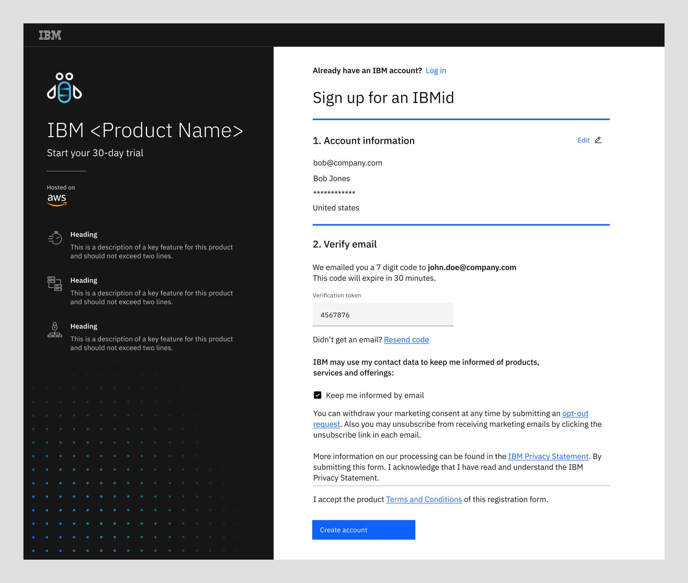

import { Breadcrumb, BreadcrumbItem } from "carbon-components-react";
import { Link } from "gatsby";

<PageDescription>

People need to evaluate if a solution is the best option for them, gain expertise ana get their questions answered. An engaging trial experience that provides an accurate demonstration of the product capabilities can increase the trial conversion, and boost brand equity.

</PageDescription>

<AnchorLinks>
  <AnchorLink>Types of trial</AnchorLink>
  <AnchorLink>Launch points</AnchorLink>
  <AnchorLink>URX and IBMid</AnchorLink>
  <AnchorLink>Signup and provision</AnchorLink>
  <AnchorLink>Related</AnchorLink>
  <AnchorLink>Design resources</AnchorLink>
  <AnchorLink>References</AnchorLink>
</AnchorLinks>

## Types of trial

To help the potential customer to evaluate the product against their business needs and use cases, different types of trial can be considered to provide the best experience when interacting with IBM.

### Product trial

A free product trial can be time-bound or with other usage limits other than time. It allows users to gain full product access up to the limit set forth in the trial terms (e.g. 30 days or storage up to 25GB/month). Users can choose to upgrade from a trial to a paid service through the same hyperscaler platform where they have launched the trial sign-up process in the first place.

<Row>
  <Column colMd={8} colLg={10}>

  </Column>
</Row> 
If trial is time-bound, a [trial period count down widget](https://pages.github.ibm.com/cdai-design/pal/cloud-paks/trial-countdown/usage/) is displayed in the global header 
<Row>
  <Column colMd={8} colLg={10}>

If trial is not time-bound, a Buy button is displayed in the global header

  </Column>
</Row>

### Test drive

(Available as an option on Azure Marketplace)
Test drive is an assigned, pre-configured environment that allowed users to try out the key features of the product without the need of signing up for an account. Once a test drive instance is assigned, it is available for use by that customer for a set period. After the period has ended, the instance will be deleted and user will no longer have access. User will be contacted through email with links for further information and action.

<Row>
  <Column colMd={6} colLg={6}>

Access Test Drive from Azure Marketplace

  </Column>
</Row>

## Launch points

User can sign up for the SaaS product trial through the different product marketing channels, such as IBM.com, AWS Marketplace, and Azure Marketplace

<Row>
  <Column colMd={8} colLg={10}>

** IBM.com **

  </Column>
</Row>

<Row>
  <Column colMd={8} colLg={10}>

** AWS Marketplace **

When user clicks on the "Try for Free" button in AWS product listing, they need to sign into their AWS Marketplace account first and create a $0 contract through AWS. At the end of the transaction, they will be provided a link to configure their account with IBM. See the <a target="_blank" href="https://docs.aws.amazon.com/marketplace/latest/buyerguide/buyer-saas-products.html#saas-free-trials-for-contracts">documentation on AWS Marketplace</a> for details

  </Column>
</Row>

## URX and IBMid

Before user can access an IBM SaaS product or a product trial, user must first be authenticated with IBMid. User can create a new IBMid using the standard URX (Unified Registration Experience) form.

The URX form collects and validate the user's account information, and record the user's consensus in email communication, data privacy policy, and product terms and conditions. This form should not be modified by individual product teams. However, on the URX form page, there is a configurable panel that can be used to provide product specific information.

The URX form used for SaaS product trail sign up should use the following template:

<Row>
  <Column colMd={8} colLg={10}>

** Direct link on AWS Marketplace (MVP) **

  </Column>
</Row>

1. **Sign up for IBMid form (not customizable)**
2. **Product trial sign up panel (customizable):** Product team can customize the contents in this panel
3. **Product icon:** Application icon should be used
4. **Product name**
5. **Sub-headline:** "Start your x-day trial"
6. **Hyperscaler cloud provider logo:** This logo should be displayed if the user launches the sign up flow from one of the hyperscaler marketplaces.
7. **Product highlight:** Concise product highlight that helps reinforce user's trial signup decision

## Signup and provision

The user will go through the IBMid signup (URX form) and trial instance provisioning in a sequential manner.

#### Step 1: Account information

<Row>
  <Column colMd={8} colLg={10}>

  </Column>
</Row>

#### Step 2: Verify email

An email verification message will be sent to the email address provided in step 1. User will copy and paste the verification code in the URX form.

<Row>
  <Column colMd={8} colLg={10}>

  </Column>
</Row>

#### Step 3: Account Privacy

After the user accept the terms and conditions, an account is created and user is presented with the Account Privacy policy.

<Row>
  <Column colMd={8} colLg={10}>

  </Column>
</Row>

#### Step 4: Instance provisioning information

User may provide the needed information on the screen right away. However, they may also exit the flow at this point and use the email sent to the email address to access this screen at a later time. See ["Your trial has begun" in email templates](https://pages.github.ibm.com/cdai-design/pal/saas-for-hyperscalers/email-templates/) for details

<Row>
  <Column colMd={8} colLg={10}>

  </Column>
</Row>

<InlineNotification>

**Note:** The instance provisioning information screen is not part of the URX form. However, in order to provide a seamless experience to the user, the same product trial sign-up panel should be used.

</InlineNotification>

#### Step 5: Getting your trial ready

<Row>
  <Column colMd={8} colLg={10}>

While the trial instance is being provisioned, the user will see the messaging screen that informs the user about the progress.

  </Column>
</Row>

#### Step 6: Trial instance is ready

Once the provisioning process is completed, the user will be redirected to this screen with the direct access to the trial instance.

An email will be sent to the user once the provisioning process is complete. User can access to the trial instance using the link provided in the email. See "Welcome to your trial" in email template guideline for details

<Row>
  <Column colMd={8} colLg={10}>

  </Column>
</Row>

 

<CardGroup>
  <MiniCard
    title="Figma template"
    href="https://www.figma.com/file/SlZ7TK2mTzNLIHZB2dGXRF/MCSP-Onboarding-Guide?node-id=1903%3A423457&t=luuwcPD9pEO2cr6L-1"
    actionIcon="launch"
  ></MiniCard>
  <MiniCard
    title="App icons library"
    href="https://www.ibm.com/design/language/iconography/app-icons/library"
    actionIcon="launch"
  ></MiniCard>
</CardGroup>{" "}

## Related

- [Account Sign up](https://pages.github.ibm.com/cdai-design/pal/saas-for-hyperscalers/common-patterns/urx)
- [Email template](https://pages.github.ibm.com/cdai-design/pal/saas-for-hyperscalers/email-templates)
- [Trail countdown](https://pages.github.ibm.com/cdai-design/pal/cloud-paks/trial-countdown/usage/)

## References

- <a
    target="_blank"
    href="https://docs.microsoft.com/en-us/azure/marketplace/what-is-test-drive"
  >
    What is test drive
  </a>
- <a target="_blank" href="https://w3.ibm.com/w3publisher/urx">
    URX
  </a>
