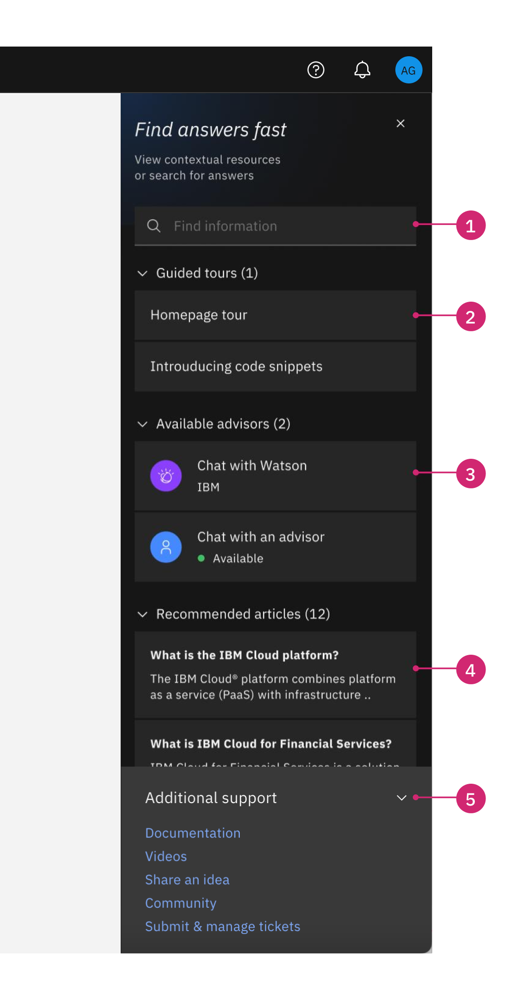

import { Breadcrumb, BreadcrumbItem } from "carbon-components-react";
import { Link } from "gatsby";

<Breadcrumb>
  <BreadcrumbItem href="https://pages.github.ibm.com/cdai-design/pal/">
    Home
  </BreadcrumbItem>
  <BreadcrumbItem href="https://pages.github.ibm.com/cdai-design/pal/saas-for-hyperscalers/overview">
    SaaS for hyperscalers
  </BreadcrumbItem>
  <BreadcrumbItem href="https://pages.github.ibm.com/cdai-design/pal/saas-for-hyperscalers/use">
    Use
  </BreadcrumbItem>
  <BreadcrumbItem
    isCurrentPage
    href="https://pages.github.ibm.com/cdai-design/pal/saas-for-hyperscalers/use-patterns/assistance"
  >
    Assistance
  </BreadcrumbItem>
</Breadcrumb>

<PageDescription>

The use of Assist Me provides a consistent way to access supporting resources to users during their product experience. Assist Me consolidates IBM’s in-app widgets, such as WalkMe, into one module that encompasses all aspects of contextual in-app user assistance.

Product can enable Assist Me in the global header from MCSP and customize the features for their product, like adding in WalkMe tours, links to the product documentation and links to the support site.

</PageDescription>

## Anatomy

<Row>
  <Column colMd={4} colLg={8}>

  </Column>
</Row>

1. **Unified smart search:** Search across multiple support domains scoped to the relevant release. Supported search results include IBM Docs, IBM Cloud Docs, and IBM Cloud Pak Docs.
2. **WalkMe tours (Optional):** Access to relevant tours for users to launch based on context.
3. **Contextual AI & Agent Chat (Optional):** Gives users immediate answers or access to on-call agents, asynchronous chat support, or scheduled consults. Currently supports any CMAAS based bot.
4. **Contextual articles & guidance (Optional):** Immediate access to contextual articles and step-by-step instructions.
5. **Additional support:** Easy access to other support links such as to the product online documentation and the ability to submit a ticket.

## Launcher

IBM Assist Me is launched from a common support icon in the header. If products don’t adopt Assist Me, they should redirect the Assist Me icon to open up the product documentation, and add the WalkMe icon to the header for WalkMe access.

<Row>

<Column colMd={2} colLg={2} noGutterSm>

<ImageCard
sub-title="WalkMe/ Tours icon"
sub-titleColor="dark"
>

</ImageCard>
</Column>

<Column colMd={2} colLg={2} noGutterSm>

<ImageCard
sub-title="Assist Me/ Assistance icon"
sub-titleColor="dark"
>

</ImageCard>
</Column>

</Row>

## Related

- [Assist Me documentation](https://pages.github.ibm.com/cdai-design/pal/assistance-panel/usage/)
- [Assist Me Development Wiki](https://github.ibm.com/PrivateCloud-analytics/ibm-assist-me/wiki)
- [Assist Me Demo](https://ibm-assist-me1.fyre.ibm.com/)
