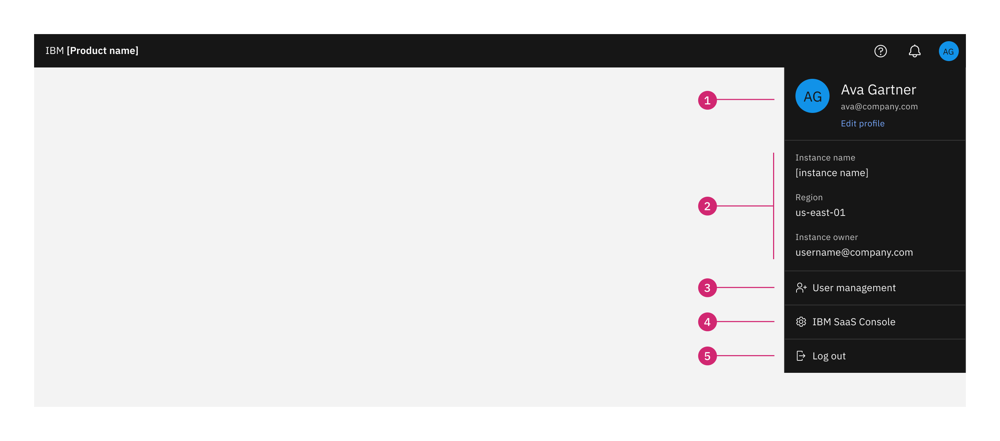

import { Breadcrumb, BreadcrumbItem } from "carbon-components-react";
import { Link } from "gatsby";

<Breadcrumb>
  <BreadcrumbItem href="https://pages.github.ibm.com/cdai-design/pal/">
    Home
  </BreadcrumbItem>
  <BreadcrumbItem href="https://pages.github.ibm.com/cdai-design/pal/saas-for-hyperscalers/overview">
    SaaS for hyperscalers
  </BreadcrumbItem>
  <BreadcrumbItem href="https://pages.github.ibm.com/cdai-design/pal/saas-for-hyperscalers/use">
    Use
  </BreadcrumbItem>
  <BreadcrumbItem
    isCurrentPage
    href="https://pages.github.ibm.com/cdai-design/pal/saas-for-hyperscalers/use-patterns/profile-menu"
  >
    Profile menu
  </BreadcrumbItem>
</Breadcrumb>

<PageDescription>

The profile menu is a consistently available user interface element that contains an essential account, product and active session information. It is only available in the logged in state.

</PageDescription>

### Anatomy

The profile menu provides information about the current instance, as well as navigation to the IBM SaaS Console. If the product is leveraging the User management feature provided by MCSP, the user may also access the User management via the profile menu.

1. **User information:** Includes the user's name and email.
2. **Instance information:** (Read only) Includes the instance name, region, and instance owner.
3. **User management:** (Optional) Products can leverage the MCSP user management from here if there is no in product management.
4. **IBM SaaS Console:** Here is where users can access and manage their subscriptions.
5. **Logout button**

 

<CardGroup>
  <MiniCard
    title="Figma template"
    href="https://www.figma.com/file/SlZ7TK2mTzNLIHZB2dGXRF/MCSP-Onboarding-Design-Guide?node-id=2195%3A409332&t=AvJflqOliLETiArL-1"
    actionIcon="launch"
  ></MiniCard>
  <MiniCard
    title="Storybook"
    href="https://pages.github.ibm.com/automation-saas/automation-common-header/?path=/story/automation-header--with-user-management"
    actionIcon="launch"
  ></MiniCard>
</CardGroup>{" "}
