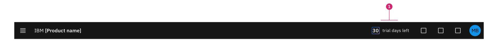

import { Breadcrumb, BreadcrumbItem } from "carbon-components-react";
import { Link } from "gatsby";

<Breadcrumb>
  <BreadcrumbItem href="https://pages.github.ibm.com/cdai-design/pal/">
    Home
  </BreadcrumbItem>
  <BreadcrumbItem href="https://pages.github.ibm.com/cdai-design/pal/saas-for-hyperscalers/overview">
    PLG and MultiCloud SaaS
  </BreadcrumbItem>
  <BreadcrumbItem href="https://pages.github.ibm.com/cdai-design/pal/saas-for-hyperscalers/use">
    Use
  </BreadcrumbItem>
  <BreadcrumbItem
    isCurrentPage
    href="https://pages.github.ibm.com/cdai-design/pal/saas-for-hyperscalers/use-patterns/trial-countdown"
  >
    Try countdown
  </BreadcrumbItem>
</Breadcrumb>

<PageDescription>

The Try countdown notifies users of the number of days remaining in their time-bound Try experience.

</PageDescription>

<AnchorLinks>
  <AnchorLink>Overview</AnchorLink>
  <AnchorLink>States</AnchorLink>
  <AnchorLink>Toggletip</AnchorLink>
  <AnchorLink>Resources</AnchorLink>

  </AnchorLinks>

## Overview

The dynamic Try countdown provides the user with the status of their time-bound Try experience. It displays the number of days remaining to use the product until their Try experience expires. 

1. **Trial countdown:** Located at the furthest left of the section utilities.

## States

The following states apply to the Try countdown: Enabled, Hover, Active, and Trial ending.

### Enabled

<Row>
  <Column colMd={8} colLg={8}>

  </Column>
</Row>

**Enabled** state is the default Try countdown state displayed during the trial period. The number of days remaining is displayed and surrounded by a [gradient](https://www.ibm.com/design/language/color#gradients) border `(Blue 50 and Purple 40)`.

### Hover

<Row>
  <Column colMd={8} colLg={8}>

  </Column>
</Row>

**Hover** state is activated when the user locates their cursor over the trial countdown display, without clicking on it. An overlay highlights the Try countdown area.

### Active

<Row>
  <Column colMd={8} colLg={8}>

  </Column>
</Row>

**Active** state is activated when the user clicks on the Try countdown. The Hover UI state and Toggle tip are displayed.

<Row>
  <Column colMd={8} colLg={8}>

  </Column>
</Row>

<Caption>Trial ending state</Caption>

<Row>
  <Column colMd={4} colLg={4}>

  </Column>
</Row>

<Caption>UI notification</Caption>

### Trial ending

**Trial ending** state is activated when the user's Try experience will expire in a number of days. The border around the Try countdown changes from the gradient to the `Red 50` stroke. The user is also notified of the approaching Try expiration by a UI login message and an automated email. 

## Toggletip

- When the user clicks on the Try countdown, the [toggletip](https://www.carbondesignsystem.com/components/toggletip/usage/) displays the Try expiration date.
- When the user clicks away from it, the toggletip content is hidden.
- Toggletip content can be configured based on your product strategy, such as to prompt a purchase or upgrade.
- Clear purchase or upgrade messaging and methods should be included in the Toggletip area.

#### Toogletip anatomy

<Row>
<Column colMd={8} colLg={8}>

  </Column>
</Row>

<Caption fullWidth>
  In this example, all elements that can be added to the toggletip are shown.
</Caption>

1. **Body copy _(required)_**
   1. This caption is the only required element in the toggletip.
   2. The caption inside the toggletip should be limited to two lines.
   3. The expiration [date format](https://pages.github.ibm.com/cdai-design/pal/content/numbers/#dates) will be localized based on the user's region.
   4. The expiration date short format Month Day, Year is the recommended default. _(See images below)_
2. **Secondary link _(optional)_**
   1. All links will include an icon on the right side.
   2. Limiting the number of actions to two is the recommended default.
   3. Example action items include: _Invite team member and Contact sales_
3. **Primary button _(optional_**)
   1. The primary action is a button.
   2. This button can also be reserved for _"Purchase"_.
   3. An alternative or secondary action is _"Contact sales"_.

<Caption>
  Variations of the toggletip that can be used.
</Caption>

### Theme switch

The toggleltip will switch to dark/light depending on your product theme.

<Row>
  <Column colMd={8} colLg={8}>

  </Column>
</Row>
