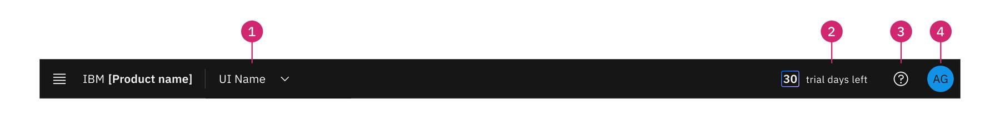

import { Breadcrumb, BreadcrumbItem } from "carbon-components-react";
import { Link } from "gatsby";

<Breadcrumb>
  <BreadcrumbItem href="https://pages.github.ibm.com/CDAI-design/cpp-foundation-microsite/">
   Home
  </BreadcrumbItem>
  <BreadcrumbItem href="https://pages.github.ibm.com/CDAI-design/cpp-foundation-microsite/saas-for-hyperscalers/overview">
   SaaS for hyperscalers
  </BreadcrumbItem>
  <BreadcrumbItem isCurrentPage href="https://pages.github.ibm.com/CDAI-design/cpp-foundation-microsite/saas-for-hyperscalers/use">
   Use
  </BreadcrumbItem>
</Breadcrumb>

<PageDescription>

Excellent use experiences are the main source of value for people and success for IBM. 

We need to ensure people have a consistent and unify experience when using our SaaS products across the cloud platform of their choice. There needs to be a clear and simple way to access their products, manage their SaaS trials and subscriptions and get the product supports when needed.

</PageDescription>

## Common experience
These are the features and components that MCSP provide. IBM SaaS products that are onboarding to MCSP can easily adopt to provide a simple and consistent user experience.
<Row>

<Column colMd={2} colLg={2} noGutterSm>

<ImageCard
sub-title="Login/Logout"
sub-titleColor="dark"
titleColor="dark"
hoverColor="light"
href="https://pages.github.ibm.com/CDAI-design/cpp-foundation-microsite/saas-for-hyperscalers/use-patterns/login-logout"
>

</ImageCard>
</Column>

<Column colMd={2} colLg={2} noGutterSm>

<ImageCard
sub-title="Expired trial"
sub-titleColor="dark"
titleColor="dark"
hoverColor="light"
href="https://pages.github.ibm.com/CDAI-design/cpp-foundation-microsite/saas-for-hyperscalers/common-patterns/trial-end/"
>

</ImageCard>
</Column>

<Column colMd={2} colLg={2} noGutterSm>

<ImageCard
sub-title="User management"
sub-titleColor="dark"
titleColor="dark"
hoverColor="light"
href="https://pages.github.ibm.com/CDAI-design/cpp-foundation-microsite/saas-for-hyperscalers/use-patterns/user-management/"
>

</ImageCard>
</Column>

</Row>

## Global header

The Global header for SaaS products may include all or any of the following patterns and components.

MCSP encourages all onboarded product to adopt the Global header which provides access points to the IBM SaaS Console, offers a consistent experience for visibility to the Trial information, and an optional navigation component that the product team can adopt in case if there are multiple UIs in the product.

1. **UI navigation** (optional)
2. **Trial countdown**
3. **Assistance** (optional)
4. **Profile menu**

<Row>

<Column colMd={2} colLg={2} noGutterSm>

<ImageCard
sub-title="UI navigation"
sub-titleColor="dark"
titleColor="dark"
hoverColor="light"
href="https://pages.github.ibm.com/CDAI-design/cpp-foundation-microsite/saas-for-hyperscalers/use-patterns/ui-navigation/"
>

</ImageCard>
</Column>

<Column colMd={2} colLg={2} noGutterSm>

<ImageCard
sub-title="Trial countdown"
sub-titleColor="dark"
titleColor="dark"
hoverColor="light"
href="https://pages.github.ibm.com/CDAI-design/cpp-foundation-microsite/saas-for-hyperscalers/use-patterns/trial-countdown"
>

</ImageCard>
</Column>

<Column colMd={2} colLg={2} noGutterSm>

<ImageCard
sub-title="Assistance"
sub-titleColor="dark"
titleColor="dark"
hoverColor="light"
href="https://pages.github.ibm.com/CDAI-design/cpp-foundation-microsite/saas-for-hyperscalers/use-patterns/assistance"
>

</ImageCard>
</Column>

<Column colMd={2} colLg={2} noGutterSm>

<ImageCard
sub-title="Profile menu"
sub-titleColor="dark"
titleColor="dark"
hoverColor="light"
href="https://pages.github.ibm.com/CDAI-design/cpp-foundation-microsite/saas-for-hyperscalers/use-patterns/profile-menu"
>

</ImageCard>
</Column>

</Row>

 
<CardGroup>
  <MiniCard 
    title="Figma file" 
    href="https://www.figma.com/file/SlZ7TK2mTzNLIHZB2dGXRF/MCSP-Onboarding-Design-Guide?node-id=2061%3A429776&t=luTQJ8HZQRFImVao-1"
    actionIcon="launch">
  </MiniCard>
  <MiniCard 
    title="Storybook" 
    href="https://pages.github.ibm.com/automation-saas/automation-common-header/?path=/story/automation-header--with-user-management"
    actionIcon="launch">
  </MiniCard>
</CardGroup> 