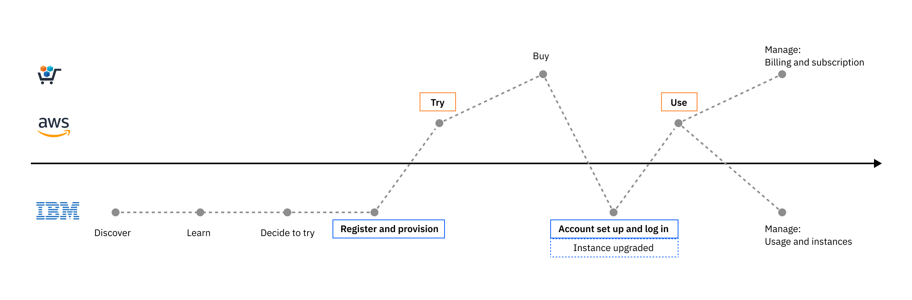
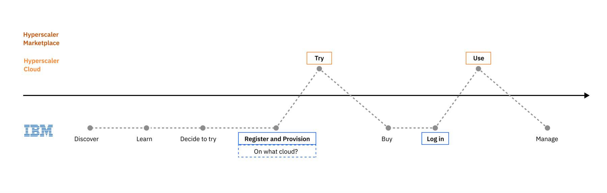

import { Breadcrumb, BreadcrumbItem } from "carbon-components-react";
import { Link } from "gatsby";

<Breadcrumb>
  <BreadcrumbItem href="../../">
    Home
  </BreadcrumbItem>

   <BreadcrumbItem href="https://pages.github.ibm.com/CDAI-design/cpp-foundation-microsite/saas-for-hyperscalers/overview">
   SaaS for hyperscalers
  </BreadcrumbItem>

 <BreadcrumbItem href="https://pages.github.ibm.com/CDAI-design/cpp-foundation-microsite/saas-for-hyperscalers/user-scenarios">
    User scenarios
  </BreadcrumbItem>

  <BreadcrumbItem isCurrentPage href="https://pages.github.ibm.com/CDAI-design/cpp-foundation-microsite/saas-for-hyperscalers/user-scenarios/transact-upgrade-ibm">
  IBM
  </BreadcrumbItem>
</Breadcrumb>

<PageDescription>

This scenario starts in IBM.com, where a user can discover, learn, try an IBM's SaaS product that is hosted on a hyperscaler of the user's choice. The user then completes the transaction by subscribing to the product through IBM.

</PageDescription>

## Try through IBM.com and buy from hyperscaler
<Row>
  <Column colMd={8} colLg={10}>

  </Column>
</Row> 

Although there are a few different channels at IBM where a user can find and explore our product offerings, the **typical journey starts from the product marketing page on IBM.com**. The user learns about the product features and the SaaS offering availability on the hyperscaler cloud providers, and registers for the **trial that is provisioned on a selected hyperscaler, like AWS or Azure**. 

When they are ready to buy, the user can purchase a paid subscription through the hyperscaler Marketplace. Once the transaction is complete, a button is provided to the user to setup the account (IBM account). The system will recognize the presence of the trial instance and upgrade the instance automatically if the user signs in with the same IBMid as the one used for setting up the trial.

When the user is ready to buy, they can also work with an IBM seller to get a custom offer that better meets their needs. See [Custom offer via IBM Sales](https://pages.github.ibm.com/CDAI-design/cpp-foundation-microsite/saas-for-hyperscalers/user-scenarios/private-offer) for details.

<CardGroup>
  <MiniCard 
    title="Click through prototype" 
    href="https://www.figma.com/proto/SlZ7TK2mTzNLIHZB2dGXRF/MCSP-Onboarding-Design-Guide?page-id=163%3A351403&node-id=2204-478778&viewport=666%2C536%2C0.5&scaling=scale-down&starting-point-node-id=2204%3A478778&show-proto-sidebar=1"
    actionIcon="launch">
  </MiniCard>
  <MiniCard 
    title="Figma design template" 
    href="https://www.figma.com/file/SlZ7TK2mTzNLIHZB2dGXRF/MCSP-Onboarding-Design-Guide?node-id=2204%3A478778&t=HclJNZcaoXiK9HbK-1"
    actionIcon="launch">
  </MiniCard>
</CardGroup> 

## Try and buy through IBM Cloud
<Row>
  <Column colMd={8} colLg={10}>

  </Column>
</Row>  

A user can discover and learn about our SaaS product offering through **IBM Cloud catalog**. When the user is ready to try the product, the user will be required to **create an IBM Cloud account** with a payment method. The user can choose to provision the product on IBM Cloud or another hyperscaler supported. When The user will be able to upgrade the trial to a paid plan through IBM Cloud. 

<CardGroup>
  <MiniCard 
    title="Click through prototype" 
    href="https://www.figma.com/proto/SlZ7TK2mTzNLIHZB2dGXRF/MCSP-Onboarding-Design-Guide?page-id=91%3A346985&node-id=828-578536&viewport=-629%2C189%2C1&scaling=scale-down&starting-point-node-id=828%3A578536"
    actionIcon="launch">
  </MiniCard>
  <MiniCard 
    title="Figma design template" 
    href="https://www.figma.com/file/SlZ7TK2mTzNLIHZB2dGXRF/MCSP-Onboarding-Design-Guide?node-id=828%3A578536&t=HclJNZcaoXiK9HbK-1"
    actionIcon="launch">
  </MiniCard>
</CardGroup>