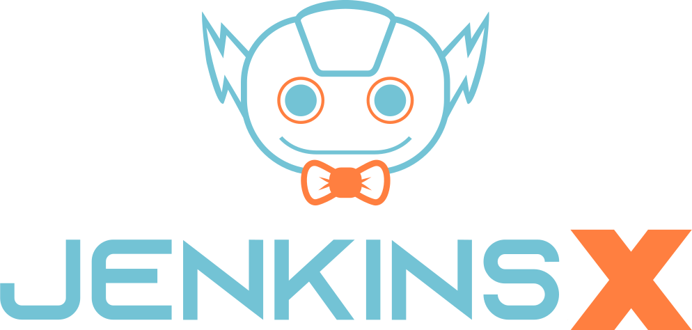
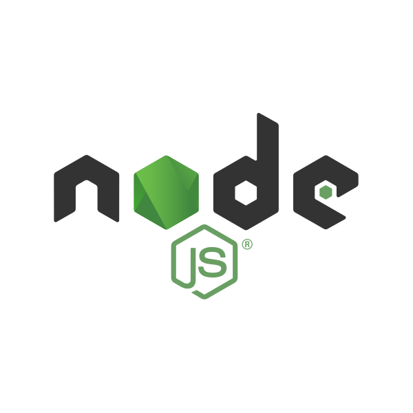
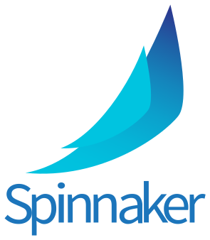
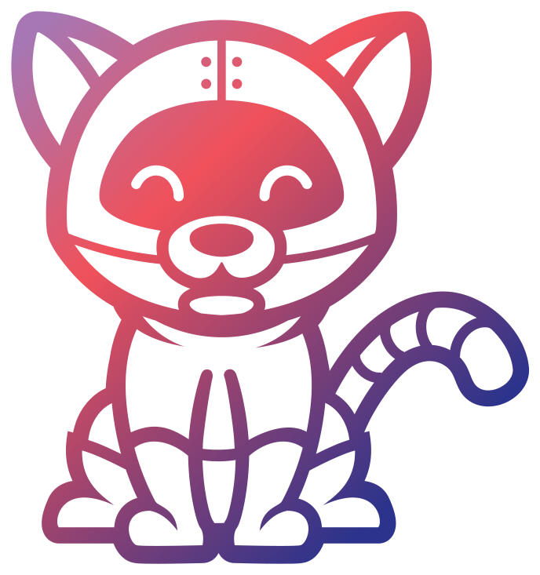
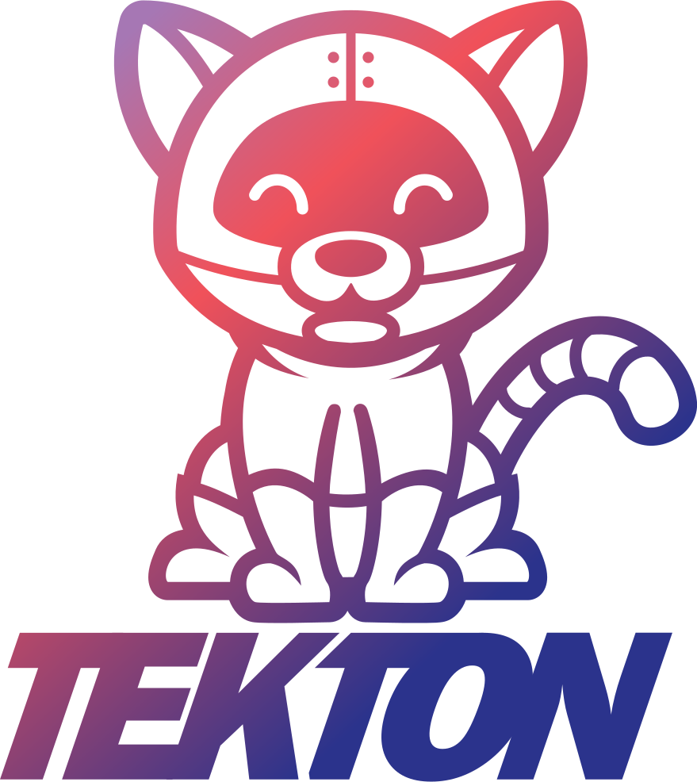

<PageDescription>

Hybrid cloud design third-party logos used across the Carbon for IBM Products PAL

</PageDescription>

 

<Row className="image-card-group">

<Column colMd={4} colLg={4} noGutterSm>

<ImageCard
  title="Alibaba Cloud"
  titleColor="dark"
  actionIcon="download"
  iconColor="dark"
  className="third-party-logo"
  href="https://github.ibm.com/CDAI-design/pal/raw/main/src/pages/third-party-logos/images/alibaba-cloud.svg"
>

</ImageCard>

</Column>

<Column colMd={4} colLg={4} noGutterSm>

<ImageCard
  title="Ansible"
  titleColor="dark"
  actionIcon="download"
  iconColor="dark"
  className="third-party-logo"
  href="https://github.ibm.com/CDAI-design/pal/raw/main/src/pages/third-party-logos/images/ansible.svg"
>

</ImageCard>

</Column>

<Column colMd={4} colLg={4} noGutterSm>

<ImageCard
  title="Amazon Web Services"
  titleColor="dark"
  actionIcon="download"
  iconColor="dark"
  className="third-party-logo"
  href="https://github.ibm.com/CDAI-design/pal/raw/main/src/pages/third-party-logos/images/aws.svg"
>

</ImageCard>

</Column>

<Column colMd={4} colLg={4} noGutterSm>

<ImageCard
  title="Codewind Blue"
  titleColor="dark"
  actionIcon="download"
  iconColor="dark"
  className="third-party-logo"
  href="https://github.ibm.com/CDAI-design/pal/raw/main/src/pages/third-party-logos/images/codewind-blue.svg"
>

</ImageCard>

</Column>

<Column colMd={4} colLg={4} noGutterSm>

<ImageCard
  title="Eclipse Che"
  titleColor="dark"
  actionIcon="download"
  iconColor="dark"
  className="third-party-logo"
  href="https://github.ibm.com/CDAI-design/pal/raw/main/src/pages/third-party-logos/images/eclipse-che.svg"
>

</ImageCard>

</Column>

<Column colMd={4} colLg={4} noGutterSm>

<ImageCard
  title="Google Cloud"
  titleColor="dark"
  actionIcon="download"
  iconColor="dark"
  className="third-party-logo"
  href="https://github.ibm.com/CDAI-design/pal/raw/main/src/pages/third-party-logos/images/google-cloud.svg"
>

</ImageCard>

</Column>

<Column colMd={4} colLg={4} noGutterSm>

<ImageCard
  title="Google Cloud with Text"
  titleColor="dark"
  actionIcon="download"
  iconColor="dark"
  className="third-party-logo"
  href="https://github.ibm.com/CDAI-design/pal/raw/main/src/pages/third-party-logos/images/google-cloud-with-text.svg"
>

</ImageCard>

</Column>

<Column colMd={4} colLg={4} noGutterSm>

<ImageCard
  title="Helm"
  titleColor="dark"
  actionIcon="download"
  iconColor="dark"
  className="third-party-logo"
  href="https://github.ibm.com/CDAI-design/pal/raw/main/src/pages/third-party-logos/images/helm.svg"
>

</ImageCard>

</Column>

<Column colMd={4} colLg={4} noGutterSm>

<ImageCard
  title="Helm Teal"
  titleColor="dark"
  actionIcon="download"
  iconColor="dark"
  className="third-party-logo"
  href="https://github.ibm.com/CDAI-design/pal/raw/main/src/pages/third-party-logos/images/helm-teal.svg"
>

</ImageCard>

</Column>

<Column colMd={4} colLg={4} noGutterSm>

<ImageCard
  title="IBM Cloud"
  titleColor="dark"
  actionIcon="download"
  iconColor="dark"
  className="third-party-logo"
  href="https://github.ibm.com/CDAI-design/pal/raw/main/src/pages/third-party-logos/images/ibm-cloud.svg"
>

</ImageCard>

</Column>

<Column colMd={4} colLg={4} noGutterSm>

<ImageCard
  title="Istio"
  titleColor="dark"
  actionIcon="download"
  iconColor="dark"
  className="third-party-logo"
  href="https://github.ibm.com/CDAI-design/pal/raw/main/src/pages/third-party-logos/images/istio.svg"
>

</ImageCard>

</Column>

<Column colMd={4} colLg={4} noGutterSm>

<ImageCard
  title="Java"
  subTitle="default logo is white (#fff)"
  titleColor="dark"
  subTitleColor="dark"
  actionIcon="download"
  iconColor="dark"
  className="third-party-logo"
  href="https://github.ibm.com/CDAI-design/pal/raw/main/src/pages/third-party-logos/images/java.svg"
>

</ImageCard>

</Column>

<Column colMd={4} colLg={4} noGutterSm>

<ImageCard
  title="Jenkinsx"
  titleColor="dark"
  actionIcon="download"
  iconColor="dark"
  className="third-party-logo"
  href="https://github.ibm.com/CDAI-design/pal/raw/main/src/pages/third-party-logos/images/jenkinsx.svg"
>

</ImageCard>

</Column>

<Column colMd={4} colLg={4} noGutterSm>

<ImageCard
  title="Jenkinsx with Text"
  titleColor="dark"
  actionIcon="download"
  iconColor="dark"
  className="third-party-logo"
  href="https://github.ibm.com/CDAI-design/pal/raw/main/src/pages/third-party-logos/images/jenkinsx-with-text.svg"
>

</ImageCard>

</Column>

<Column colMd={4} colLg={4} noGutterSm>

<ImageCard
  title="Knative"
  titleColor="dark"
  actionIcon="download"
  iconColor="dark"
  className="third-party-logo"
  href="https://github.ibm.com/CDAI-design/pal/raw/main/src/pages/third-party-logos/images/knative.svg"
>

</ImageCard>

</Column>

<Column colMd={4} colLg={4} noGutterSm>

<ImageCard
  title="Kubernetes"
  titleColor="dark"
  actionIcon="download"
  iconColor="dark"
  className="third-party-logo"
  href="https://github.ibm.com/CDAI-design/pal/raw/main/src/pages/third-party-logos/images/kubernetes.svg"
>

</ImageCard>

</Column>

<Column colMd={4} colLg={4} noGutterSm>

<ImageCard
  title="Microsoft Azure"
  titleColor="dark"
  actionIcon="download"
  iconColor="dark"
  className="third-party-logo"
  href="https://github.ibm.com/CDAI-design/pal/raw/main/src/pages/third-party-logos/images/microsoft-azure.svg"
>

</ImageCard>

</Column>

<Column colMd={4} colLg={4} noGutterSm>

<ImageCard
  title="Microsoft"
  titleColor="dark"
  actionIcon="download"
  iconColor="dark"
  className="third-party-logo"
  href="https://github.ibm.com/CDAI-design/pal/raw/main/src/pages/third-party-logos/images/microsoft.svg"
>

</ImageCard>

</Column>

<Column colMd={4} colLg={4} noGutterSm>

<ImageCard
  title="Nodejs"
  titleColor="dark"
  actionIcon="download"
  iconColor="dark"
  className="third-party-logo"
  href="https://github.ibm.com/CDAI-design/pal/raw/main/src/pages/third-party-logos/images/nodejs.svg"
>

</ImageCard>

</Column>

<Column colMd={4} colLg={4} noGutterSm>

<ImageCard
  title="OL"
  titleColor="dark"
  actionIcon="download"
  iconColor="dark"
  className="third-party-logo"
  href="https://github.ibm.com/CDAI-design/pal/raw/main/src/pages/third-party-logos/images/ol.svg"
>

</ImageCard>

</Column>

<Column colMd={4} colLg={4} noGutterSm>

<ImageCard
  title="Operator Lifecycle Manager"
  titleColor="dark"
  actionIcon="download"
  iconColor="dark"
  className="third-party-logo"
  href="https://github.ibm.com/CDAI-design/pal/raw/main/src/pages/third-party-logos/images/operator.svg"
>

</ImageCard>

</Column>

<Column colMd={4} colLg={4} noGutterSm>

<ImageCard
  title="Oracle"
  titleColor="dark"
  actionIcon="download"
  iconColor="dark"
  className="third-party-logo"
  href="https://github.ibm.com/CDAI-design/pal/raw/main/src/pages/third-party-logos/images/oracle.svg"
>

</ImageCard>

</Column>

<Column colMd={4} colLg={4} noGutterSm>

<ImageCard
  title="Prometheus"
  titleColor="dark"
  actionIcon="download"
  iconColor="dark"
  className="third-party-logo"
  href="https://github.ibm.com/CDAI-design/pal/raw/main/src/pages/third-party-logos/images/prometheus.svg"
>

</ImageCard>

</Column>

<Column colMd={4} colLg={4} noGutterSm>

<ImageCard
  title="Provider"
  titleColor="dark"
  actionIcon="download"
  iconColor="dark"
  className="third-party-logo"
  href="https://github.ibm.com/CDAI-design/pal/raw/main/src/pages/third-party-logos/images/provider.svg"
>

</ImageCard>

</Column>

<Column colMd={4} colLg={4} noGutterSm>

<ImageCard
  title="Red Hat"
  titleColor="dark"
  actionIcon="download"
  iconColor="dark"
  className="third-party-logo"
  href="https://github.ibm.com/CDAI-design/pal/raw/main/src/pages/third-party-logos/images/red-hat.svg"
>

</ImageCard>

</Column>

<Column colMd={4} colLg={4} noGutterSm>

<ImageCard
  title="Slack"
  titleColor="dark"
  actionIcon="download"
  iconColor="dark"
  className="third-party-logo"
  href="https://github.ibm.com/CDAI-design/pal/raw/main/src/pages/third-party-logos/images/slack.svg"
>

</ImageCard>

</Column>

<Column colMd={4} colLg={4} noGutterSm>

<ImageCard
  title="Spinnaker"
  titleColor="dark"
  actionIcon="download"
  iconColor="dark"
  className="third-party-logo"
  href="https://github.ibm.com/CDAI-design/pal/raw/main/src/pages/third-party-logos/images/spinnaker.svg"
>

</ImageCard>

</Column>

<Column colMd={4} colLg={4} noGutterSm>

<ImageCard
  title="Spinnaker with Text"
  titleColor="dark"
  actionIcon="download"
  iconColor="dark"
  className="third-party-logo"
  href="https://github.ibm.com/CDAI-design/pal/raw/main/src/pages/third-party-logos/images/spinnaker-with-text.svg"
>

</ImageCard>

</Column>

<Column colMd={4} colLg={4} noGutterSm>

<ImageCard
  title="Tekton"
  titleColor="dark"
  actionIcon="download"
  iconColor="dark"
  className="third-party-logo"
  href="https://github.ibm.com/CDAI-design/pal/raw/main/src/pages/third-party-logos/images/tekton.svg"
>

</ImageCard>

</Column>

<Column colMd={4} colLg={4} noGutterSm>

<ImageCard
  title="Tekton with Text"
  titleColor="dark"
  actionIcon="download"
  iconColor="dark"
  className="third-party-logo"
  href="https://github.ibm.com/CDAI-design/pal/raw/main/src/pages/third-party-logos/images/tekton-with-text.svg"
>

</ImageCard>

</Column>

<Column colMd={4} colLg={4} noGutterSm>

<ImageCard
  title="Transformation Advisor"
  titleColor="dark"
  actionIcon="download"
  iconColor="dark"
  className="third-party-logo"
  href="https://github.ibm.com/CDAI-design/pal/raw/main/src/pages/third-party-logos/images/transformation-advisor.svg"
>

</ImageCard>

</Column>

<Column colMd={4} colLg={4} noGutterSm>

<ImageCard
  title="VMware"
  titleColor="dark"
  actionIcon="download"
  iconColor="dark"
  className="third-party-logo"
  href="https://github.ibm.com/CDAI-design/pal/raw/main/src/pages/third-party-logos/images/vmware.svg"
>

</ImageCard>

</Column>

</Row>
