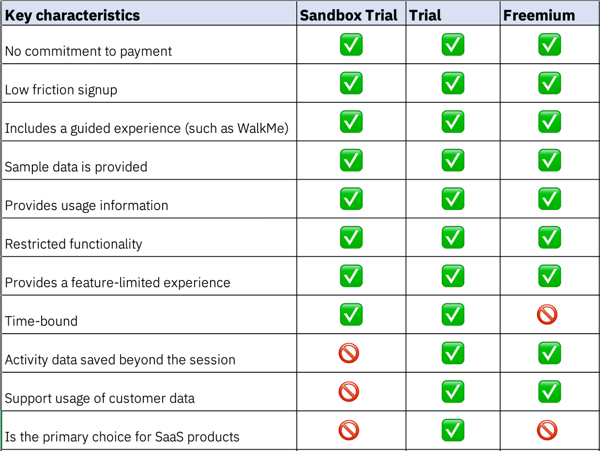
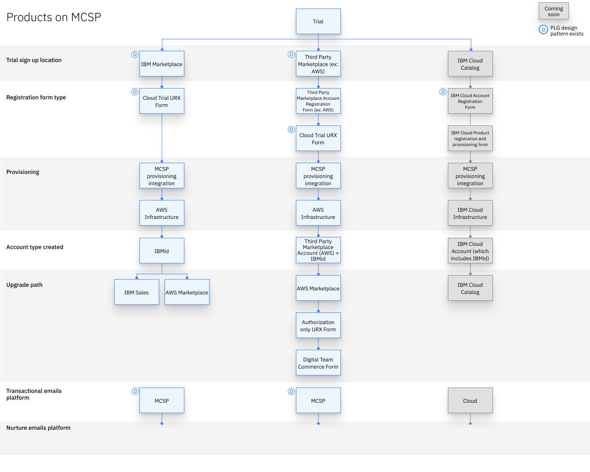
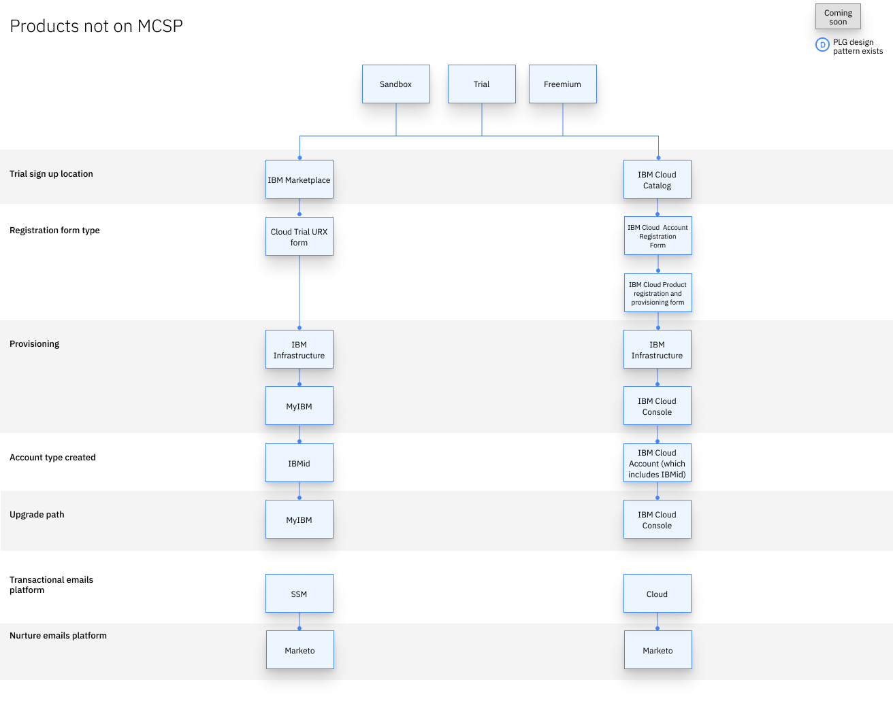

import { Breadcrumb, BreadcrumbItem } from "carbon-components-react";
import { Link } from "gatsby";

<PageDescription>

A Try offer is a working instance of a product which enables potential users to evaluate a product's ability to meet their needs before purchasing, at no cost. IBM offers three types of Try offers: a Sandbox Trial, Trial, and Freemium. 

</PageDescription>

## Overview

A key objective in a product-led experience is to allow potential customers to try a working instance of our products. This engages our target audience and demonstrates a product’s capabilities so that we can successfully convert them into paying customers. 

#### An effective Try offer:

1. Minimizes friction to allow potential users to easily try our products.
2. Demonstrates a product’s value to potential customers as quickly as possible.
3. Offers an exceptional user experience that converts potential users into paying customers.

There are three ways for users to experience an IBM product before purchasing: Sandbox Trial, Trial, or Freemium. All three models have benefits, and teams are required to offer at least one. 

  <ExpressiveList 
    title="Sandbox Trial"
    background="true">
    A Sandbox Trial is a guided experience that leads users through key product capabilities to illustrate value. Sandbox Trials do not support user data and may have some restricted functionality. They are also time-bound, and should encourage the user to upgrade to a full Trial or Freemium, or upgrade via self-service purchase or through Sales.
  </ExpressiveList>

  <ExpressiveList 
    title="Trial"
    background="true">
    A Trial is an immersive experience that allows users to immediately access a working instance of a product for evaluation. A Trial can be a guided or explore-on-your-own experience. Trials allow users to upload their own data and may have restricted functionality, unlike Sandbox Trials. They are also time-bound, and should encourage the user to connect with Sales to purchase the product when the session expires or utilize a self-service upgrade feature if available. 
  </ExpressiveList>
    
  <ExpressiveList 
    title="Freemium"
    background="true">
    A Freemium is a customer acquisition model that provides indefinite access to a product with limited-functionality without charge. Freemiums can support user data and are not time-bound, meaning users can potentially use an instance of the product with limited features for an unlimited amount of time. Freemiums are designed to demonstrate enough value, even with restricted functionality, that users want to upgrade to the paid product.  
  </ExpressiveList>

This graphic illustrates the key differences between the three types of Try offers. It's likely that more than one of these options could be suitable for your product. We recommend you start with the option that is the best fit, then use data from that experience to decide whether adding another is the right strategy for your team.

<Row>
  <Column colMd={6} colLg={8}>

  </Column>
</Row>

## Seamless registration enables easy access

It’s important to note that users do not want to spend time registering to try a product. Providing a seamless and quick registration process is critical. Gating our product Try offers with varying levels of registration is a careful balance between minimizing signup friction and gathering user data for analytics and nurture purposes.

### In the registration form, users should be able to:

1. Quickly see the duration and benefits of trying a product before signing up.
2. Easily complete the registration process.
3. Provide least amount of information as possible to register.
4. Immediately access the Try offer upon completion.

The patterns you use to design a registration experience depends on various factors, including the marketplace where it can be provisioned and the cloud provider (if relevant) where it will run.

### Marketplaces

Think of a marketplace as a store front. These include the [AWS Marketplace](https://aws.amazon.com/marketplace), the [IBM Cloud Catalog](https://cloud.ibm.com/catalog), and [IBM Marketplace](https://mediacenter.ibm.com/channel/IBM+Marketplace/73629932). 

The decision for where an IBM product appears is based on the product’s strategy and falls to our product management and executive teams. The process of registering for a Try offer and upgrading a product varies based on which marketplace(s) the user provisions the product from. Be sure to review the descriptions for the marketplace(s) where your product is offered. This will allow you to understand which registration and upgrade patterns your team should be using. 

<Tabs>

<Tab label="Products on MCSP">
<Row>
  <Column colMd={8} colLg={10}>

  </Column>
</Row>

#### Try offer journeys depending on marketplace 
These diagrams illustrate the backend processes and design patterns that are involved in a Try offer. Reference this diagram to see the key differences in the journeys depending on the marketplace where the user registers and whether a product is on the MultiCloud SaaS Platform.

</Tab>

<Tab label="Products NOT on MCSP">
<Row>
  <Column colMd={8} colLg={10}>

  </Column>
</Row>

#### Try offer journeys depending on marketplace 
These diagrams illustrate the backend processes and design patterns that are involved in a Try offer. Reference this diagram to see the key differences in the journeys depending on the marketplace where the user registers and whether a product is on the MultiCloud SaaS Platform.

</Tab>
</Tabs>

#### IBM Marketplace

The [IBM Marketplace](https://mediacenter.ibm.com/channel/IBM+Marketplace/73629932) is for all IBM products, both Software (on-prem) and SaaS. All IBM products, including IBM Cloud products, are listed here and registration and billing are handled through IBM. Potential users can try and buy directly through this platform and the products listed in this marketplace are managed through [myibm.com](https://myibm.ibm.com/dashboard/). 

To try a product listed in the IBM Marketplace, a user will only need an IBMid. Billing information is not required until they are ready to purchase a product. 

Products can be on the IBM Marketplace **autonomously** or by adopting the [MultiCloud SaaS Platform](https://w3.ibm.com/w3publisher/multicloud-saas-platform). MCSP was built to accelerate the adoption of IBM SaaS products onto third-party hyperscalers. 

<InlineNotification kind="info">
  Note: MCSP is currently enabled for AWS and work is underway to expand the support to other hyperscalers, like Microsoft Azure.
</InlineNotification>

Review the registration page to find the patterns associated with each option. 

<MiniCard title="Registration patterns" href="/patterns/registration/overview">
  </MiniCard>

#### IBM Cloud Catalog

The [IBM Cloud Catalog](https://cloud.ibm.com/catalog) is for all IBM Cloud products. All IBM Cloud products are listed here, and registrations and billing are handled by IBM Cloud. Potential users can try and buy directly through this platform, and the products listed in this marketplace are managed through our IBM Cloud platform. 

To try a product listed in the IBM Cloud Catalog, a user will need an IBM Cloud account. This process includes the creation of an IBMid and a few additional steps, such as providing a credit card for identity verification purposes.The IBM Cloud team has a service framework (linked) that dictates how products are onboarded in the IBM Cloud Catalog. Reference this framework to understand the steps a user must follow to register for a Try offer or purchase a product. Review the Registration page to find the patterns associated with this marketplace.

<CardGroup>
  <MiniCard title="IBM Cloud service framework" href="https://w3.ibm.com/w3publisher/cloudarchitecture/service-framework">
  </MiniCard>
  <MiniCard title="Registration patterns" href="/patterns/registration/overview">
  </MiniCard>
</CardGroup>

#### Third-party marketplaces (like AWS, Azure, or Google)

Some customers may have existing technology stacks built on a single third-party SaaS platform (like AWS, Azure, or Google), or have discounts and a committed budget to spend at these third-party marketplaces. We want to be able to sell our products to these potential users, so IBM Software (on-prem) and SaaS products can also be listed on these third-party marketplaces. The potential customer must have an account with the third party, and the billing will be managed by the third-party marketplace. 

This means that the user will have an account with the third party (like AWS or Azure) and then need to create an IBMid with IBM.

The [MultiCloud SaaS Platform](https://w3.ibm.com/w3publisher/multicloud-saas-platform) has been built to accelerate the adoption of IBM SaaS products on third-party hyperscalers. MCSP provides full guidance for IBM products through a common registration and provisioning experience. 

<InlineNotification kind="info">
Note: MCSP is currently enabled for AWS and work is underway to expand the support to other hyperscalers, like Microsoft Azure.
</InlineNotification>

Review the guidance in the service framework then review the Registration page to find the patterns associated with third-party marketplaces.

<CardGroup>
  <MiniCard title="MCSP service framework" href="https://pages.github.ibm.com/ibm-saas-platform/MultiCloud-SaaS-Framework/">
  </MiniCard>
  <MiniCard title="Registration patterns" href="/patterns/registration/overview">
  </MiniCard>
</CardGroup>

## Demonstrate value as quickly as possible

Once a user has registered for a Try offer, it’s critical to show how the product meets their needs. Crafting an excellent onboarding experience is an essential step to achieve this as it allows users to familiarize themselves with the product in a personalized, interactive way. Creating effective onboarding is a team’s opportunity to guide users to the product’s “aha” moments and demonstrate its value.

These “aha” moments are the points in time when a user understands how the product can meet their needs. They are emotional and inspiring moments that have the power to turn an evaluating user into an activated one.

Designing an effective onboarding experience takes some planning and strategic thinking. The Onboarding page provides activities your team should use to align around these topics. Use this guidance to dive deeper into these important concepts and find the patterns to leverage while building this phase of your product’s experience.

<MiniCard title="Onboarding patterns" href="/patterns/onboarding/overview">
  </MiniCard>

## An exceptional experience users want to purchase

Everything the user has experienced up to this point has been designed with the intention of converting them into a paying customer. The final objective is to motivate the potential user to purchase.

It’s important to maintain strong communication with the user while they complete a Try offer as a way to encourage them to complete the session and upgrade or purchase. Emails provide a way to asynchronously communicate outside of the product. Use transactional emails to keep users informed their Try offer, and nurture emails to guide them towards upgrading or purchasing the product. 

Email patterns have been created to ensure any communication is consistent across all IBM products. Review the Emails page to find the patterns associated with the marketplace your product is listed through.  

<MiniCard title="Email patterns" href="/patterns/emails/overview">
  </MiniCard>

## Provide a simple option to upgrade 

The most critical step is to provide an easy upgrade option for the user. Keeping in mind the marketplace where your product is listed, review the Upgrade page(link) to find the patterns you can use to design this phase of your product’s experience. 

<MiniCard title="Upgrade and purchase patterns" href="/patterns/upgrade-purchase/overview">
  </MiniCard>

