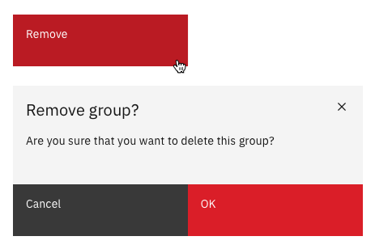

> "(Quote to go here...)"

<AnchorLinks>
  <AnchorLink>Grammar and structure</AnchorLink>
  <AnchorLink>Capitalization</AnchorLink>
  <AnchorLink>Punctuation and symbols</AnchorLink>
  <AnchorLink>Terminology</AnchorLink>
</AnchorLinks>

## Grammar and structure

When people click on UI buttons they are looking to do something, so button labels should predominantly use **verbs**.

- Use as few words as possible (but remain clear).
- Ideally UI button labels should be one or two words in length.
- Where there is more than one button (e.g. a modal with both a _Cancel_ and a _Submit_ button), positive actions should be displayed on the right, negative actions on the left.

<Row>
  <Column colMd={4} colLg={4}>
    <DoDontExample type="do" text="Sign up" aspectRatio="1:1" />
  </Column>
  <Column colMd={4} colLg={4}>
    <DoDontExample
      text="Yes, sign me up for the free trial"
      aspectRatio="1:1"
    />
  </Column>
</Row>

## Capitalization

Use sentence case capitalization.  
See the [Capitalization](/guidelines/content/capitalization) section for more details.

<Row>
  <Column colMd={4} colLg={4}>
    <DoDontExample type="do" text="Log in" aspectRatio="1:1" />
  </Column>
  <Column colMd={4} colLg={4}>
    <DoDontExample text="Log In" aspectRatio="1:1" />
  </Column>
</Row>

## Punctuation and symbols

Don’t use periods, ellipses, or other symbols in button labels.  
The only exception being the use of an ampersand, which is permitted in button labels.

<Row>
  <Column colMd={4} colLg={4}>
    <DoDontExample
      type="do"
      text="Publish app"
      aspectRatio="1:1"
    />
  </Column>
  <Column colMd={4} colLg={4}>
    <DoDontExample
      text="Publish app."
      aspectRatio="1:1"
    />
  </Column>
</Row>
<Row>
  <Column colMd={4} colLg={4}>
    <DoDontExample
      type="do"
      text="Preferences"
      aspectRatio="1:1"
    />
  </Column>
  <Column colMd={4} colLg={4}>
    <DoDontExample
      text="Preferences..."
      aspectRatio="1:1"
    />
  </Column>
</Row>
<Row>
  <Column colMd={4} colLg={4}>
    <DoDontExample
      type="do"
      text="Save & continue"
      aspectRatio="1:1"
    />
  </Column>
  <Column colMd={4} colLg={4}>
    <DoDontExample
      text="Save + continue"
      aspectRatio="1:1"
    />
  </Column>
</Row>

## Terminology

Check the [Glossry](/guidelines/content/glossary) to ensure you are using standard button labels.
(UI buttons are not the place to express your unbounded creativity.)

- Keep dialog titles, confirmation text, and button labels consistent.
- Only use the generic term OK if there is not a more obvious verb available.

In this example, the original button label is "Remove" yet the confirmation text then uses the term "delete",
and the confirmation button is "OK". This is inconsistent and confusing.
The correct word should be chosen depending on whether this action _removes_ or _deletes_ the object
(see the [Glossary](/guidelines/content/glossary) for details) and then used consistently throughout.