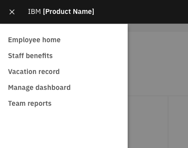

> “If a word in the dictionary were misspelled, how would we know?”

<AnchorLinks>
  <AnchorLink>Grammar and structure</AnchorLink>
  <AnchorLink>Capitalization</AnchorLink>
  <AnchorLink>Punctuation and symbols</AnchorLink>
  <AnchorLink>Using abbreviations</AnchorLink>
  <AnchorLink>Use of pronouns</AnchorLink>
</AnchorLinks>

## Grammar and structure

People use UI navigation links to get to a certain place within the product, so navigation labels should predominantly use **nouns**.

Of course, sometimes a noun alone is not sufficient. In such cases use an adjective to clarify the noun.

<Row>
  <Column colMd={4} colLg={4}>

<DoDontExample
type="do"
captionTitle=""
caption=""
>

</DoDontExample>

  </Column>
  <Column colMd={4} colLg={4}>

<DoDontExample
  type="do"
  captionTitle=""
  caption=""
  >

</DoDontExample>

  </Column>
</Row>

Use as few words as possible, but remain clear. If your navigation labels are more than three or four words, see if you can shorten them.

<Row>
  <Column colMd={4} colLg={4}>
    <DoDontExample
      type="do"
      text="Support"
      aspectRatio="1:1"
    />
  </Column>
  <Column colMd={4} colLg={4}>
    <DoDontExample
      text="Getting support"
      aspectRatio="1:1"
    />
  </Column>
</Row>
<Row>
  <Column colMd={4} colLg={4}>
    <DoDontExample
      type="do"
      text="Settings"
      aspectRatio="1:1"
    />
  </Column>
  <Column colMd={4} colLg={4}>
    <DoDontExample
      text="Configuring your settings"
      aspectRatio="1:1"
    />
  </Column>
</Row>
<Row>
  <Column colMd={4} colLg={4}>
    <DoDontExample
      type="do"
      text="Appliance dashboard"
      aspectRatio="1:1"
    />
  </Column>
  <Column colMd={4} colLg={4}>
    <DoDontExample
      text="Appliance management, monitoring, and availability dashboard"
      aspectRatio="1:1"
    />
  </Column>
</Row>

## Capitalization

Use sentence case capitalization for all navigation labels.  
See the [Glossary](glossary) for more details.

<Row>
  <Column colMd={4} colLg={4}>
    <DoDontExample type="do" text="User groups" aspectRatio="1:1" />
  </Column>
  <Column colMd={4} colLg={4}>
    <DoDontExample text="User Groups" aspectRatio="1:1" />
  </Column>
</Row>

## Punctuation and symbols

Don’t use periods, ellipses, or other symbols in navigation labels.

<Row>
  <Column colMd={4} colLg={4}>
    <DoDontExample
      type="do"
      text="Docs"
      aspectRatio="1:1"
    />
  </Column>
  <Column colMd={4} colLg={4}>
    <DoDontExample
      text="Docs."
      aspectRatio="1:1"
    />
  </Column>
</Row>
<Row>
  <Column colMd={4} colLg={4}>
    <DoDontExample
      type="do"
      text="Preferences"
      aspectRatio="1:1"
    />
  </Column>
  <Column colMd={4} colLg={4}>
    <DoDontExample
      text="Preferences..."
      aspectRatio="1:1"
    />
  </Column>
</Row>
<Row>
  <Column colMd={4} colLg={4}>
    <DoDontExample
      type="do"
      text="Users and groups"
      aspectRatio="1:1"
    />
  </Column>
  <Column colMd={4} colLg={4}>
    <DoDontExample
      text="Users & groups"
      aspectRatio="1:1"
    />
  </Column>
</Row>

## Using abbreviations

Feel free to use common software navigation label abbreviations such as _admin_, _app_, _docs_, _org_, etc. 
but avoid using less well-established abbreviations. If you do use an abbreviation, don’t add a period.

As always, consistency is key, so if you are going to use an abbreviation (e.g. "apps") then ensure 
that it is used throughout your product experience.

<Row>
  <Column colMd={4} colLg={4}>
    <DoDontExample type="do" text="Published apps" aspectRatio="1:1" />
  </Column>
  <Column colMd={4} colLg={4}>
    <DoDontExample type="do" text="Org settings" aspectRatio="1:1" />
  </Column>
</Row>
<Row>
  <Column colMd={4} colLg={4}>
    <DoDontExample type="do" text="Admin console" aspectRatio="1:1" />
  </Column>
  <Column colMd={4} colLg={4}>
    <DoDontExample text="Admin. console" aspectRatio="1:1" />
  </Column>
</Row>
<Row>
  <Column colMd={4} colLg={4}>
    <DoDontExample type="do" text="KPI dashboard" aspectRatio="1:1" />
  </Column>
  <Column colMd={4} colLg={4}>
    <DoDontExample text="KPI dash" aspectRatio="1:1" />
  </Column>
</Row>
<Row>
  <Column colMd={4} colLg={4}>
    <DoDontExample type="do" text="Kubernetes settings" aspectRatio="1:1" />
  </Column>
  <Column colMd={4} colLg={4}>
    <DoDontExample text="K8s settings" aspectRatio="1:1" />
  </Column>
</Row>

## Use of pronouns

In general, avoid using pronouns (e.g. _My apps_, _Your apps_, etc.) in navigation labels, except where it’s really necessary.
For example, in some contexts it might be necessary to distinguish between the user’s own assets (e.g. _My expenses_) and assets belonging to individuals whom they manage (e.g. _Team expenses_).

For more information see the article [Is this my interface or yours?](https://medium.com/@jsaito/is-this-my-interface-or-yours-b09a7a795256)

