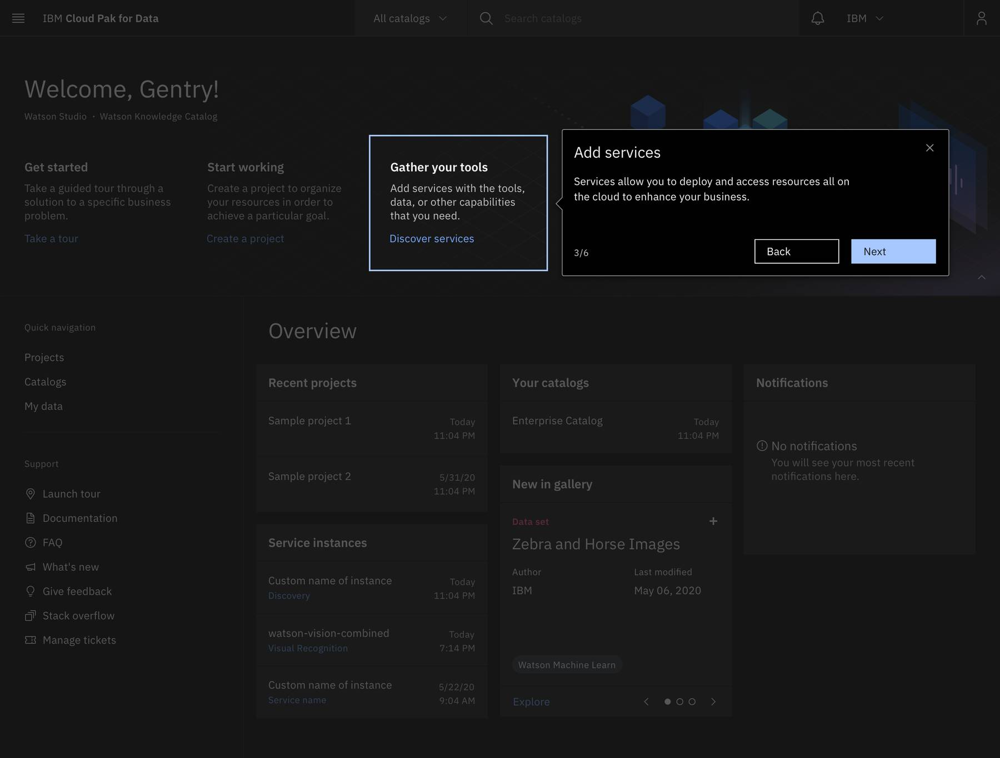
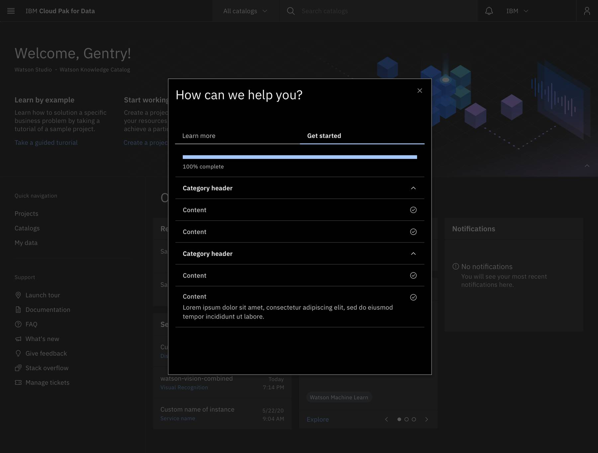

import illustrationVideo from './videos/BBcode-Illustration-Guidance.mp4';

<PageDescription>

  Here you can find design guidance to help speed up your getting started journey and help ensure consistency across the IBM Software portfolio. You can also find component-specific style guidance on each WalkMe component page.

</PageDescription>

<AnchorLinks>
  <AnchorLink>Design resources</AnchorLink>
  <AnchorLink>Choosing the correct template design</AnchorLink>
  <AnchorLink>Button structure</AnchorLink>
  <AnchorLink>Illustration</AnchorLink>
  <AnchorLink>Overlays and dark themes</AnchorLink>
</AnchorLinks>

## Design resources

We've pulled together some resources to help you get started.

<Row className="resource-card-group">
  <Column colMd={4} colLg={4} noGutterSm>
    <ResourceCard
      subTitle="WalkMe"
      title="Sketch kit"
      aspectRatio="2:1"
      actionIcon="download"
      href="https://sketch.cloud/s/16c33f90-8481-4210-a375-bcd14adadee4"
    >
    </ResourceCard>
  </Column>
  <Column colMd={4} colLg={4} noGutterSm>
    <ResourceCard
      subTitle="Growth team guidance"
      title="WalkMe Carbon design CSS template"
      aspectRatio="2:1"
      actionIcon="launch"
      href="https://nurturelove.w3bmix.ibm.com/documentation/datatools/walkme-guide/deploymentguides/designTemplates/"
    >
    </ResourceCard>
  </Column>
</Row>

## Choosing the correct template design

When creating a ShoutOut or Popup, choose the correct design template in the WalkMe Gallery.

For example, if a ShoutOut is needed without an illustration container don't delete the image container to create your desired design because it might cause the template to behave incorrectly.

Instead, select **Change Design** in the editor window and select **SWT START TEMPLATE, NO IMAGE.**

When creating a ShoutOut or Popup, choose the correct design template in the WalkMe Gallery.

For example, if a ShoutOut is needed without an illustration container don't delete the image container to create your desired design because it might cause the template to behave incorrectly.

Instead, select **Change Design** in the editor window and select **SWT START TEMPLATE, NO IMAGE.**

## Button structure

ShoutOuts, Popups , and Step balloons can all contain primary, tertiary, and close buttons. A button cannot have any element or text within 16 pixels / 1 rem of its borders.

For button groups, the primary button is positioned on the outside of the set, while the tertiary button is positioned inside. For a button with a glyph, the space between the button label and the glyph must be greater than or equal to 16 pixels / 1 rem. This is to accommodate for instances where two or more buttons with glyphs appear together. Visit [IDL button guidelines](https://www.carbondesignsystem.com/components/button/style/) for further behavior guidance.

Here are examples of default, hover and focus states:

#### Primary

 

#### Tertiary

 

#### Close

 

## Illustration

Use images and GIFs to amplify the story you're trying to tell and always use them in context. 

To add images to your ShoutOut or Popup, you can select the image icon and drag and drop your image into the design or link to the file through the BBcode.

To add a GIF, you'll need to link to the file through the BBcode because the drag and drop method has a max file size of 500KB.

To link files using the BBcode, you must have your image or GIF stored in a cloud location that can be accessed from a public URL. You can find more guidance around creating, storing, and uploading GIFS in this 

<Video src={illustrationVideo} />

Note: To size and scale your image appropriately, you can change the height of the image container but don't change the width. Also, make sure your image doesn’t cover or hide the close icon.

## Overlays and dark themes

Overlays should be utilized for both light and dark themes to provide better clarity around the flow or task that a user engages with.

WalkMe supports three types of overlay features: ShoutOut screen overlay, Step Balloon / Popup Spotlight, and Highlighters. Additionally, your Sketch file prototypes should follow these rules to get wider approval from an accessibility and design standpoint prior to implementation.

 

 

#### Dark themes

Dark themes may present unique difficulties with accessibility because we can only have one global template. Make sure you adopt the right ShoutOut screen overlays,  Step Balloon / Popup spotlight overlays, and Step Balloon Highlighters to avoid this issue.

 

 

#### ShoutOuts

Here you can add a screen overlay behind your ShoutOut, and set the color and opacity of the overlay. For ShoutOuts, the overlay color is Gray 100 #161616 at 70% opacity.

 

 

#### Popups

Popups were designed with custom CSS to match the styling of our ShoutOuts. Because of this you can only utilize the Spotlight overlay within the Popup settings. This should look the same visually but it is applied differently.

From here, you have to enable the Spotlight, set the position within the center of your screen with Position & Fine Tuning, and set the color to Gray 100 (#161616) with  .7 opacity.

 

 

#### Menu and player overlay

The menu and player overlay is styled in the Global CSS and should appear automatically when you build it in the WalkMe editor.

 

 

#### Step balloon spotlights

Be sure to use Spotlight Balloons for steps within your UI tours, since the primary goal is to call out specific parts of the UI.

When you enable the Spotlight Balloon feature for a step it will dim the screen, except for your selected element, and all other elements will be inactive.

Be sure to set the color to Gray 100 (#161616) at .7 opacity. Set the proper positioning and size in regards to your element, keeping in mind [Carbon spacing guidelines](https://www.carbondesignsystem.com/guidelines/spacing/overview).

Note: You have to set this for each balloon you create.

 

 

#### Step balloon highlighter

When you enable the Highlighter it will present a colored box around the chosen element of a step balloon. This feature is used to emphasize and frame the selected element. The highlighter is customizable in both thickness and color. Set the thickness to 2px and the color to Blue 30 #A6C8FF.

 

