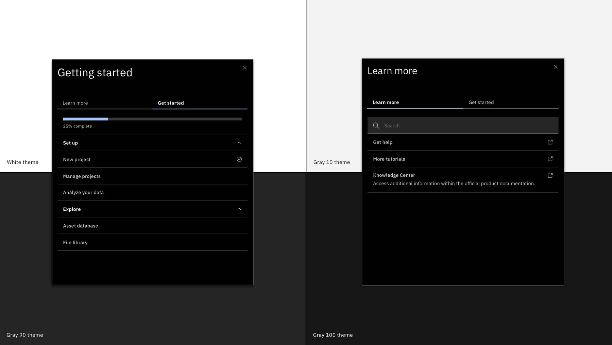

<PageDescription>

  The Menu is the default mechanism for users to access WalkMe experiences. It can be used to provide onboarding tasks, deliver “What’s new?” content, integrate resources, and provide support for the specific page the user is on.

</PageDescription>

<Row>
  <Column colLg={8}>

  </Column>
</Row>

The Menu can be used as a standalone component initiated by the WalkMe Widget component or it can be accessed as a docked button, pop-up, or from an existing menu item.

More information about the [Menu](https://support.walkme.com/knowledge-base/customize-player/).

## Use Cases

Users can return to the Menu to access available WalkMe content. You can configure the Menu to show specific content based on user segmentation and it can be accessed from a docked widget, a pop-up on the screen, or in an existing menu. When new content is created it is auto-added to the Menu, even if you don't want it there.

## Best Practices

* Place the widget where your user can quickly access it but make sure it doesn't block anything that your user might need to access
* Be sure to order the Onboarding tasks chronologically or in a way that makes most sense to your users
