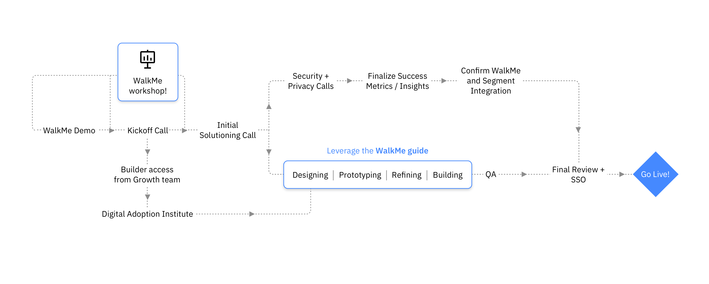

<PageDescription>

  IBM uses a third-party tool called [WalkMe](https://www.walkme.com/) to deploy getting started and trial experiences on top of our products—Welcome patterns, Overview patterns, and Task patterns. WalkMe also provides analytics, reporting, and session replays (for both WalkMe and the overall offering), which gives teams the opportunity to gain a comprehensive understanding of offering usage and data.

  In this PAL you can find information that covers [WalkMe patterns](/walkme-guide/walkme-patterns/overview), [Design guidance](/walkme-guide/overview/design), and [WalkMe components](/walkme-guide/overview/overview#walkme-components).

</PageDescription>

<AnchorLinks>
  <AnchorLink>WalkMe implementations</AnchorLink>
  <AnchorLink>Using the WalkMe guide</AnchorLink>
  <AnchorLink>WalkMe workshops</AnchorLink>
</AnchorLinks>

## WalkMe implementations

Before you dive deep into our WalkMe patterns, components, and design guidance, you should reach out to the [Growth team](/walkme-guide/overview/contacts#additional-contacts) to get set up with a WalkMe demo, a kickoff call, and receive WalkMe editor access. In addition, the Growth team will get you started with the [Digital Adoption Institute](https://community.walkme.com/forum/t/walkme-university-is-now-the-digital-adoption-institute/721) (formerly called WalkMe University) orientation course that helps you better understand how WalkMe interacts with your products.

In this initial stage, you and your team can set up a [WalkMe workshop](#walkme-workshops) to align around WalkMe concepts. The WalkMe workshop is flexible on timing and can be held before or after the WalkMe demo and kickoff calls. However, if the workshops are held too late in the process they will be less effective.

 

 

Once you are ready, you can leverage our WalkMe guide to help design your WalkMe experiences! We suggest that you reach out to the Growth team for questions on WalkMe's installation and technical issues.

## Using the WalkMe guide

The WalkMe guide Pattern Asset Library is broken down between WalkMe patterns, overall design guidance, and various WalkMe components.

### WalkMe patterns

WalkMe patterns are a set of design guidelines for getting started and trial experiences. They are made up of flows that contain sequences of WalkMe components to help successfully guide our users to achieve their goals. Here are a few of the most popular WalkMe patterns:

- [Welcome pattern](/walkme-guide/walkme-patterns/welcome-pattern) helps welcome your users to your product and best informs them of your product's values and capabilities. 
- [Overview pattern](/walkme-guide/walkme-patterns/overview-pattern) introduces users to key links, features, actions, and elements of a page with multiple important UI components.
- [Task pattern](/walkme-guide/walkme-patterns/task-pattern) guides and walks users through a specific task from beginning to end.

### Design guidance

From the [design guidance](/walkme-guide/overview/design) you can find information on how to utilize the WalkMe Carbon template in the WalkMe editor.

You can also find resources such as the WalkMe Sketch Kit and links to Carbon design guidance that is the foundation for the WalkMe Carbon components.

### WalkMe components

We've designed WalkMe components that compliment our existing Carbon styling. So far, we've established the following component patterns:

- [Player menu](/walkme-guide/menu/usage) and launcher are your users method to access and launch your WalkMe patterns.
- [ShoutOuts](/walkme-guide/shoutouts/usage) are modals that are used to create your Welcome screen patterns.
- [Smart Walk-Thrus](/walkme-guide/smart-walk-thrus/overview) are made up of Popups and Steps and are designed to help you create your UI tour and Step-by-step patterns.

## WalkMe workshops

The WalkMe workshops help you and your team kickoff your getting started journey!

Before you start each workshop, you should open up the Pre-workshop checklist. This will help you gather all the right materials and people you need to make the workshop a success. Use the Murals (one available for UI tours and one for step-by-step tours) to help facilitate the workshop to guide your team to create a low-fidelity WalkMe prototype. We've also pulled together some post-workshop guidance so you know what to do next.

If you need any help with the WalkMe workshop, reach out to the [Getting Started design team](/walkme-guide/overview/contacts#getting-started-design-team) for guidance!

 

<Row className="resource-card-group">
  <Column colMd={4} colLg={4} noGutterSm>
    <ResourceCard
      subTitle="Boxnote"
      title="Pre workshop homework"
      aspectRatio="2:1"
      actionIcon="launch"
      href="https://ibm.box.com/s/34m381edd5exgbba11xseirg26cj14wp"
    >
    </ResourceCard>
  </Column>
  <Column colMd={4} colLg={4} noGutterSm>
    <ResourceCard
      subTitle="Boxnote"
      title="Post workshop: next steps"
      aspectRatio="2:1"
      actionIcon="launch"
      href="https://ibm.box.com/s/pto3mlvxh3gp3lwmzuzmb9u3pln5n0mp"
    >
    </ResourceCard>
  </Column>
  <Column colMd={4} colLg={4} noGutterSm>
    <ResourceCard
      subTitle="Mural"
      title="UI tour workshop"
      aspectRatio="2:1"
      actionIcon="launch"
      href="https://app.mural.co/template/2202211f-9e8a-4b18-8926-d2a2b7680b0e/c72019ec-72e2-45b4-8d28-b90ac455ca36"
    >
    </ResourceCard>
  </Column>
  <Column colMd={4} colLg={4} noGutterSm>
    <ResourceCard
      subTitle="Mural"
      title="Step-by-step workshop"
      aspectRatio="2:1"
      actionIcon="launch"
      href="https://app.mural.co/template/a9f51ec9-4d73-47b2-9b0f-0ed43ae74032/4121da59-969c-46cd-810c-890e53c938f8"
    >
    </ResourceCard>
  </Column>
</Row>
