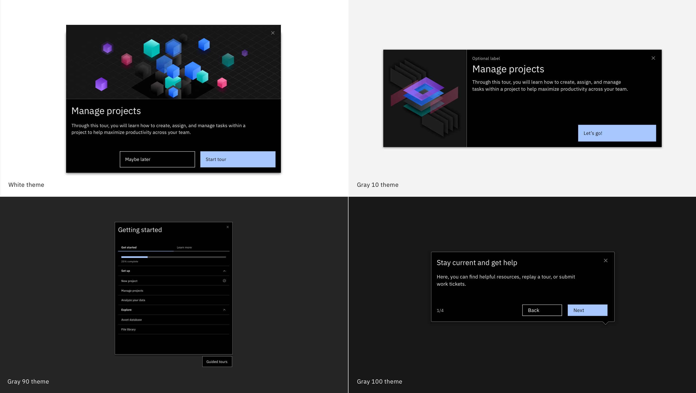

<PageDescription>

  UI tours are guided introductions to key links, features, actions, and elements of a page with multiple important UI components. Use these tours to orient new users within key experiences like a homepage or dashboard.

  UI tours should follow a linear flow that helps users gain not only a basic understanding, but an overall sense of ease and confidence, when navigating a product's central—and relatively complex—pages. You can also use UI tours to reorient user around any major updates.

</PageDescription>

<AnchorLinks>
  <AnchorLink>Primary components</AnchorLink>
  <AnchorLink>Content guidelines </AnchorLink>
</AnchorLinks>

<Row>
  <Column colLg={8}>

  </Column>
</Row>

## Primary components

UI Tours should follow this basic structure: 

* Each tour should start with a **ShoutOut or Popup** followed by a series of **Smart Walk-Thru** Steps 
* Tours should be **6 steps** or fewer 
* Navigation via buttons (Next, Back, Done) 
* Optional: include a Popup at the end of the UI tour if you want the user to continue to another tour or resource 

## Content guidelines

In contrast to a step-by-step tour, the linear nature of this type of tour is fabricated. The steps do not inherently lead to one another. 

Here are a few things to remember as you're creating your tour: 

1. Point out key features and functions that might be new to your users. 
2. Don't highlight pieces of the experience that are obvious or "table stakes." 
3. Keep steps short, ensure the messages are direct and actionable, and clearly communicate the end goal.

#### Component guidance 

**Opening ShoutOut or Popup:**

* Describe what the tour will cover and why it is beneficial to the user
* Use welcoming, encouraging language (Think of yourself as the best tour guide ever!) 
* Offer the user the option to close/return to the player to continue

**Steps:**

* Avoid direct calls to action that might unintentionally divert users and cause drop-off (For example: "Click here to expand the menu") 
* Instead of asking users to "click" consider using verbs like "explore"
* In this context, Questions may be used to frame objective or purpose 

**Closing Popup (Optional):**

* Congratulate the user on finishing this tour 
* If applicable, offer a direct call-to-action to additional resources or a followup tour

Need a bit more content and style guidance?

Visit the [ShoutOut](/walkme-guide/shoutout) and [Smart WalkThru](/walkme-guide/smart-walk-thrus) pages. 
