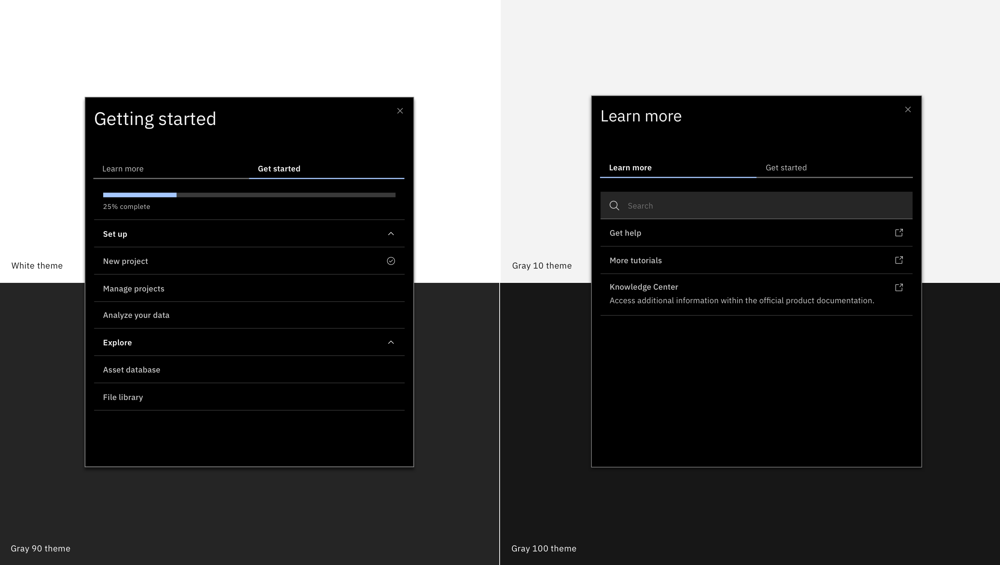

<PageDescription>

  The Player menu is the default mechanism for users to access WalkMe experiences. It can be used to provide onboarding steps, deliver “What’s new?” content, integrate resources, and provide support for the specific page the user is on.

</PageDescription>

<Row>
  <Column colLg={8}>

  </Column>
</Row>

The Player can be used as a standalone component initiated by the Walkme Widget component or it can be accessed as a docked button, pop-up, or from an existing menu item.

More information about the [Player](https://support.walkme.com/knowledge-base/customize-player/).
