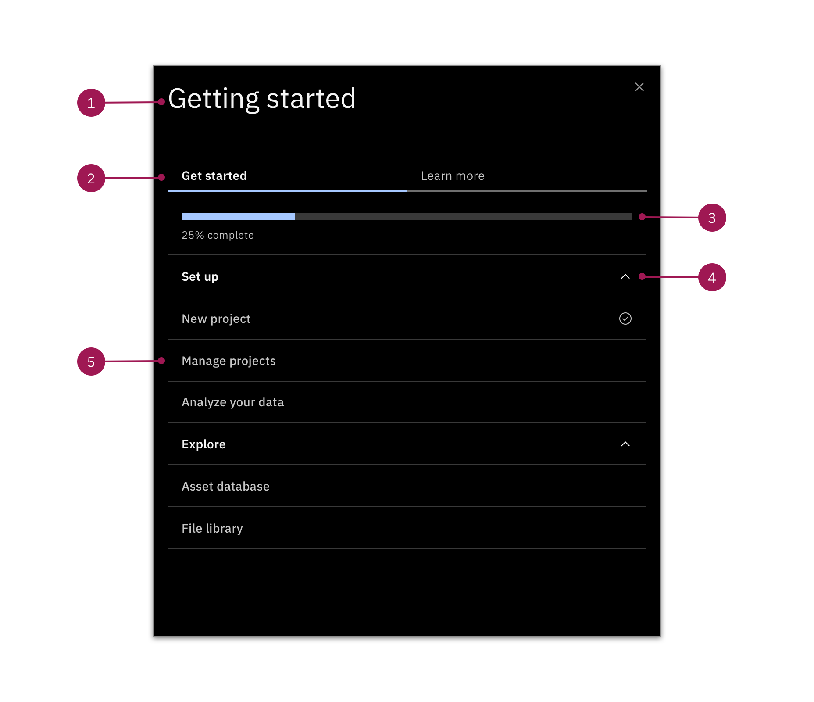
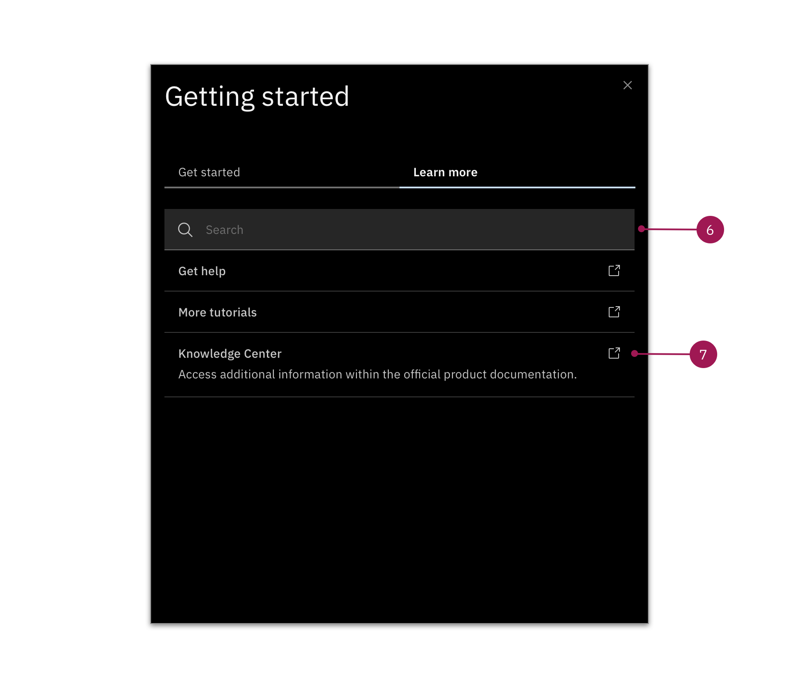

<AnchorLinks>
  <AnchorLink>Content</AnchorLink>
  <AnchorLink>Visual</AnchorLink>
</AnchorLinks>

## Content

<Row>
  <Column colLg={8}>

  </Column>
</Row>

All of the labels within the Player should be clear and concise. They should speak to the tasks your users will accomplish or the things they will learn. 

#### 1. Title 

The title of your Player should call back to the title of the Launcher or the in-product call to action that you design.

Common titles:

* Guided tours
* Need help?
* Key tasks
* Get started
* Start here

#### 2 Tabs 

Within the Player, you can use tabs to group similar resources. Tabs should be labeled based on where the user is in their journey. 

Popular tab labels include:

* **Get started** For onboarding walkthroughs and step-by-step guides for key tasks
* **Learn more** For deeper knowledge through walkthroughs and links to additional resources
* **Help** (Optional) For links to support, documentation, etc.

#### 3. Progress bar (Optional) 

Include the progress bar if you have a series of tasks that need to be completed within a certain order, like a course. 

#### 4. Categories 

Use categories to group 2 or more pieces of similar content.

* Make sure your content is listed in order of relevance or sequence 
* Avoid creating categories with only one guided tour or resource
* Categories that have more than 6 pieces of content might be too vague, consider splitting them up

**Labeling categories**

As you build out your information architecture, be sure to establish a consistent naming convention for your categories. Avoid categories that are directly redundant of your content and make sure the labels are clear, concise, and consistent. 

Some popular themes include:

* Actions (Set up, Explore)
* Goals (Manage users, Set up projects) 
* Content type (Step-by-step tours, Videos) [Use this in the Learn more tab] 

#### 5. Content labels

Think of content labels as course titles. The user should know exactly what they'll get by going through the tour or accessing the resource. 

As you're labeling your content, ask yourself:

* What is the user going to learn? 
* What tasks will they be completing? 
* What will they be watching, reading, or doing?

<Row>
  <Column colLg={8}>

  </Column>
</Row>

#### 6. Search field (Optional) 

Include the search field if you have 7 or more links within the Learn more tab or if you want the user to be able to search within the Knowledge Center or existing documentation. 

#### 7. Content description 

Only use descriptions for external resources that your users will be linking off to. The description should speak directly to the user and what they will learn. 

## Visual

#### Do's:

* Use the check mark and progress bar for guided tours 
* Use the external link icon for resources

#### Don'ts:

* Don't place the launcher in an area that covers vital information
* Don't resize the player

#### Specs
