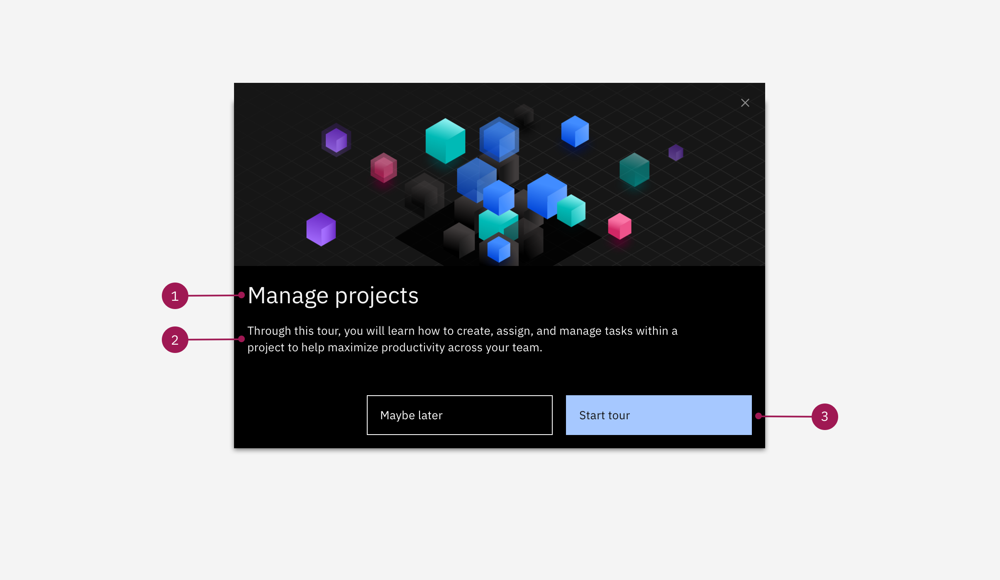

<PageDescription>

  ShoutOuts should be clear and concise, and speak directly to the user. ShoutOuts should have between 3-5 sentences and contain just enough information for your user to get an understanding of the feature or tour.

</PageDescription>

#### Tips:

* **Don't** use for system outages, maintenance notifications, or error messages if a mechanism is already in place for your product.
* **Don't** use to embed videos, instead use a SWT Pop-up.
* **Do** limit titles to one line of text, using sentence style capitalization.
* **Don't** market the product to the user when conveying the products value.

<Row>
  <Column colLg={8}>

  </Column>
</Row>

**1. Header (55 characters):** 

If you're using a ShoutOut to kickoff a tour, the header should welcome and speak directly to the user. It should state what they will accomplish within the tour. **Pro-tip:** The header for this modal can match the label in the Player. 

If you're using a ShoutOut to call out a specific feature, make sure you're highlighting the direct value to the user and how it will help them do their job. Avoid anything that might sound like sales or marketing. 

**2. Body Content (310 characters):**

This content should be clear and concise. It should say exactly what the user will accomplish within the tour or the value of the specific feature. 

**3. Buttons:** Should give the user two options to either start a tour or explore the UI on their own. 

Popular button labels:

* **Primary button:** Let's go!; Start tour 
* **Tertiary button:** Maybe later; Explore on my own
