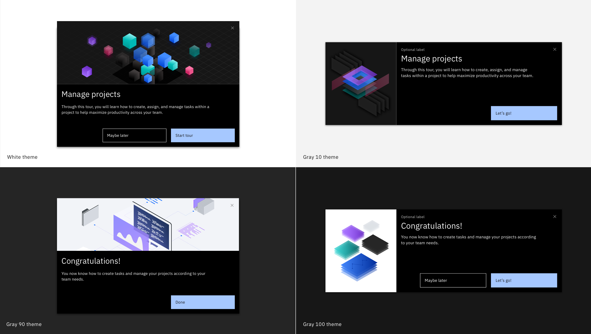

<PageDescription>

  ShoutOuts are dynamic components that you can use to welcome the user to a product or launch a Smart Walk-Thru tour. ShoutOuts present content that users won't need to re-access from the player later.

</PageDescription>

<Row>
  <Column colLg={8}>

  </Column>
</Row>

Consider how you would like to communicate information to your users. Instead of relying on your user to seek out information that they might not even know exists, ShoutOuts automatically appear and guarantee users see your message. You can add an action button to the ShoutOut that takes the user to a Smart Walk-Thru or links out to additional resources.

## Use cases

* Welcome user to the product
* Launch a tour
* Present content that users won’t need to re-access later
* Promote new features

You can configure ShoutOuts to appear automatically throughout a users' journey or manually from a Launcher or Player. Depending on how you're building the experience, you can start a tour with a ShoutOut instead of a Popup.

## Best practices

* Configure and associate segments to ensure the correct users are viewing the ShoutOut based on permissions, roles, and access.
* Make sure messaging is popping up at the right time, in the right place, and for the right user.
* Use a Launcher to initiate a ShoutOut so it's not as disruptive.
* Carefully determine which content is best suited for a ShoutOut so that users are not inundated by them.
* Work with your project teams to determine content and autoplay rules based on your user goals.
* Try not to market the product to the user when conveying the products value.
