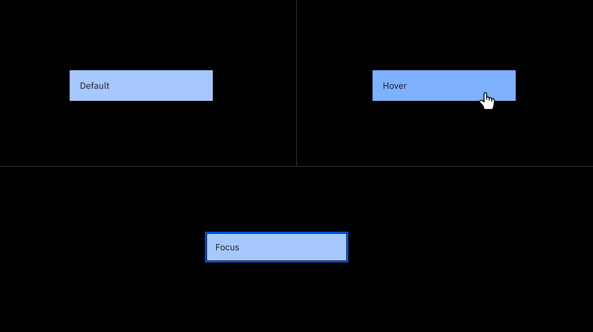
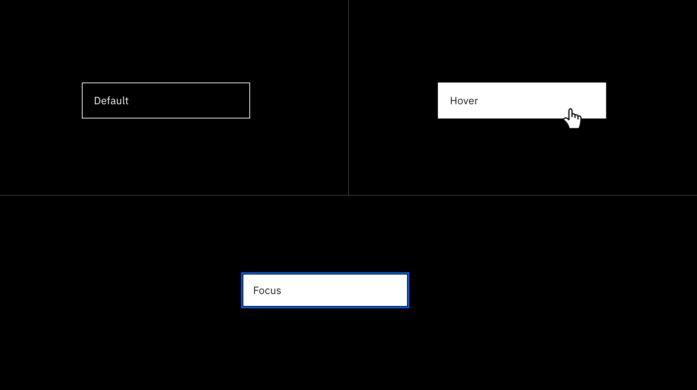
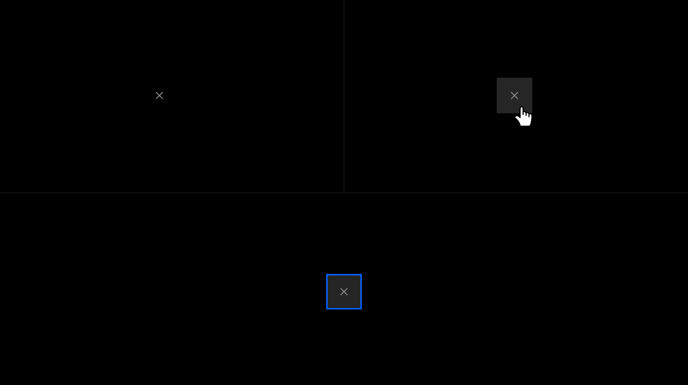
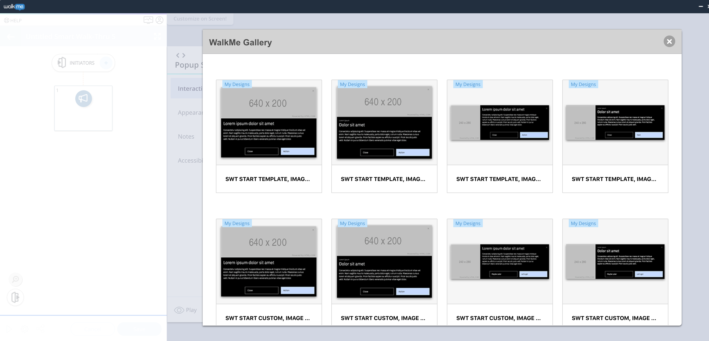
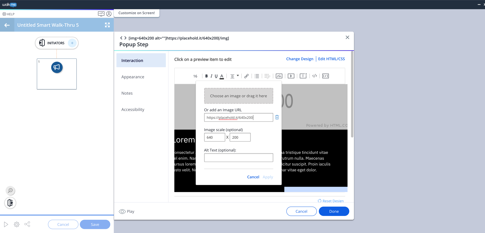

## Button Structure

A button cannot have any element or text within 16 pixels / 1 rem of its borders. For button groups, the primary button is positioned on the outside of the set, while the tertiary button is positioned inside. For a button with a glyph, the space between the button label and the glyph must be greater than or equal to 16 pixels / 1 rem. This is to accommodate for instances where two or more buttons with glyphs appear together. Visit [IDL button guidelines](https://www.carbondesignsystem.com/components/button/style/) for further behavior guidance.

#### Primary

<Row>
  <Column colLg={8}>

  </Column>
</Row>

#### Tertiary

<Row>
  <Column colLg={8}>

  </Column>
</Row>

#### Close

<Row>
  <Column colLg={8}>

  </Column>
</Row>

## Choose the correct template design

When creating a ShoutOut, choose the correct design template in the WalkMe Gallery.

For example, if a ShoutOut  is needed without an illustration container don't delete the image container to create your desired design because it might cause the template to behave incorrectly.

Instead, select **Change Design** in the editor window and select **SWT START TEMPLATE, NO IMAGE.**

<Row>
  <Column colLg={8}>

  </Column>
</Row>

## Illustration

Illustration works to amplify the story we tell to our users and should be used in context with the information provided. There are two ways to add illustration to your Shout out: Select the image icon and drag and drop, or link the image through the BBcode.

<Row>
  <Column colLg={8}>

  </Column>
</Row>

#### Do's:

- Change the height of the image container
- Size and scale your image appropriately
- Use optional overlay for better separation

#### Don'ts:

- Change the width of the image container
- Obstruct visibility of the close icon with illustration elements

#### Resources

<Row className="resource-card-group">
  <Column colMd={4} colLg={4} noGutterSm>
    <ResourceCard
      subTitle="IBM Design Language"
      title="Illustration Guidelines"
      aspectRatio="2:1"
      actionIcon="launch"
      href="https://www.ibm.com/design/language/illustration/overview/"
    >
    </ResourceCard>
  </Column>
</Row>