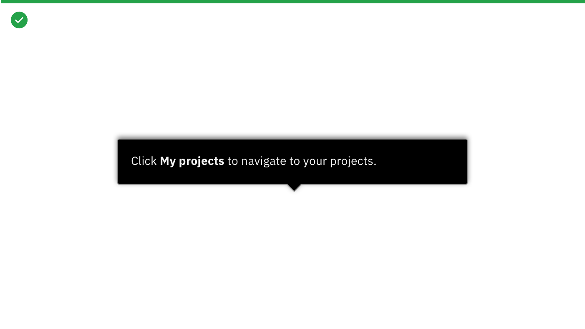
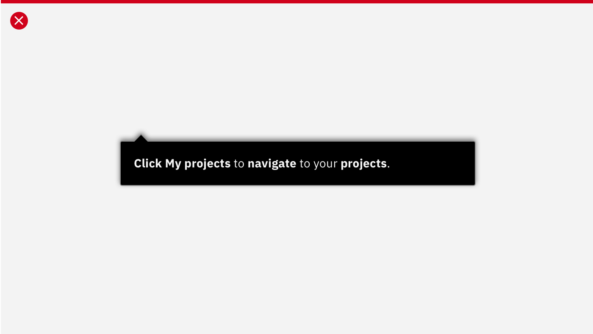

## Content Guidelines

Use SmartTips to give users quick contextual assistance. Limit text to no more than two lines of text. Limit the number of links in a tooltip to one.

* If you need to link out to another resource, provide a contextual hyperlink and label it as  "Learn more"
* Don't use list items in a tooltip
* Don't use periods for fragmented sentences
* If you are guiding a user to take an action, be sure explain the reasoning. For example: Instead of "Click here" it should be "Click **My projects** to navigate to your projects." 

## Visual

<Row>
  <Column colLg={8}>

  </Column>
</Row>

#### Do's:

* Bold words that add value to the statement
* Use the Carbon information icon in your product

<Row>
  <Column colLg={8}>

  </Column>
</Row>

#### Don'ts:

* Use WalkMe icons
* Bold words for decoration