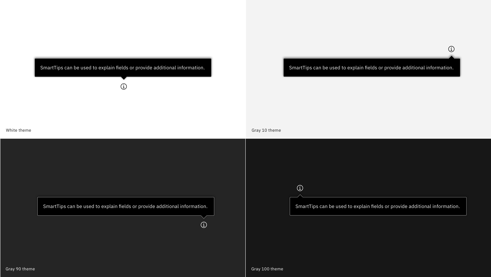

<PageDescription>

  SmartTips can be used to explain fields or provide additional information. SmartTips should only be used if you don't using Carbon Tooltips within your product yet.

</PageDescription>

<Row>
  <Column colLg={8}>

  </Column>
</Row>

SmartTips should always be attached to an information icon and are triggered when a user hovers over them.

For more information, see the Carbon [tooltip component](https://www.carbondesignsystem.com/components/tooltip/code) guidance.
