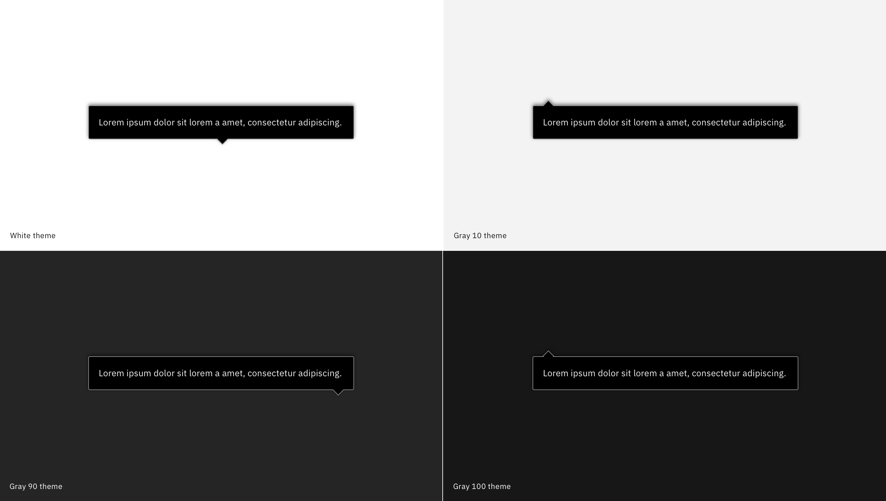

<PageDescription>

  SmartTips can be used to explain fields or provide additional information.

</PageDescription>

<Row>
  <Column colLg={8}>

  </Column>
</Row>

SmartTips should always be attached to an information icon and are triggered when a user hovers over them. 

Please reference the [Carbon guidelines](https://www.carbondesignsystem.com/components/tooltip/code) for additional usage guidance.
