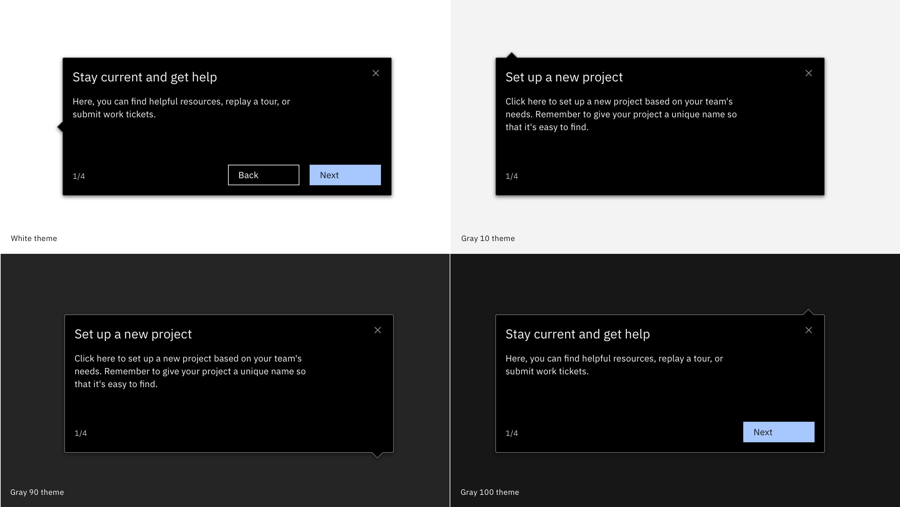

<PageDescription>

  The Smart Walk-Thrus feature allows you to create step balloons within your product that guide users through any process. Just like a GPS takes you from start to finish where you want to go, a Smart Walk-Thru will take your users through any process with interactive step-by-step guidance.

</PageDescription>

<Row>
  <Column colLg={8}>

  </Column>
</Row>

## Use cases

You can use Smart Walk-Thrus to build out various types of in-app guidance and tutorials, but the two most common use cases for getting started experiences are:

* [UI tours](/walkme-guide/overview/ui-tours) that point out specific parts of the UI and help orient new users or highlight new features
* [Step-by-step guides](/walkme-guide/overview/step-by-step-guides) that help a user complete a specific task 

## Components

The Smart Walk-Thru feature includes the following components: 

[Steps](/walkme-guide/smart-walk-thrus/steps)

* components that point to specific elements in the UI or prompt the user to do something 

[Popups](/walkme-guide/smart-walk-thrus/pop-ups)

 * large modal components that appear in the center of the screen, unattached from UI elements. Within our current visual guidance, Popups and ShoutOuts follow the same style guidance.  
