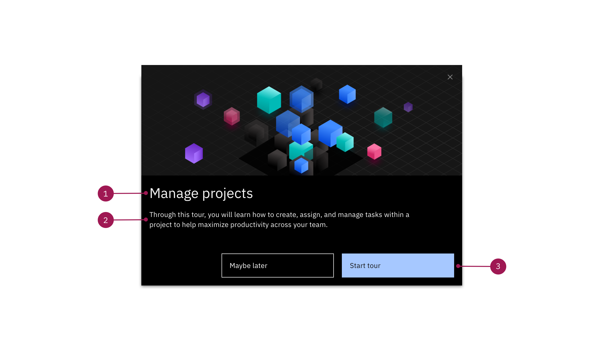
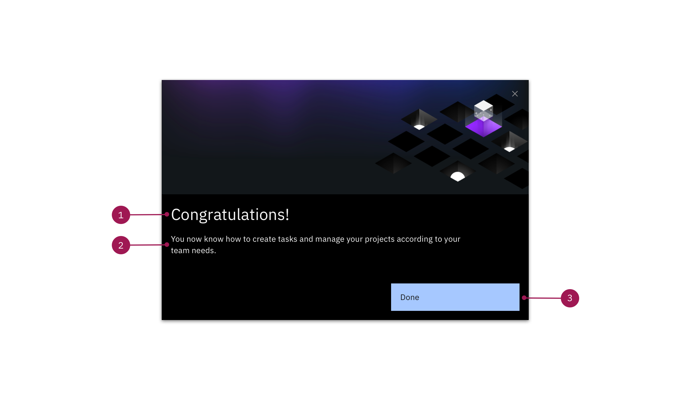

<PageDescription>

  Popups have multiple uses within a Smart Walk-Thru. You can use them to start and end a tour, or provide additional information that isn't directly anchored to a specific part of the UI.

</PageDescription>

<Row>
  <Column colLg={8}>

  </Column>
</Row>

## When starting a tour 

All tours should include a welcome popup that explains exactly what the user will do within a tour. Keep things short and concise, but be sure to highlight the value of this particular feature or action.

**1. Header (Max. 55 characters):**

If you're using a Popup to kickoff a tour, the header should welcome and speak directly to the user. It should state what they will accomplish within the tour. Pro-tip: The header for this modal can match the Player title.

**2. Body Content (310 characters):**

This content should be clear and concise. It should say exactly what the user will accomplish within the tour and the value it will bring.

**3.Buttons:**

Should give the user two options to either start a tour or explore the UI on their own.

**Popular button labels:**

* Primary button: Let's go!; Start tour 
* Tertiary button: Maybe later; Explore on my own

## When ending a tour (optional)

Just like any good story, every tour should have a clear ending. Within a Step-by-Step guide we recommend using a Popup to congratulate the user and, if applicable, guide them to additional resources or tours.

<Row>
  <Column colLg={8}>

  </Column>
</Row>

**1. Header (Max. 55 characters):**

Congratulate the user for completing the tour or task. Remember to be encouraging and engaging.

**2. Body Content (310 characters):**

This is a good time to give the user a quick summary of what they've just walked through and accomplished.

If there were multiple sections of the tour, feel free to list a summary of those sections and what they helped the user to accomplish. If applicable, provide a call to action to the next tour in the sequence or additional resources.

**3.Buttons:**

This would be a great time to suggest other tours that the user may want to explore.

* **Primary button:** Finish; Done
* **Tertiary button:** Explore more
