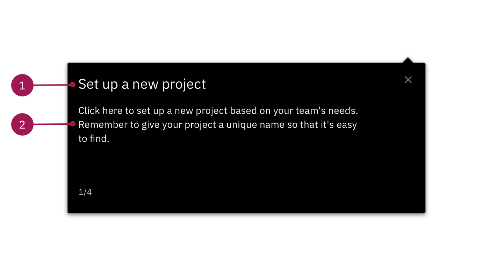

<PageDescription>

  All Steps must be anchored to a specific part of the UI, whether you're pointing out a specific feature within a UI tour, or prompting the user to take a specific action within a Step-by-step guide.

  Here, we've broken down the guidance to highlight the types of steps you can use and when.

</PageDescription>

## Steps with action buttons 

Use steps with action buttons to point out specific parts of the UI. For the most part, these steps **don't** prompt the user to take action and are primarily used for UI tours. 

#### Usage

* Use buttons to advance the tour
* Limit headers to one line of text (Max. 55 characters)
* Limit body text to 2 sentences 

#### Content

<Row>
  <Column colLg={8}>

  </Column>
</Row>

**1. Header (Max. 55 characters):**

* The header should be action-oriented and geared toward the user. User words like: Explore, view, find, etc.
* If you are pointing out a specific part of the UI with a clear label, the header should include it
* Keep the tone neutral and limit exclamation points unless they have completed a section or tour 

**2. Body text:**

* Keep a conversational tone but always be clear and concise
* Avoid more direct calls to action that might unintentionally divert users and cause drop-off (For example: "Click here to expand the menu") 
* Avoid using terms like "click" without explaining to the user why they are selecting that option. This prevents the user from unintentionally exiting the tour.

**3. Button(s):**

* You may want to get fancy..but don't. **Only use:** Next, Back, and Done 

## Steps without action buttons 

Use these steps to instruct your users to take a direct action within the UI. These steps are only used within Step-by-step guides. 

#### Usage

* User actions advance the tour
* Limit titles to one line of text (Max: 55 characters)
* Body text is optional, limit to 2 sentences 

#### Content

<Row>
  <Column colLg={8}>

  </Column>
</Row>

**1. Header (Max. 55 characters):**

* Clearly state where and what the user will click on or navigate to
* Use "select" instead of "click here" if there are multiple options for the user to choose from
* Use "navigate to" if there is a dropdown menu the user needs to click before getting to their destination

**2. Body content (optional):**

* Use the body section to explain why the user would navigate to or click on a specific section in the UI
* Add tips in this section if there is useful information that can help the user do something better or faster
* If your user is about to navigate to a new page, tell them why they are going there
