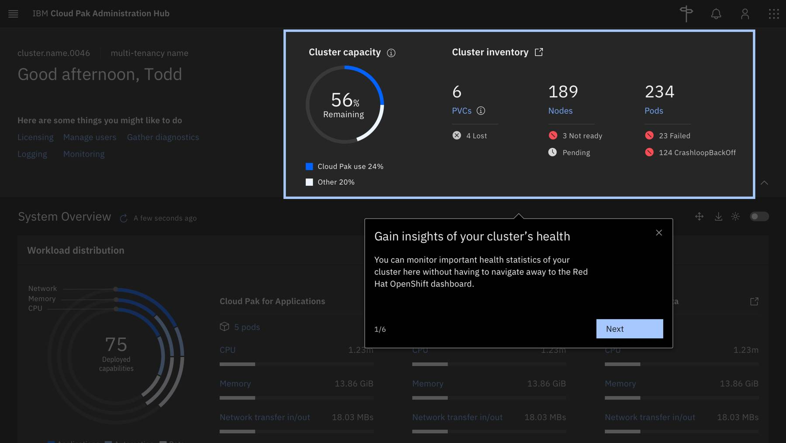

<PageDescription>

Overview patterns help you create a flow that points out specific features or elements within the UI to your users. These patterns can also help you orient new users on the homepage or highlight new features.

</PageDescription>

 

<Row>
  <Column colLg={10}>

  </Column>
</Row>

 

<AnchorLinks>
  <AnchorLink>Usage</AnchorLink>
  <AnchorLink>Components</AnchorLink>
  <AnchorLink>Examples</AnchorLink>
</AnchorLinks>

## Usage

**Used to**:
- Give a new user some context and value provided by the product
- Highlight the value in context of the UI and where they can access the value

**Not used to**:
- Teach the user how to do something

Best practices
- Point out key features and functions that might be new to your users
- Don’t highlight pieces of the experience that are obvious or “table stakes”
- Keep steps short and make sure you’re highlighting the value to your users, instead of just pointing something out
- At the end of the flow, point out where they can access that experience and others

## Components

Overview patterns should follow this basic structure: 

- Each tour should start with a [Popup](/walkme-guide/smart-walk-thrus/popups) or Carousel followed by a series of [Step Balloons](/walkme-guide/smart-walk-thrus/steps)
- Tours should be **6 visible steps or fewer** not counting the opening and closing Popups
- Include a Popup at the end of the tour. Optionally: provide additional call to action if you want the user to continue to another tour or resource

 

### Popups

<Row>
  <Column colLg={10}>

  </Column>
</Row>

Opening Popups
- Describe what the tour will cover and why it is beneficial to the user
- Use welcoming, encouraging language (Think of yourself as the best tour guide ever!) 
- Offer the user the option to close/return to the player to continue

Closing Popup (optional) 
- Congratulate the user on finishing this tour 
- If applicable, offer a direct call-to-action to additional resources or a follow-up tour

For more guidance on [Popups](/walkme-guide/smart-walk-thrus/popups).

 

### Carousels

<Row>
  <Column colLg={10}>

  </Column>
</Row>

### Steps (with button)

<Row>
  <Column colLg={10}>

_Overview-pattern.png)

  </Column>
</Row>

- If you're primarily using Step balloons with buttons remember to avoid direct calls to action that might unintentionally diver users and cause drop-off (Example: "Click here to expand the menu")
- Remember to always highlight the value of the feature or function to your user and their jobs to be done
- In this context, questions may be used to frame objective or purpose 

For more guidance on [Steps (with buttons)](/walkme-guide/smart-walk-thrus/steps#step-balloons-with-action-buttons).

 

### Steps (without button)

<Row>
  <Column colLg={10}>

_Overview-pattern.png)

  </Column>
</Row>

For more guidance on [Steps (without buttons)](/walkme-guide/smart-walk-thrus/steps#step-balloons-without-action-buttons).

## Examples

We’ve collected examples of WalkMe UI tour patterns that have been created by other IBM product teams. You can access them below.

 

<Row className="resource-card-group">
  <Column colMd={4} colLg={4} noGutterSm>
    <ResourceCard
      subTitle="Invision"
      title="Cloud Pak for Data - Overview pattern"
      aspectRatio="2:1"
      actionIcon="launch"
      href="https://ibm.invisionapp.com/share/BKO0DPU5X6P#/screens/319672284"
    >
    </ResourceCard>
  </Column>
  <Column colMd={4} colLg={4} noGutterSm>
    <ResourceCard
      subTitle="Invision"
      title="Admin hub - Overview pattern"
      aspectRatio="2:1"
      actionIcon="launch"
      href="https://ibm.invisionapp.com/share/TKO0HT7VSNZ#/screens/319711634"
    >
    </ResourceCard>
  </Column>
  <Column colMd={4} colLg={4} noGutterSm>
    <ResourceCard
      subTitle="WalkMe"
      title="Live example - Overview pattern"
      aspectRatio="2:1"
      actionIcon="launch"
      href="?walkme=19-824082"
    >
    </ResourceCard>
  </Column>
</Row>
