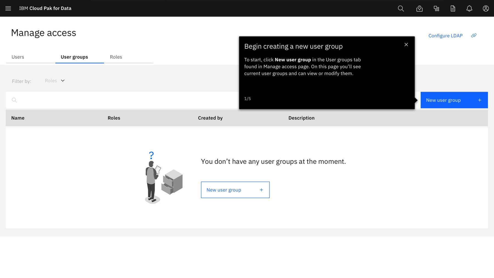
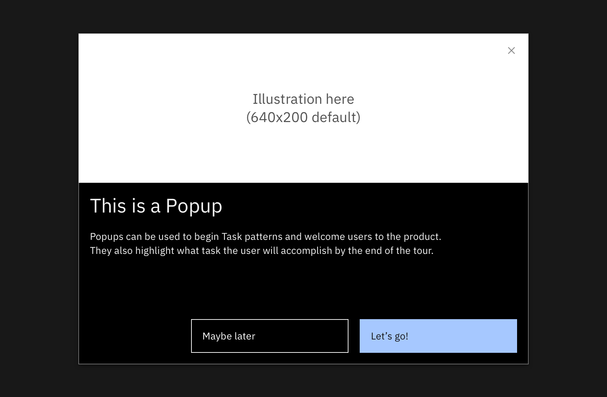

<PageDescription>

Task patterns are guidelines that help you successfully implement WalkMe components that guide your users to complete specific tasks within the UI.  These tasks should help your users get to productive use of the product from Day 1 of their journey and on.

</PageDescription>

 

<Row>
  <Column colLg={10}>

  </Column>
</Row>

 

<AnchorLinks>
  <AnchorLink>Usage</AnchorLink>
  <AnchorLink>Components</AnchorLink>
  <AnchorLink>Examples</AnchorLink>
</AnchorLinks>

## Usage

**Used to**:
- Take the user through a task to show them how it's done and/or how easy it can be
- Explain the value of the various steps in completing the task

**Not used to**:
- Set context at Day 1, unless there is a difficult task that must be completed before the user can do anything else

Best practices
- Avoid tasks that are overly complex or can’t be automated through WalkMe
- Don’t just tell a user to “click” somewhere without providing context or value
- Keep steps short, ensure the messages are direct and actionable, and clearly communicate the end goal

## Components

Task patterns should follow this basic structure:

- Start the tour with a [Popup](/walkme-guide/smart-walk-thrus/popups) or Carousel followed by a series of [Step Balloons](/walkme-guide/smart-walk-thrus/steps).
- Tours should be **8 visible steps or fewer** not counting the opening and closing Popups
- Use Popups to reorient the user during a tour
- End each tour with a congratulatory Popup and clear call to action 

 

### Popups

<Row>
  <Column colLg={10}>

  </Column>
</Row>

Opening Popup:
- Use welcoming, encouraging language (Think of yourself as the best tour guide ever!) 
- Describe the task that they'll complete and what they'll learn along the way 
- Always offer the option to close/return to the player 

Closing Popup: 
- Congratulate the user for completing the task
- If applicable, suggest another tour or point out additional resources

For more guidance on [Popups](/walkme-guide/smart-walk-thrus/popups).

 

### Carousels

<Row>
  <Column colLg={10}>

  </Column>
</Row>

 

### Steps (without button)

<Row>
  <Column colLg={10}>

_Task-pattern.png)

  </Column>
</Row>

- Provide clear and precise direction
- If the step is simple, include the purpose or result of the action and omit body text
- If including body text, avoid redundancy and only use this text to describe the value of the action the user is taking or provide additional context

For more guidance on [Steps (without buttons)](/walkme-guide/smart-walk-thrus/steps#step-balloons-without-action-buttons).

 

### Steps (with button)

<Row>
  <Column colLg={10}>

-Task-pattern.png)

  </Column>
</Row>

For more guidance on [Steps (with buttons)](/walkme-guide/smart-walk-thrus/steps#step-balloons-with-action-buttons).

## Examples

We’ve collected examples of WalkMe UI tour patterns that have been created by other IBM product teams. You can access them below.

 

<Row className="resource-card-group">
  <Column colMd={4} colLg={4} noGutterSm>
    <ResourceCard
      subTitle="Invision"
      title="Cloud Pak for Data - Task pattern"
      aspectRatio="2:1"
      actionIcon="launch"
      href="https://ibm.invisionapp.com/share/BKO0DPU5X6P#/screens/319672299"
    >
    </ResourceCard>
  </Column>
  <Column colMd={4} colLg={4} noGutterSm>
    <ResourceCard
      subTitle="WalkMe"
      title="Live example - Task pattern"
      aspectRatio="2:1"
      actionIcon="launch"
      href="?walkme=19-824109"
    >
    </ResourceCard>
  </Column>
</Row>
