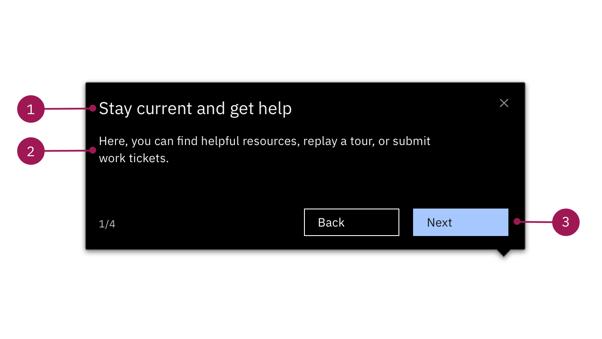
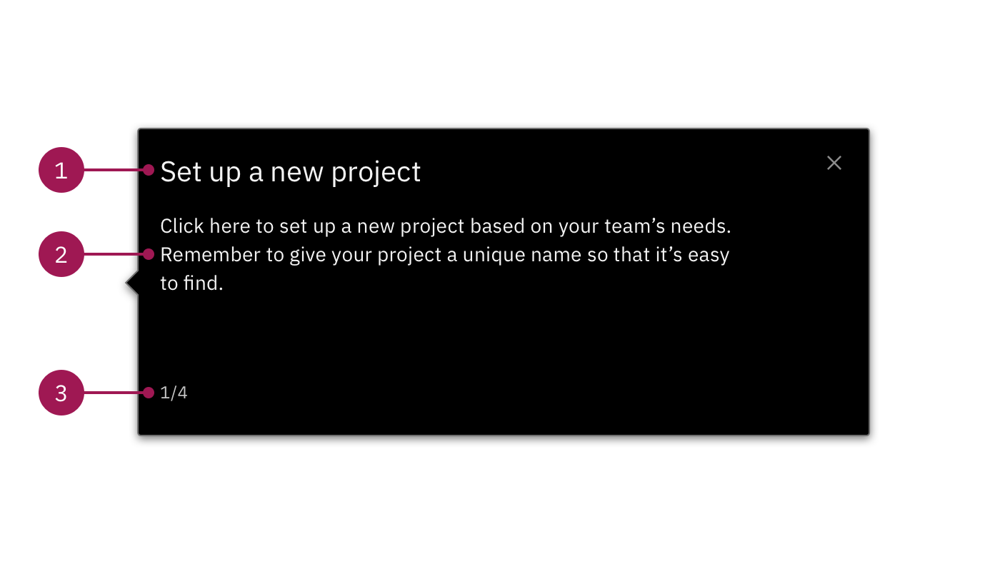
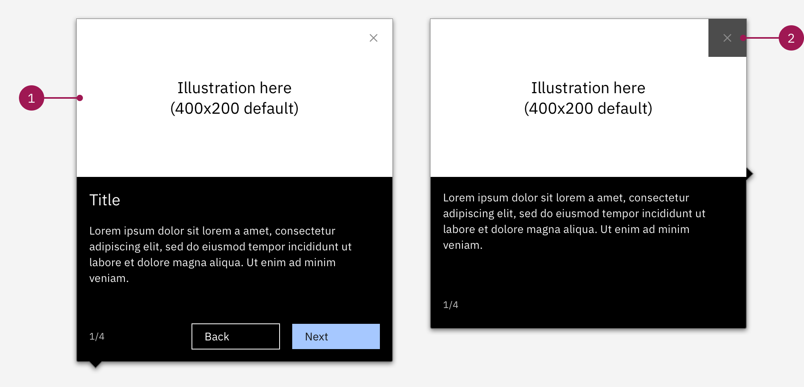

import paginationVideo from './videos/pagination.mp4';

<PageDescription>

  Step balloons must be anchored to a specific part of the UI, whether you're pointing out a specific feature within a UI tour or prompting the user to take an action within a Step-by-step guide. Here's some guidance around the types of Step balloons you can use and when.

</PageDescription>

 

 

## Style and usage

 

### Step balloons with action buttons

Use Step balloons with action buttons to point out specific parts of the UI. For the most part, these steps **don't** prompt the user to take action and are triggered by the action button.

<Row>
  <Column colLg={8}>

  </Column>
</Row>

 

#### 1. Header (Max. 55 characters):

* The header should be action-oriented and geared toward the user. User words like: Explore, view, find, etc.
* If you are pointing out a specific part of the UI with a clear label, the header should include it
* Keep the tone neutral and limit exclamation points unless they have completed a section or tour

#### 2. Body text:

* Keep a conversational tone but always be clear and concise
* Avoid more direct calls to action that might unintentionally divert users and cause drop-off (For example: "Click here to expand the menu")
* Avoid using terms like "click" without explaining to the user why they are selecting that option. This prevents the user from unintentionally exiting the tour.

 

### Step balloons without action buttons

Use these Step balloons to instruct your users to take a direct action within the UI. These steps are triggered by actions within the UI.

<Row>
  <Column colLg={8}>

  </Column>
</Row>

 

#### 1. Header (Max. 55 characters):

* Clearly state what the user is about to do or accomplish

#### 2. Body content (optional):

* Use "select" instead of "click here" if there are multiple options for the user to choose from
* Use "navigate to" if there is a dropdown menu the user needs to click before getting to their destination
* Add tips in this section if there is useful information that can help the user do something better or faster
* If your user is about to navigate to a new page, tell them why they are going there and how it will help them

#### 3. Pagination (optional):

* Though optional, we highly encourage including pagination within your Smart WalkThru tours.
* Use pagination to help a user understand where they are within a UI Tour or Step-by-step guide

 

### Steps with GIFs

Steps with GIFs can appear in both templates—with or without the action buttons. Use Steps with GIFs to add value to what you're explaining in the body text or to help the user understand how to navigate and / or interact with the UI. These are especially helpful when explaining complex interactions. For example, the drag and drop. 

<Row>
  <Column colLg={8}>

  </Column>
</Row>

 

#### 1. GIF
- Use GIFs to help your user understand more complex interactions like the 'drag and drop'. You can also use GIFs to provide extra context to what you are explaining with your body text and header. 
- Keep GIFS short and to the point
- Save GIFS to your WalkMe Assets Library in the WalkMe editor

#### 2. Close button
- When your GIF has similar colors as the close button, you can change the button to an alternate version that has a gray opacity behind the "x".  

 

### Running into a pagination bug

If the pagination in your Step balloons isn't showing, follow the workaround shown in the video below. You will need to remove the Carbon template and re-apply the WalkMe default California template to activate the Font & Shape tab in the editor. Bypass the CSS warning, navigate to the Font & Shape tab, select Custom in the Step Number Format drop down, and be sure it reads {0}/{1}. Then switch back to the Balloon tab, change back to the Classic template, then select Change Design, and reapply the correct Carbon Step balloon template.

<Video src={paginationVideo} />