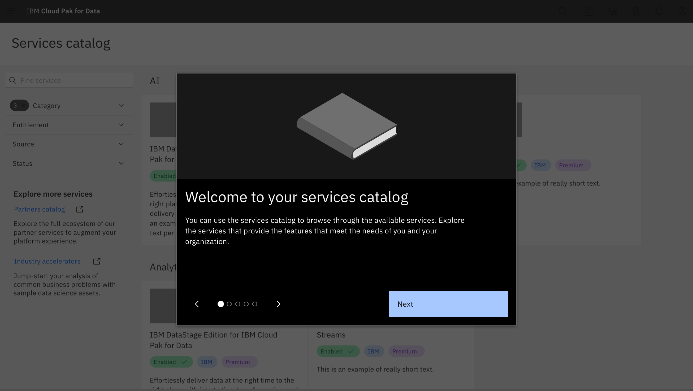
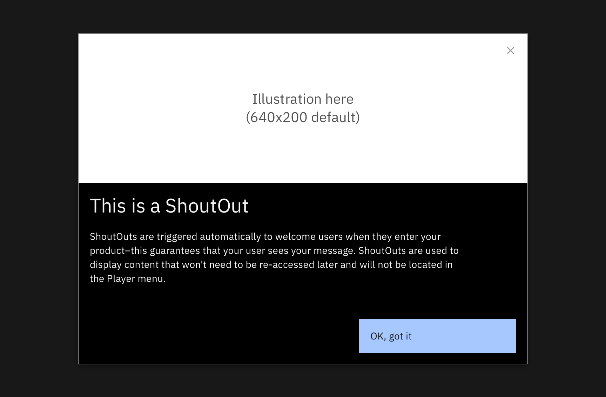
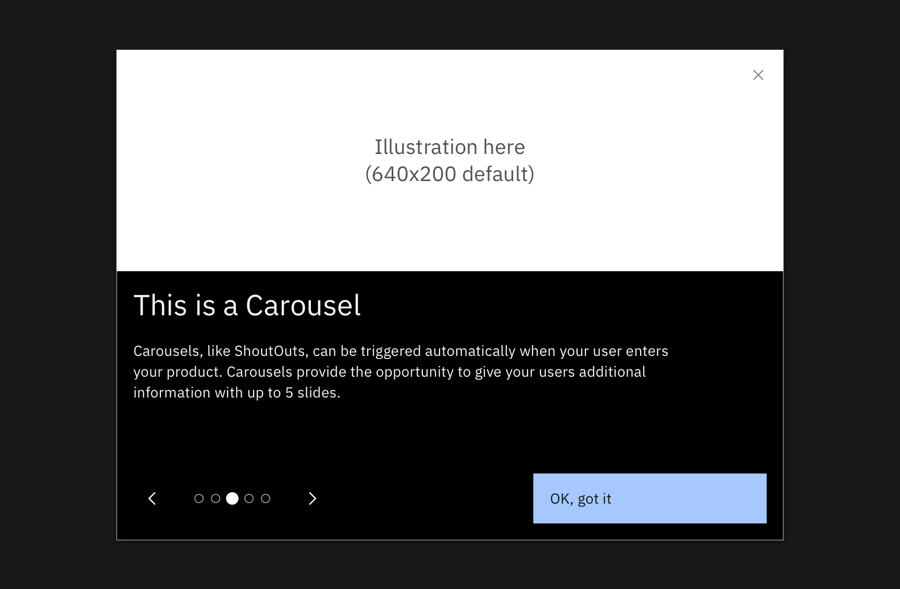

<PageDescription>

Welcome patterns provide guidance on the best ways to introduce your users to your offering. This is the first screen your users will see–it's usually a ShoutOut or Carousel. This guidance will help you welcome your users to best inform them of your product's values and capabilities.
 
</PageDescription>

 

<Row>
  <Column colLg={10}>

  </Column>
</Row>

 

<AnchorLinks>
  <AnchorLink>Usage</AnchorLink>
  <AnchorLink>Components</AnchorLink>
  <AnchorLink>Examples</AnchorLink>
</AnchorLinks>

## Usage

**Used to**: 
- Warmly welcome a new user to the product
- Give a new user some context and value provided by the product
- Make announcements–like new features or updates

**Not used to**: 
- Teach the user how to do something
- Show the user around the UI

Best practices
- Keep the content to a minimum to avoid annoying the user upon opening the product
- Focus on the value of the product
- If the value of the product does not require much explanation, then you might not need a welcome experience
- At the end of the flow, point out where they can access that experience and others

## Components

Welcome patterns can be created using [ShoutOuts](/walkme/shoutouts/usage) or Carousels.

 

### Shoutouts

<Row>
  <Column colLg={10}>

  </Column>
</Row>

For more guidance on [ShoutOuts](/walkme/shoutouts/usage).

 

### Carousels

<Row>
  <Column colLg={10}>

  </Column>
</Row>

## Examples

We’ve collected examples of WalkMe UI tour patterns that have been created by other IBM product teams. You can access them below.

 

<Column colMd={4} colLg={4} noGutterSm>
  <ResourceCard
    subTitle="WalkMe"
    title="Live example - Welcome pattern"
    aspectRatio="2:1"
    actionIcon="launch"
    href="?walkme=14-287342">
  </ResourceCard>
</Column>
