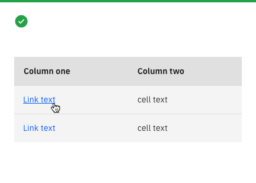
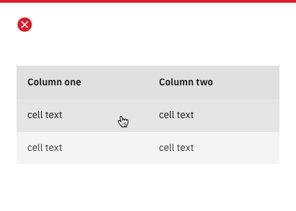
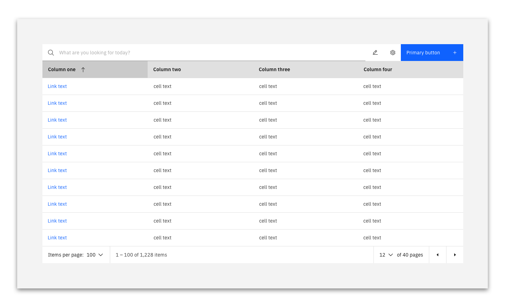
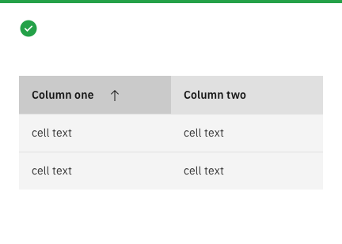
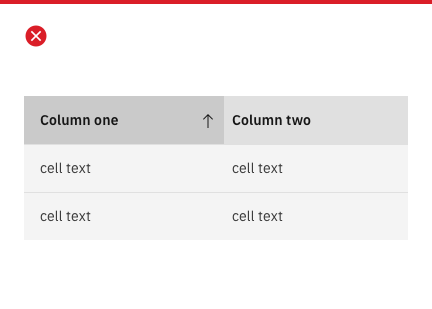
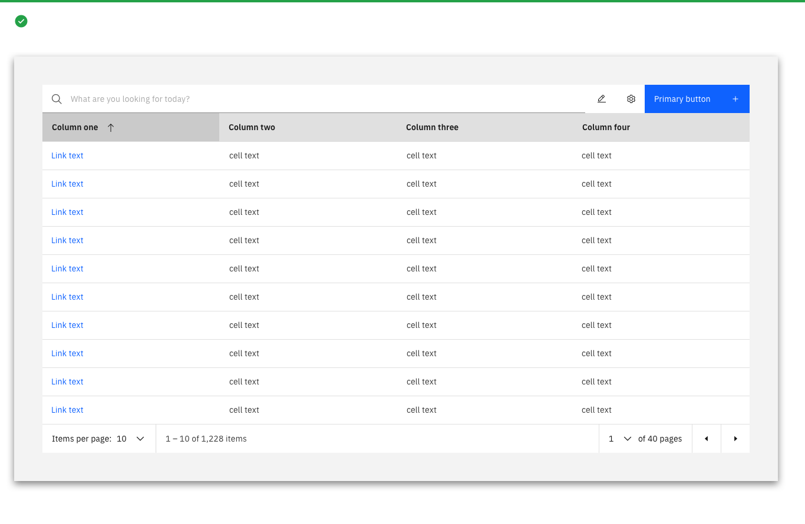
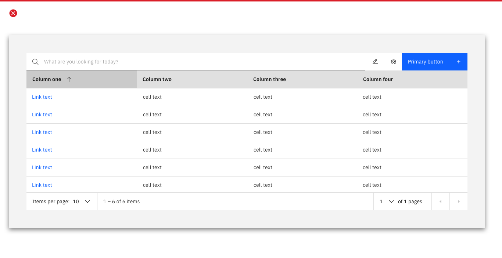

<PageDescription>

  The data table is a set of standard Carbon components designed to be flexible enough to meet a large variety of usecases.

</PageDescription>
<InlineNotification>

  **Note:** This page are not intended to replace the Carbon documentation.  These should be seen as guidlines to implementing data tables for products in the Cloud Pak for Integration to improve consistency of approach.

</InlineNotification>

<AnchorLinks>
  <AnchorLink>Carbon guidelines</AnchorLink>
  <AnchorLink>Linking from data tables</AnchorLink>
  <AnchorLink>Searching in tables</AnchorLink>
  <AnchorLink>Sort icon alignment</AnchorLink>
  <AnchorLink>Table footers</AnchorLink>
</AnchorLinks>

## Carbon guidelines

The standard Carbon data tables have been delivered as a set of components, as such these are flexible in the way they can be implemented.  The carbon guidelines can be found [here](https://www.carbondesignsystem.com/components/data-table/code).

This documentation is a set of guidelines on how to implement these component to ensure a consistent experience and provide users with a similar, uniform experience.

In addition there are some deviations from the standard Carbon guidelines to improve usability.

## Data table options
### Linking from data tables

When providing the user with links from a data tables this should be using [standard link component](https://www.carbondesignsystem.com/components/link/code) in the first column of the data table.

<Row>
 <Column colLg={4}>

<Caption>Do use the link component to indicate to the user where to click.</Caption>
 </Column>

  <Column colLg={4}>

<Caption>Do not use the whole role as a clickable element.</Caption>
 </Column>

</Row>

### Searching in tables

As part of the additional data table functionality Carbon provided a [data table searching component in the header](https://www.carbondesignsystem.com/components/data-table/usage#search).  These are guidelines on how the searching functionality is to be implemented.

The search bar is to be defaulted to always open and will take the full width of the screen which isn't being used by the other components in the header.

<Row>
 <Column colLg={8}>

 </Column>
</Row>

### Sort icon alignment

In order to make the connection between the sort icon and the title of the column which is being sorted more obvious to the user the sorting icons is aligned to the right of the column label, rather than fully justified to the right of the cell itself.

<Row>
 <Column colLg={4}>

<Caption>Do The sort icon is aligned to the right of the header field label.</Caption>
 </Column>

  <Column colLg={4}>

<Caption>Don't display the sort icon aligned to the right of the header label cell.</Caption>
 </Column>
</Row>

### Table footers

Table footers are only to be implemented when they are needed. The minimum number of items which you can view in a data table is at any one time is ten, therefore the footer only needs to be implemented when there are at least eleven items in the table. 
<Row>
 <Column colLg={8}>

<Caption>Do use the table footer when there is enough content to make it relevant</Caption>
 </Column>
</Row>
<Row>
 <Column colLg={8}>

<Caption>Don't display the table footer when there is 10 items or fewer in the table.</Caption>
 </Column>
</Row>

## Linked to

[Editing & Updating](../common-patterns/editing)
