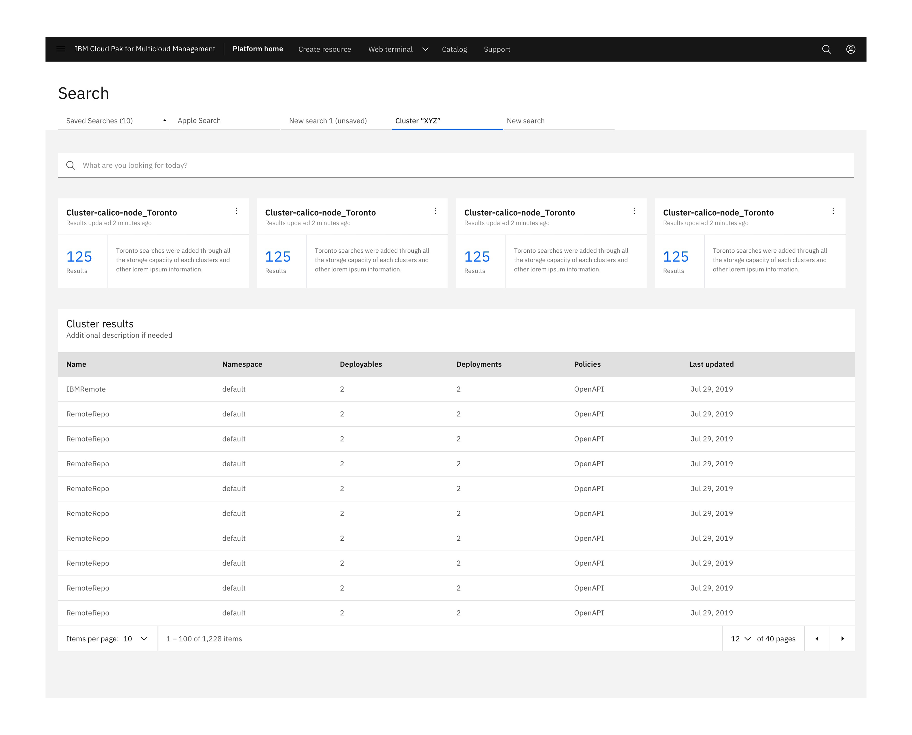
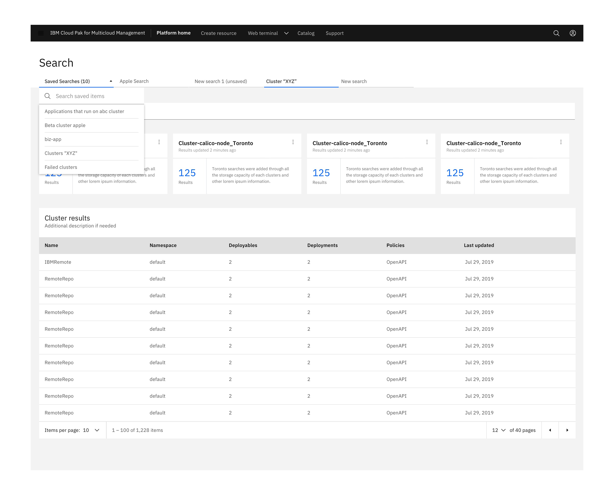
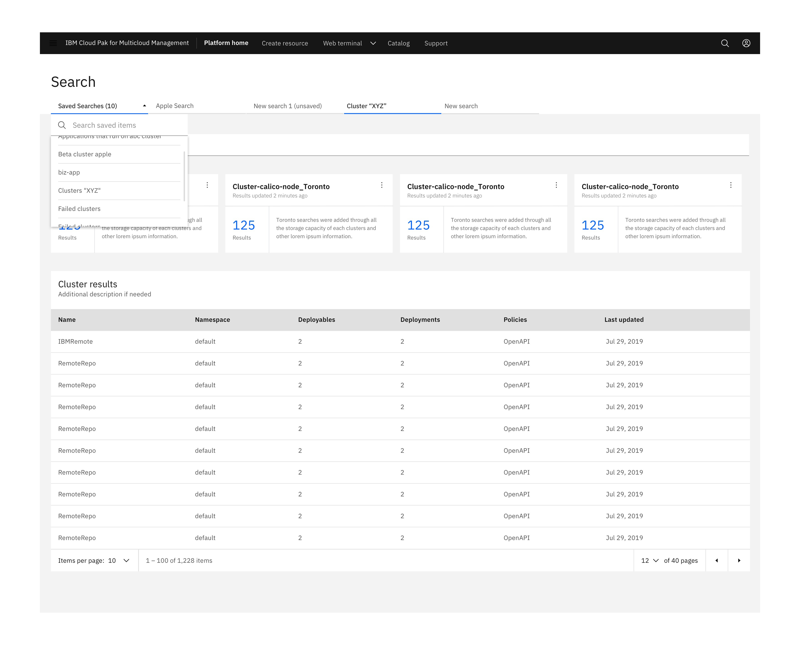
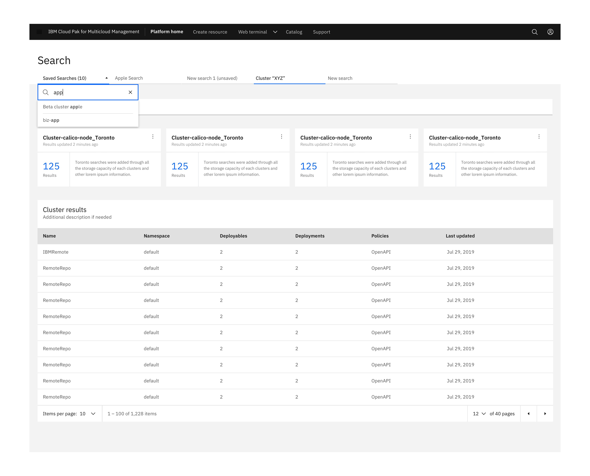

<PageDescription>

_Filterable_ search tab presents a list of past searches that can be selected to open into new tabs.

</PageDescription>

<AnchorLinks>
  <AnchorLink>Overview</AnchorLink>
  <AnchorLink>Behavior guidance</AnchorLink>
  <AnchorLink>Anatomy</AnchorLink>
</AnchorLinks>

## Overview

User may have a lot of saved searches, and when they open one, it opens as a new tab. To choose which one to open, they can click the dropdown and search their saved searches.

Filterable search tabs is a mechanism which allows users to filter past searches and provide the ability to select from this list to trigger and open a new tab. 

Users may have a lot of past saved searches which they want to reuse. The dropdown allows them to search and select from the list of saved searches in order to open a new tab at the end of the row.

## Behavior guidance

Saved searches tab dropdown drawers should appear above all other UI elements. They can be dismissed by clicking outside of the dropdown item or on the parent element.

*Saved Searches* are the first hierarchal element which include the number of saved searches (in parentheses) followed by the search bar (Search saved items). Lastly, users are able to scroll through and select from a list of saved searches.

### Filter dropdown type ahead

When the user hovers over the label area, a text cursor will appear. The drawer opens on click (anywhere in the field) and the user can type to filter through the list of options below or can scroll through the list of saved searched to select the appropriate one. Once the user begins typing, the close (x) icon will appear to the right of the label. This will clear any user-inputted text. Selecting an item from the dropdown will close the drawer and the selected option will replace the default label. A new row would then be added at the end of the row

### Filter dropdown

Selecting an item from the dropdown will close the drawer and the selected option will replace the label. A new tab would then be added at the end of the row. 

## Anatomy

There are two primary Carbon components that make up the Filterrable search tab. The 2 main components are Search and Dropdown. The are used in the Grey 10 theme. 

- The default input color is *$field-01* and is used on *$ui-background* and *$ui-02* page backgrounds
- Inputs come in two different colors. The default input color is *$field-01* and is used on *$ui-background* and *$ui-02* page backgrounds.