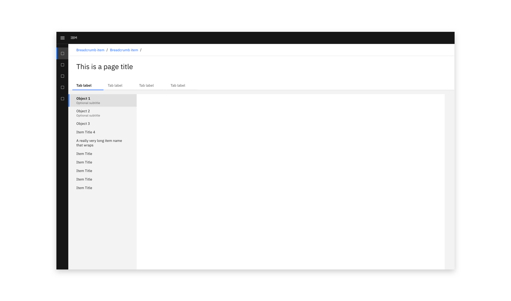
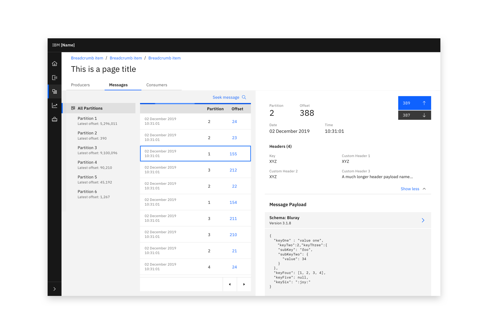
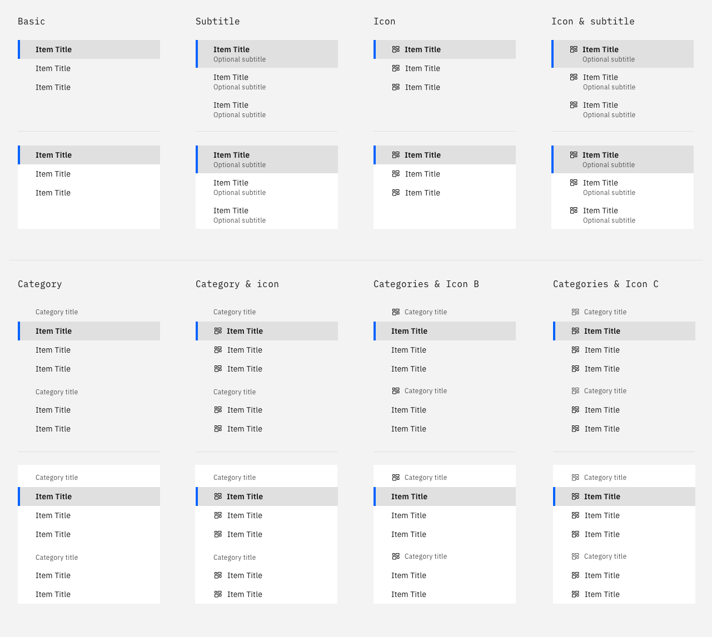
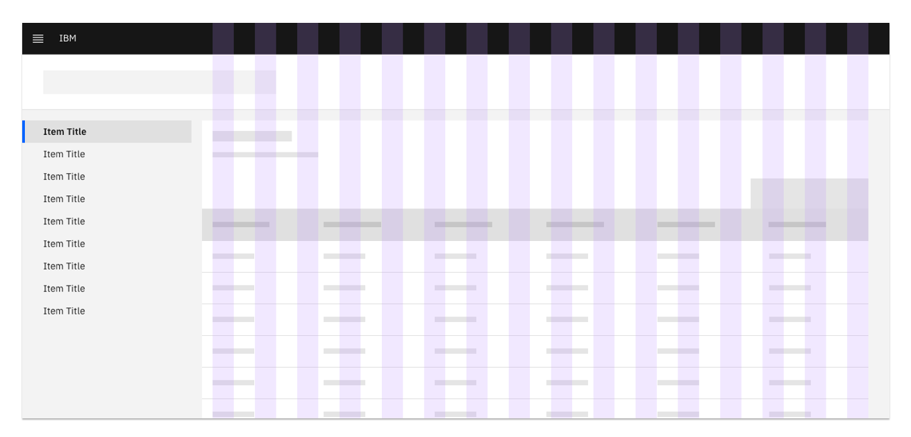
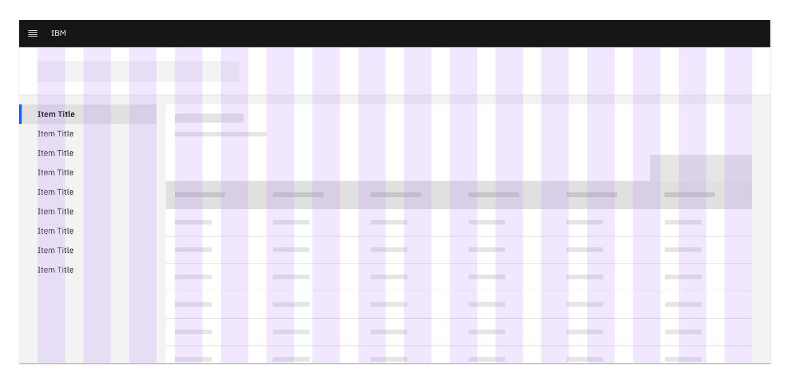
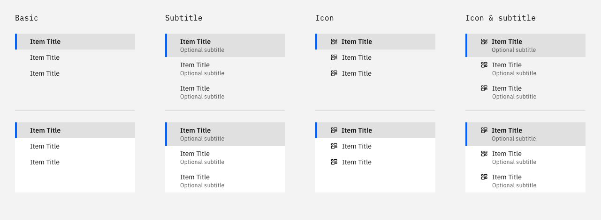
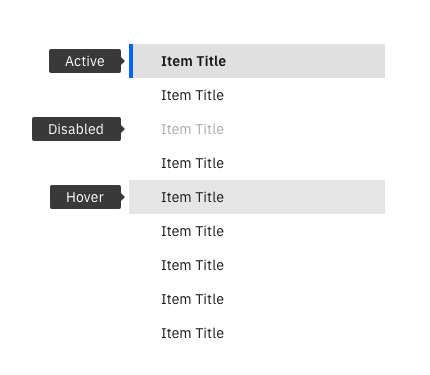
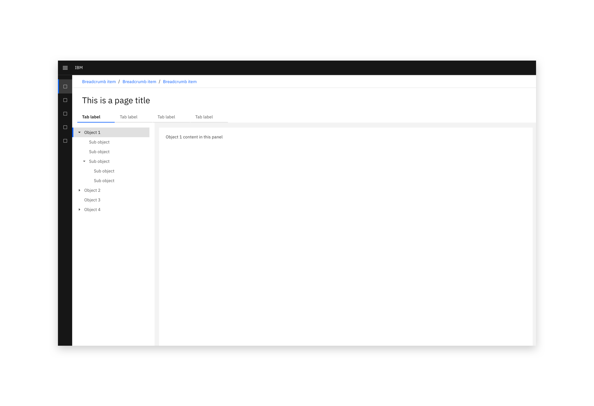

**Maintainers:**
[Chloe Poulter](https://w3.ibm.com/bluepages/profile.html?uid=118468866), [Kacie Eberhart](https://w3.ibm.com/bluepages/profile.html?uid=5G0431897)

### In-page navigation allows a user to navigate the contents of a page. 

<InlineNotification kind="warning">

  This page is work in progress.  
  
</InlineNotification>

<AnchorLinks>
  <AnchorLink>Implementation method</AnchorLink>
  <AnchorLink>Options</AnchorLink>
  <AnchorLink>Future considerations</AnchorLink>
</AnchorLinks>

<Row>
  <Column colLg={10}>

  </Column>
</Row>

<Row>
  <Column colLg={10}>

  </Column>
</Row>

### Implementation method

As there are two distinct implementation methods, it is suggested that only one method (either **Panel** or **Anchors**) is used across each experience, or set of experiences.  

#### Panel
In-page navigation can be used to switch between content panels. 

<Row>
<Column colLg={10}>

</Column>
</Row>

#### Anchors
In-page navigation can be used to jump to items up and down a long page. 

<Row>
<Column colLg={10}>

</Column>
</Row>

### Options

#### Categories
Items in the in-page navigation can be sorted into non-clickable categories.
<Row>
 <Column colLg={8}>

 </Column>
</Row>

#### Grid Usage
The in-page navigation is used both as and not as a grid influencer.  
<Row>
 <Column colLg={8}>

<Caption>When the navigation needs to remain a set width across an experience, it should be a grid influencer.</Caption>

 </Column>
</Row>
<Row>
 <Column colLg={8}>

<Caption>When a variety of widths are required for the component, it can be implemented inside the grid.</Caption>

 </Column>
</Row>

#### Icons

The in-page navigation is available with and without icons.

<Row>
 <Column colLg={8}>

<Caption>In-page navigation can be implemented with or without icons</Caption>

 </Column>
</Row>

#### States

In-page navigation objects have active, disabled, and inactive states.
All of these states may also use an optional subtitle and/or an icon.

<Row>
 <Column colLg={8}>

 </Column>
</Row>

### Future considerations

Although this component will be available in the CDAI Sketch Kit V2, it is not yet available as a reusable code component.  

- Consider including a design for adding/removing items from this component
- Consider documenting this component in a resizable left panel
- Consider documenting guidance about the order in which navigational components should be used
- Consider documenting differences between this component and the proposed Properties viewer compoenent

#### Hierarchy and nesting

The in-page navigation hierarchy includes sub-items, which are grouped under collapsible items including a chevron. 
When nesting is combined with icons, the collapse/expand chevron appears to the left of the icon.  
The nesting parts of the component are not yet published in the Sketch Kit. Updates will be made on publication of the Carbon Tree view component. 

<Row>
 <Column colLg={8}>

 </Column>
</Row>