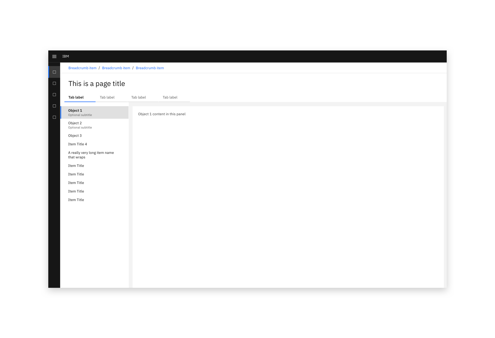
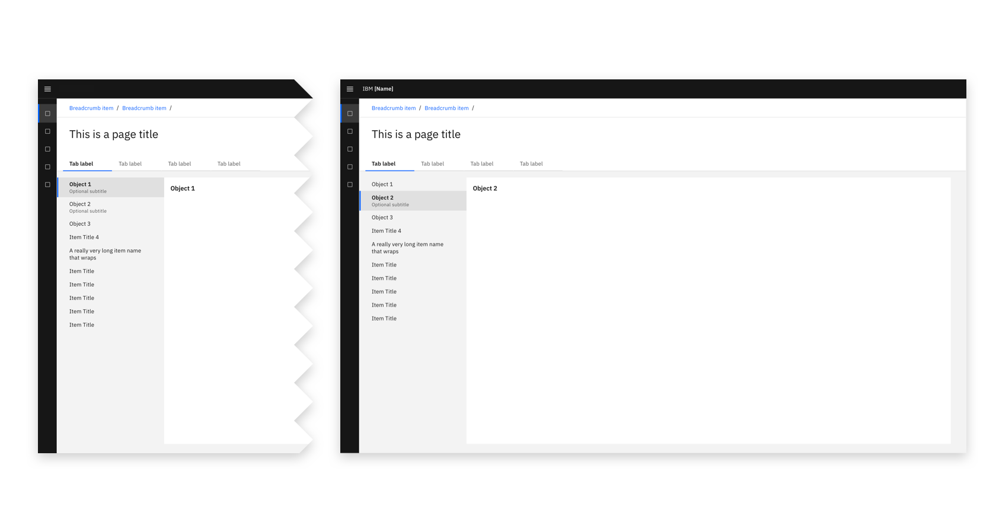
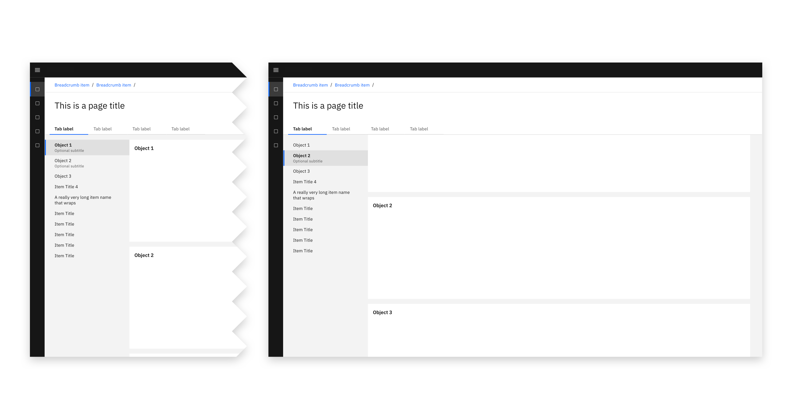

### In-page navigation allows a user to navigate the contents of a page. 

<AnchorLinks>
  <AnchorLink>Implementation method</AnchorLink>
  <AnchorLink>Options</AnchorLink>
  <AnchorLink>Future considerations</AnchorLink>
</AnchorLinks>
<InlineNotification kind="warning">

  This page is work in progress.  
  
</InlineNotification>

<Row>
  <Column colLg={10}>

  </Column>
</Row>

<Row>
  <Column colLg={10}>

  </Column>
</Row>

### Implementation method

As there are two distinct implementation methods, it is suggested that only one method (either **Panel** or **Anchors**) is used across each experience, or set of experiences.  

#### Panel
In-page navigation can be used to switch between content panels. 

<Row>
 <Column colLg={12}>

<Caption>In-page navigation implemented to switch between content with no scrolling.</Caption>

 </Column>
</Row>

#### Anchors
In-page navigation can be used to jump to items up and down a long page. 

<Row>
 <Column colLg={12}>

<Caption>In-page navigation implemented as anchors before scrolling (left) and after scrolling (right).</Caption>

 </Column>
</Row>

### Options

#### Icons

The in-page navigation is available with and without icons.

<Row>
 <Column colLg={8}>

<Caption>In-page navigation implemented with icons</Caption>

 </Column>
</Row>

#### States

In-page navigation objects have active, disabled, and inactive states.
All of these states may also use an optional subtitle and/or an icon.

<Row>
 <Column colLg={8}>

 </Column>
</Row>

#### Hierarchy and nesting

The in-page navigation hierarchy includes sub-items, which are grouped under collapsible items including a chevron. 
When nesting is combined with icons, the collapse/expand chevron appears to the left of the icon.

<Row>
 <Column colLg={8}>

 </Column>
</Row>

### Future considerations

Although this component will be available in the CDAI Sketch Kit V2, it is not yet available as a reusable code component.  
Carbon is currently underway building a tree view component which is very similar to the contents of this pattern.  

- Establish whether this component is part of or related to the Tree view component:
  - Consider whether, as part of the tree view or data tree component, a number-of-items visual should be available on the right side of the tree items
  - Consider whether, as part of the tree view or data tree component, an all-folders or view-all top object should be documented
- Consider including a design for adding/removing items from this component
- Consider documenting this component in a resizable left panel
- Consider documenting guidance about the order in which navigational components should be used
- Consider documenting differences between this component and the proposed Properties viewer compoenent
