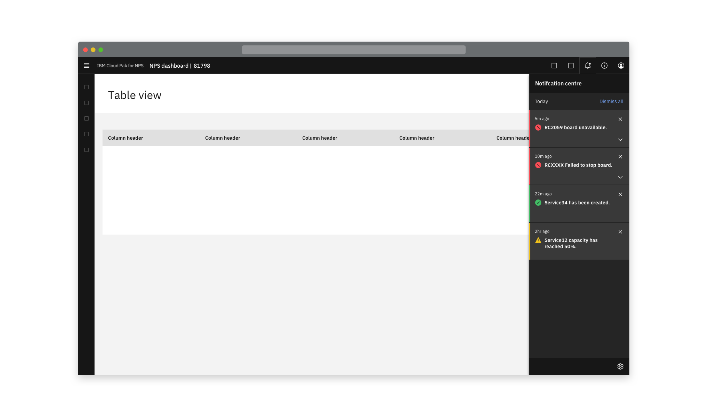
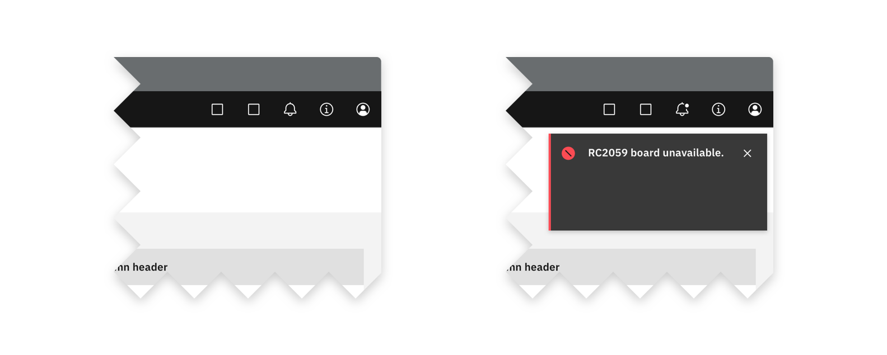
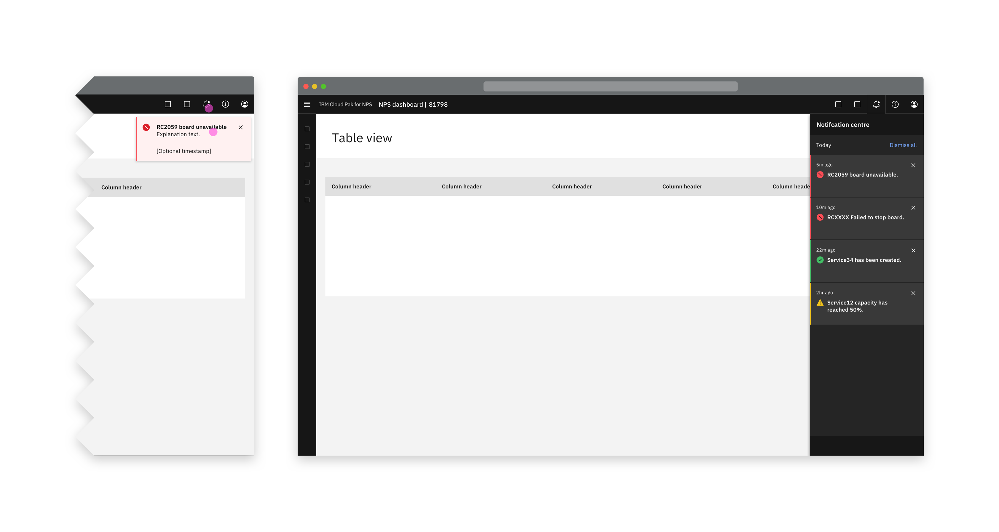
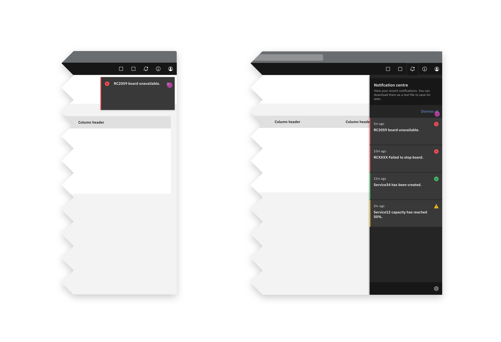
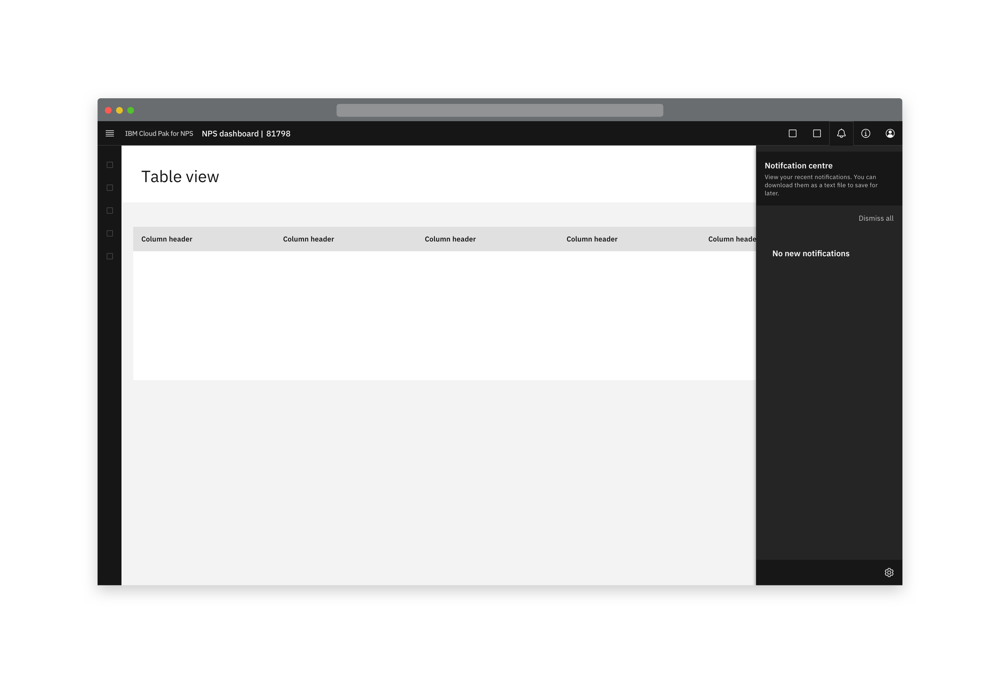
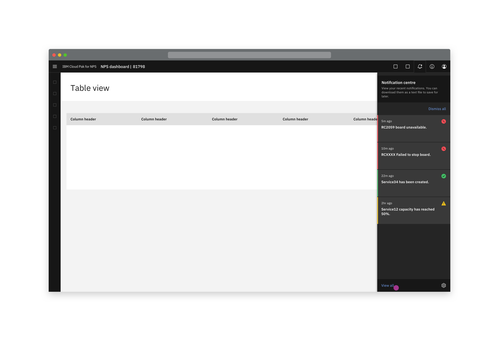
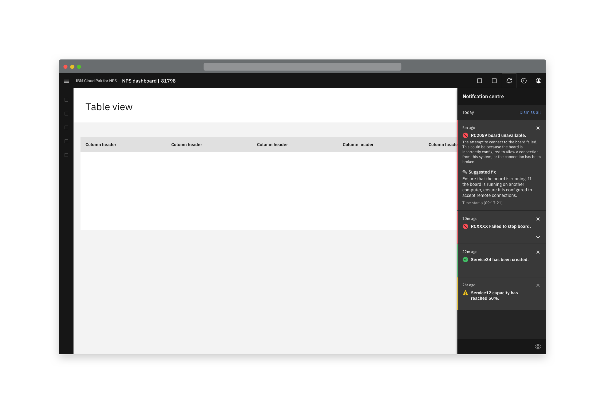
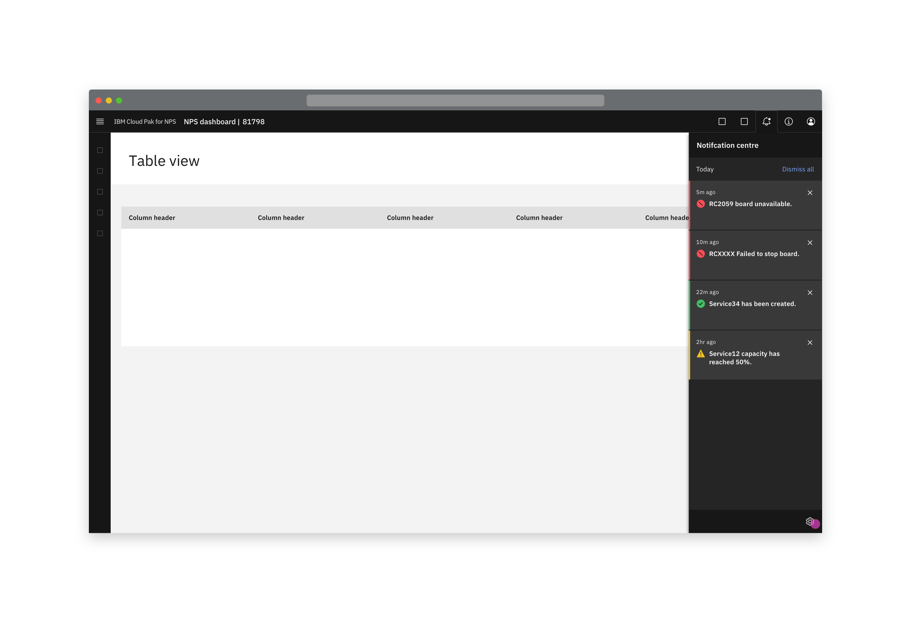

<InlineNotification kind="warning">

  Please note this pattern is still under review.

</InlineNotification>

<InlineNotification>

 This page is not intended to replace the Carbon documentation, but to expand on it.  
 Find the Carbon notifications guidance [here](https://www.carbondesignsystem.com/patterns/notification-pattern) and [here](https://www.carbondesignsystem.com/components/notification/usage).

</InlineNotification>

<PageDescription>

 The notification panel acts as a store for notifications, allowing the user to view and interact with them all in one place. This is particularly useful as by default, toast notifications disappear after a few seconds.  

</PageDescription>

## Behaviour

### New notifications
The notification panel is housed within the header, launched by the bell icon. When the user receives a new notification in the UI, it is indicated as a dot within the notification panel icon. This dot remains until the panel has been opened and closed again. 

<Row>
  <Column colLg={8}>

  </Column>
</Row>

### Slide over panel

The notification panel is a slide over panel. The slide over panel does not have an overlay.   
Clicking the bell icon in the header bar launches the panel. Additionally, if the user sees a toast notification, clicking on it launches the notification panel.   
In the panel, notifications are ordered chronologically, with the most recent at the top.  

<video width="600" controls>
  <source src="images/Notificationspanel.mp4" type="video/mp4" style="padding:3rem"></source>
  Your browser does not support video.
</video>
<Caption>Example of a notification panel opening in a product</Caption>

<Row>
  <Column colLg={8}>

<Caption>The panel can be opened by clicking the notification icon or the toast notification.</Caption>
  </Column>
</Row>

### Dismissing notifications

Dismissing a toast notification in the UI, or allowing it to time out, does not result in it being removed from the notification panel.  
To clear all notifications from the notification panel, the user clicks "Dismiss all" within the panel itself. 

<Row>
  <Column colLg={8}>

<Caption>The panel can be emptied by clicking "Dismiss all". Dismissing the notification does not remove it from the panel.</Caption>
  </Column>
</Row>

<Row>
  <Column colLg={8}>

<Caption>When cleared, the notification panel displays as empty.</Caption>
  </Column>
</Row>

## Optional modifiers

### View all

By default, the panel scrolls to contain all of the current notifications.  
If the offering also has a full-page notifications viewer, the notification panel may include a "View all" link to open it. This may be useful if the user has too many notifications to fit easily within the side panel.

<Row>
  <Column colLg={8}>

<Caption>The optional "view all" link is at the bottom on the notification panel and opens a whole page for notifications.</Caption>
  </Column>
</Row>

### Expandable notifications

Expandable notifications may be used when there is useful extra information about a specific notification. An example is that for error notifications, there could be more information about the error presented to the user, as well as a suggested fix. 

<video width="600" controls>
  <source src="images/Expandablenotifications.mp4" type="video/mp4"></source>
  Your browser does not support video.
</video>
<Caption>Example of expandable notifications in a product</Caption>

<Row>
  <Column colLg={8}>

<Caption>Where required, notifications can be expandable.</Caption>
  </Column>
</Row>

### Link to settings

If there are notification settings available to the user, a link to them (on another page) can be included in the panel.   
This can be accessed from the settings icon at the bottom of the side panel.

<Row>
  <Column colLg={8}>

<Caption>Where required, a link to notification settings is provided.</Caption>
  </Column>
</Row>