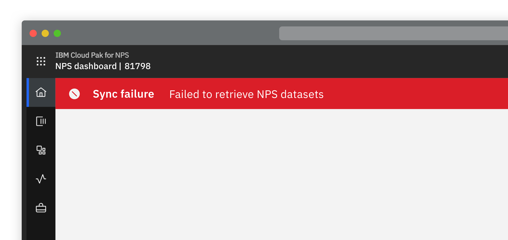
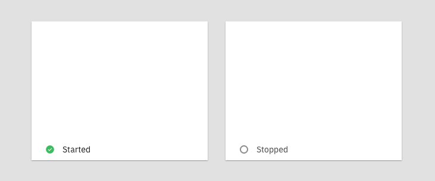
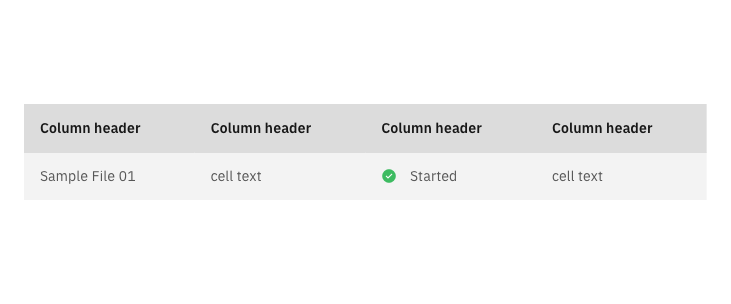
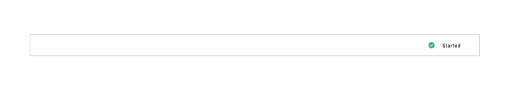

import styles from './state.module.scss';

<PageDescription>

  Indicates the situation or condition of a system or resource.

</PageDescription>

<Row>
  <Column colLg={8}>

  </Column>
</Row>

## Overview

State is a series of sustainable and consistent status. Therefore the state,
the general description, may show a historical view of status.

It is recommended that indication should use a text label representative of
the state / status and if applicable it should be accompanied with an
associated icon. Take a look at the [Carbon Icon Library](https://www.carbondesignsystem.com/guidelines/iconography/library).

<AnchorLinks>
  <AnchorLink>Glossary</AnchorLink>
  <AnchorLink>System state</AnchorLink>
  <AnchorLink to="#resource-state---in-context">Resource state — in context</AnchorLink>
  <AnchorLink to="#change-in-resource-state---out-of-context">Change in resource state — out of context</AnchorLink>
</AnchorLinks>

## Glossary

A list of status, their definitions, and corresponding icons to describe the
state of a resource. The icons are for use when showing
the [Resource state — in context](#resource-state---in-context).

<Row>
 <Column colLg={8}>
 
 

  Incomplete
  Resource is not fully created and is not ready to start.
 

 

  Ready to start
  Resource...
 

 

  Starting
  Resource...
 

 

  Started
  Resource is available to do work
 

 

  Stopped
  Resource is properly configured but not available to do work (opposite to Started)
 

 

  Stopping
  
 

 

  Initiated
  
 

 

  Deploying
  Resource is being set up and prepared (primarily a cloud resource)
 

 

  Running
  Resource has started and is activley doing work
 

 
  </Column>
</Row>

## System state

In situations where it is important for the user to see the overall state of
the system, regardless of where they are in the product.

*TBD Possible in the CID header showing system state / heath*

## Resource state — in context

In situations where a user has navigated to a resource and needs to see the
state / status of that resource. The state should be displayed in the same
way regardless of whether it’s shown on a tile, in a secondary header, or
elsewhere.

Tile example:

<Row>
 <Column colLg={8}>

 </Column>
</Row>

Table row example:

<Row>
 <Column colLg={8}>

 </Column>
</Row>
<Row>
 <Column colLg={8}>

 </Column>
</Row>

## Change in resource state — out of context

In situations where it is important for the user to be made aware of a
resource change out of context of a component or page.

**Use the**

[Persistent banner](../../components/persistent-banner) component if
the change in unexpected.

<Row>
 <Column colLg={8}>
 
 

  Example: The user did not initiate the stopping of a server but it has just stopped.
 

 </Column>
</Row>
 

[Toast notification](https://www.carbondesignsystem.com/components/notification/code#toast-notification) component if the change in state is expected.

<Row>
 <Column colLg={8}>
 
 

  Example: a server has finally started after the user initiated it
 

 
 </Column>
</Row>

## Linked to

[Creation flows](creation-flows)

[Editing & Updating](editing)

[HTTP errors](http-errors)
