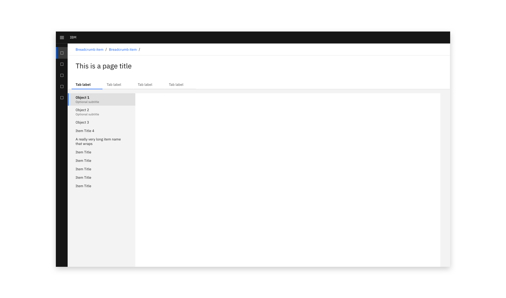
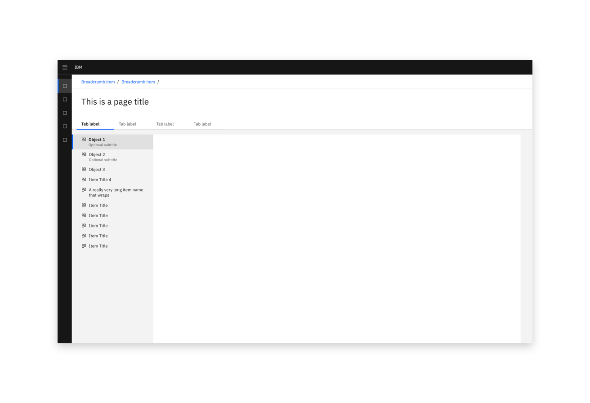
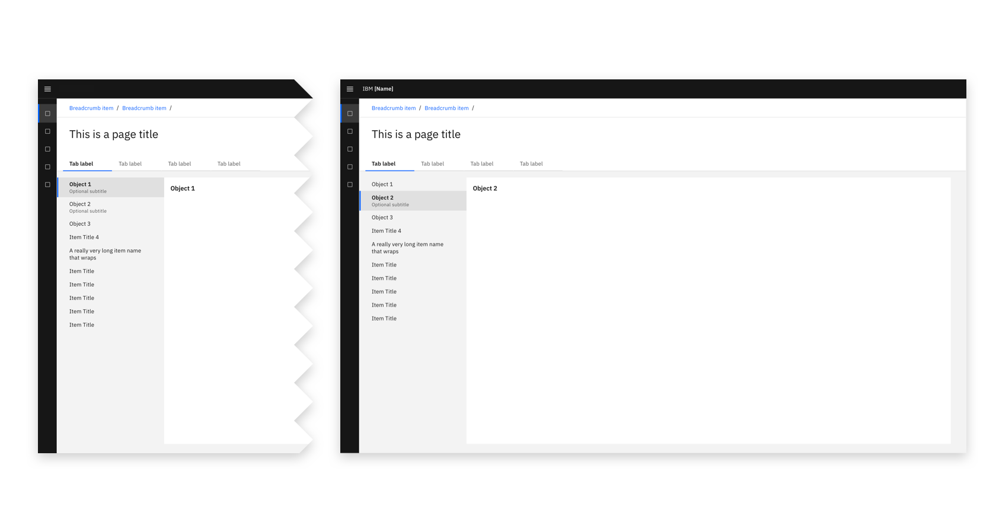
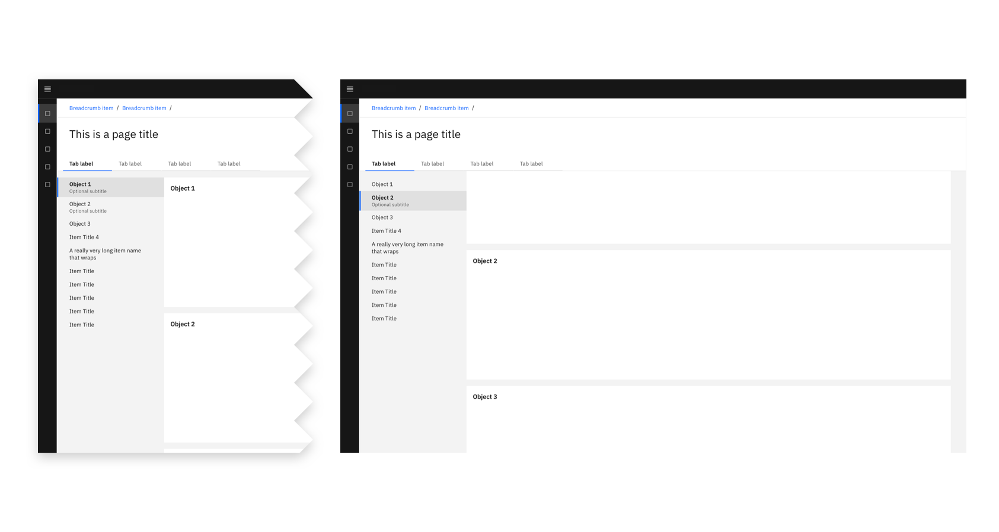
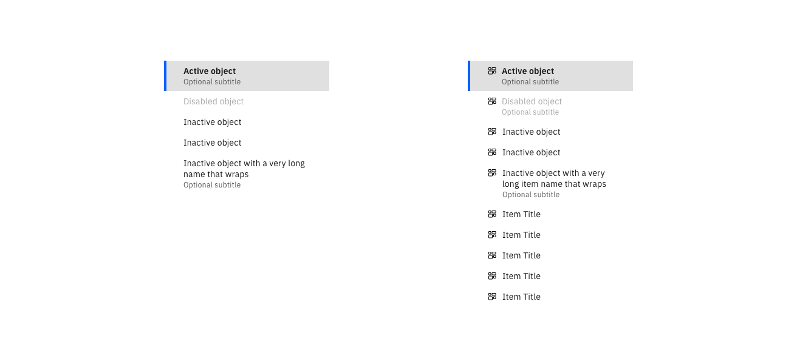

<InlineNotification kind="warning">

  This page is work in progress.  
  
</InlineNotification>

### Tertiary navigation should provide for navigation *after* the left navigation and the use of header tabs. 

<Row>
  <Column colLg={10}>

  </Column>
</Row>

<AnchorLinks>
  <AnchorLink>Icons</AnchorLink>
  <AnchorLink>Implementation method</AnchorLink>
  <AnchorLink>States</AnchorLink>
  <AnchorLink>Future considerations</AnchorLink>
</AnchorLinks>

### Icons

The tertiary navigation is available with and without icons.

<Row>
 <Column colLg={8}>

<Caption>Tertiary navigation implemented with icons</Caption>

 </Column>
</Row>

### Implementation method

#### Pages
A tertiary navigation can be used to switch between a selection of pages. 

<Row>
 <Column colLg={10}>

<Caption>Tertiary navigation implemented to switch between pages with no scrolling.</Caption>

 </Column>
</Row>

#### Anchors
A tertiary navigation can be used to jump to items up and down a long page. 

<Row>
 <Column colLg={10}>

<Caption>Tertiary navigation implemented as anchors before scrolling (left) and after scrolling (right).</Caption>

 </Column>
</Row>

### States

Tertiary navigation objects have active, disabled, and inactive states.
All of these states may also use an optional subtitle and/or an icon.

<Row>
 <Column colLg={8}>

 </Column>
</Row>

### Future considerations

Although this component will be available in the CDAI Sketch Kit V2, it is not yet availble as a reusable code component.

